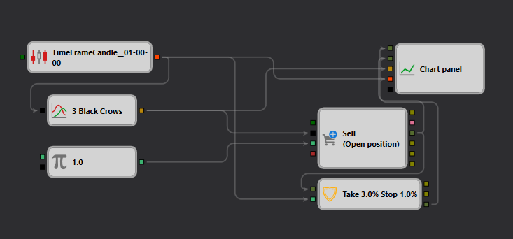

# 3 Black Crows Trend Strategy Description in StockSharp Strategy Designer

## Strategy Overview

The "3 Black Crows Trend" strategy in the [Strategy Designer](https://doc.stocksharp.com/topics/designer.html) employs a specific bearish reversal candlestick pattern to predict potential downward movements in the stock market. This automated trading schema is meticulously crafted to recognize and act on significant price patterns, aiming to benefit from bearish trends.

## Strategy Details

### Pattern Detection: 3 Black Crows

- **Description**: This module identifies the "3 Black Crows" [pattern](https://doc.stocksharp.com/topics/api/indicators/list_of_indicators/pattern.html), which signals a potential bearish reversal following an uptrend. The pattern consists of three consecutive long-bodied candles that close lower than their opening prices with each session's open occurring within the body of the previous candle.
- **Conditions**:
  - Candle 1: Open > Close
  - Candle 2: Open > Close and Open < Previous Open
  - Candle 3: Open > Close and Open < Previous Open

### Trade Execution

- **Order Type**: Market [Order](https://doc.stocksharp.com/topics/designer/strategies/using_visual_designer/elements/positions/modify.html)
- **Entry**: Initiates a sell order upon confirmation of the "3 Black Crows" pattern.
- **Exit Strategy**: 
  - **Take Profit**: Set at 3% above the entry price.
  - **Stop Loss**: Set at 1% below the entry price.
- **Risk Management**: The strategy strictly adheres to its initial [stop loss and take profit](https://doc.stocksharp.com/topics/designer/strategies/using_visual_designer/elements/common/protect_position.html) settings without trailing.

### Trading Conditions

- **Frequency**: Operates on a [daily timeframe](https://doc.stocksharp.com/topics/designer/strategies/using_visual_designer/elements/data_sources/candles.html), processing new candle formations at the end of each trading day.
- **Market Order**: Ensures rapid execution by [placing trades](https://doc.stocksharp.com/topics/designer/strategies/using_visual_designer/elements/positions/modify.html) at prevailing market prices.

## Implementation Details

- **Platform**: Implemented on the StockSharp platform, which offers comprehensive features for pattern detection and automated trade execution.
- **Settings**:
  - **Logging Level**: Configurable to facilitate detailed operational insights.
  - **Parameter Display**: Customizable display settings for operational transparency.
  - **Null Value Processing**: Configurable handling of null values to enhance robustness and reliability.

## Conclusion

The "3 Black Crows Trend" strategy is designed for traders who focus on identifying and capitalizing on bearish reversal patterns. It combines precise pattern recognition with strict trade execution rules to enhance potential profitability in bearish market scenarios.
