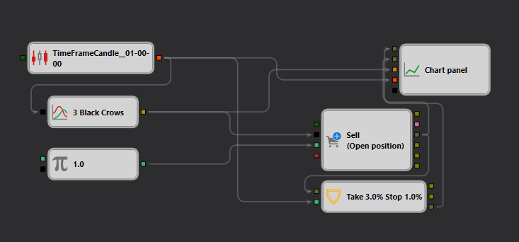

# Descrição da Estratégia 3 Black Crows Trend no StockSharp Strategy Designer
[English](README.md) | [Русский](README_ru.md) | [中文](README_zh.md) | [Español](README_es.md) | [Deutsch](README_de.md) | [日本語](README_ja.md)

## Visão geral da estratégia

A estratégia "3 Black Crows Trend" no [Strategy Designer](https://doc.stocksharp.com/topics/designer.html) emprega um padrão específico de reversão de baixa em candles para prever potenciais movimentos de queda no mercado de ações. Este esquema de negociação automatizado é meticulosamente elaborado para reconhecer e agir sobre padrões de preço significativos, visando beneficiar-se de tendências de baixa.

## Detalhes da estratégia

### Detecção de padrão: 3 Black Crows

- **Descrição**: Este módulo identifica o [padrão](https://doc.stocksharp.com/topics/api/indicators/list_of_indicators/pattern.html) "3 Black Crows", que sinaliza uma possível reversão de baixa após uma tendência de alta. O padrão consiste em três candles consecutivos de corpo longo que fecham abaixo dos seus preços de abertura, com a abertura de cada sessão ocorrendo dentro do corpo do candle anterior.
- **Condições**:
  - Candle 1: Open > Close
  - Candle 2: Open > Close e Open < Previous Open
  - Candle 3: Open > Close e Open < Previous Open

### Execução de negociações

- **Tipo de ordem**: [Ordem](https://doc.stocksharp.com/topics/designer/strategies/using_visual_designer/elements/positions/modify.html) a mercado
- **Entrada**: Inicia uma ordem de venda ao confirmar o padrão "3 Black Crows".
- **Estratégia de saída**:
  - **Take Profit**: Definido a 3% acima do preço de entrada.
  - **Stop Loss**: Definido a 1% abaixo do preço de entrada.
- **Gestão de risco**: A estratégia adere estritamente às configurações iniciais de [stop loss e take profit](https://doc.stocksharp.com/topics/designer/strategies/using_visual_designer/elements/common/protect_position.html) sem rastreamento.

### Condições de negociação

- **Frequência**: Opera em um [intervalo de tempo diário](https://doc.stocksharp.com/topics/designer/strategies/using_visual_designer/elements/data_sources/candles.html), processando novas formações de candles no final de cada dia de negociação.
- **Ordem a mercado**: Garante execução rápida ao [colocar negociações](https://doc.stocksharp.com/topics/designer/strategies/using_visual_designer/elements/positions/modify.html) a preços de mercado vigentes.

## Detalhes de implementação

- **Plataforma**: Implementada na plataforma StockSharp, que oferece recursos abrangentes para detecção de padrões e execução automatizada de negociações.
- **Configurações**:
  - **Nível de log**: Configurável para facilitar informações operacionais detalhadas.
  - **Exibição de parâmetros**: Configurações de exibição personalizáveis para transparência operacional.
  - **Processamento de valores nulos**: Tratamento configurável de valores nulos para melhorar a robustez e a confiabilidade.

## Conclusão

A estratégia "3 Black Crows Trend" foi projetada para traders que se concentram em identificar e capitalizar padrões de reversão de baixa. Ela combina reconhecimento preciso de padrões com regras rígidas de execução de negociações para melhorar a rentabilidade potencial em cenários de mercado de baixa.
