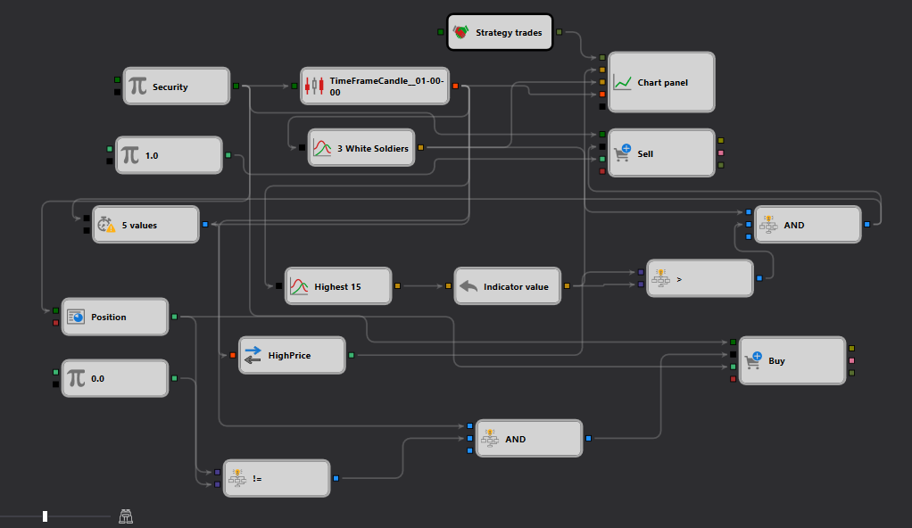

# Three White Soldiers Pattern Detection Example in StockSharp Strategy Designer

## Overview

This example demonstrates the implementation of a trading strategy in the StockSharp Strategy Designer that utilizes the "Three White Soldiers" candlestick pattern. This pattern is often interpreted as a bullish reversal signal and can be pivotal for traders looking to capitalize on shifts in momentum. The setup described in the JSON schema involves the detection of this pattern and the initiation of trades based on its occurrence.

## Description of the Schema

The schema outlines a complex workflow designed to detect the "Three White Soldiers" pattern and execute trades accordingly. Here are the key components and their roles:

1. **Security Node**: Specifies the security for which the strategy is applied. It acts as the primary data input source, providing market data necessary for the subsequent analysis.

2. **TimeFrameCandle Node**: Generates candle data for the specified security. This node is crucial as it processes incoming market data into a usable format (candles) that the pattern detection algorithm can analyze.

3. **Pattern Detection Node**: Specifically configured to detect the "Three White Soldiers" pattern. This node analyzes the candle data and triggers an action when the pattern is identified.

4. **Chart Panel Node**: Visualizes the trading data, including candlestick patterns and possibly trades executed by the strategy. This component helps in monitoring the strategy’s performance and understanding how the pattern influences trading decisions.

5. **Trading Nodes (Buy, Sell)**: These nodes are configured to execute trades when the pattern is detected. The actions can vary based on additional conditions set within the strategy, such as market conditions or other technical indicators.

## Workflow

- The **Security Node** feeds market data into the **TimeFrameCandle Node** where the data is transformed into candlesticks.
- These candlesticks are then passed to the **Pattern Detection Node**, which is configured to identify the "Three White Soldiers" pattern.
- Upon detecting the pattern, the node can trigger one or more **Trading Nodes** to execute buy or sell orders depending on the strategy’s design.
- The **Chart Panel Node** provides a real-time visualization of the candlesticks and any trades executed, which helps in assessing the strategy’s effectiveness and making adjustments if necessary.

## Practical Application

This setup is particularly useful for traders focusing on momentum-based strategies where recognizing patterns early can lead to significant gains. The "Three White Soldiers" pattern is a strong indicator of a bullish reversal, making this strategy suitable for:
- Swing trading in markets where momentum shifts are sharp and clear.
- Day trading in highly volatile markets where early recognition of trend reversals can lead to profitable trades.

## Conclusion

This example from the StockSharp Strategy Designer illustrates a sophisticated use of candlestick pattern detection within an algorithmic trading context. By automating the detection of patterns like the "Three White Soldiers," traders can more effectively position themselves in the market, leveraging the predictive power of historical price patterns. The detailed visualization and real-time data processing also assist in refining the strategy based on observed market conditions and outcomes.