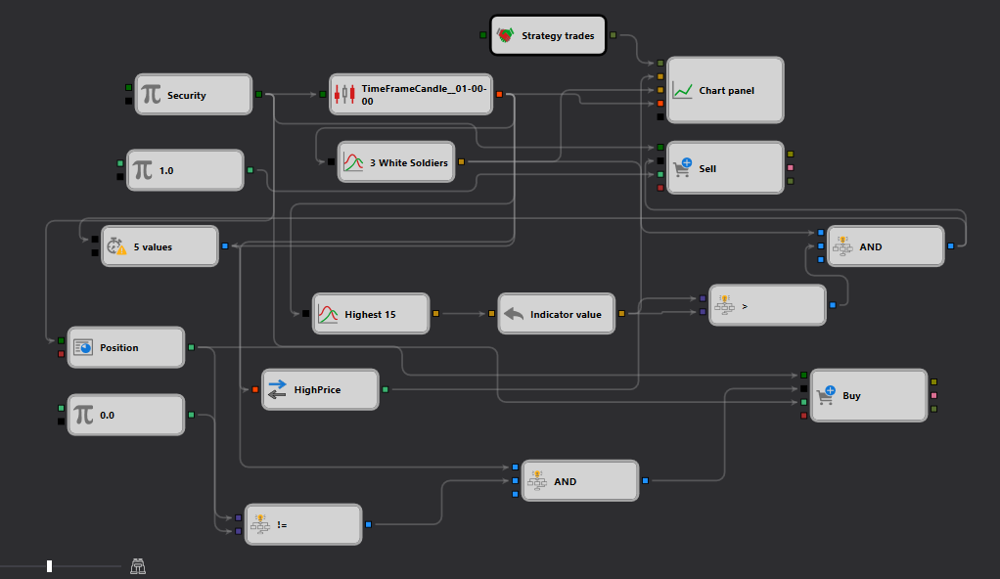

# Ejemplo de Detección del Patrón Three White Soldiers en StockSharp Strategy Designer
[English](README.md) | [Русский](README_ru.md) | [中文](README_zh.md) | [Deutsch](README_de.md) | [Português](README_pt.md) | [日本語](README_ja.md)

## Descripción general

Este ejemplo demuestra la implementación de una estrategia de trading en el StockSharp Strategy Designer que utiliza el patrón de velas "Three White Soldiers". Este patrón suele interpretarse como una señal de reversión alcista y puede ser decisivo para los traders que buscan capitalizar los cambios de impulso. La configuración descrita en el esquema JSON implica la detección de este patrón y el inicio de operaciones basadas en su aparición.

## Descripción del esquema

El esquema describe un flujo de trabajo complejo diseñado para detectar el [patrón](https://doc.stocksharp.com/topics/api/indicators/list_of_indicators/pattern.html) "Three White Soldiers" y ejecutar operaciones en consecuencia. A continuación se presentan los componentes clave y sus funciones:

1. **Nodo Security**: Especifica el [valor](https://doc.stocksharp.com/topics/designer/strategies/using_visual_designer/elements/data_sources/variable.html) para el que se aplica la estrategia. Actúa como la fuente principal de entrada de datos, proporcionando los datos de mercado necesarios para el análisis posterior.

2. **Nodo TimeFrameCandle**: Genera [datos de velas](https://doc.stocksharp.com/topics/designer/strategies/using_visual_designer/elements/data_sources/candles.html) para el valor especificado. Este nodo es crucial ya que procesa los datos de mercado entrantes en un formato utilizable (velas) que el algoritmo de detección de patrones puede analizar.

3. **Nodo de Detección de Patrón**: Configurado específicamente para detectar el [patrón](https://doc.stocksharp.com/topics/api/indicators/list_of_indicators/pattern.html) "Three White Soldiers" mediante un [indicador](https://doc.stocksharp.com/topics/designer/strategies/using_visual_designer/elements/common/indicator.html). Este nodo analiza los datos de velas y desencadena una acción cuando se identifica el patrón.

4. **Nodo Chart Panel**: Visualiza los datos de trading, incluyendo patrones de velas y posiblemente las operaciones ejecutadas por la estrategia. Este [componente](https://doc.stocksharp.com/topics/designer/strategies/using_visual_designer/elements/common/chart.html) ayuda a monitorear el rendimiento de la estrategia y a entender cómo el patrón influye en las decisiones de trading.

5. **Nodos de Trading (Compra, Venta)**: Estos [nodos](https://doc.stocksharp.com/topics/designer/strategies/using_visual_designer/elements/positions/modify.html) están configurados para ejecutar operaciones cuando se detecta el patrón. Las acciones pueden variar según las condiciones adicionales establecidas dentro de la estrategia, como las condiciones de mercado u otros indicadores técnicos.

## Flujo de trabajo

- El **Nodo Security** alimenta datos de mercado al **Nodo TimeFrameCandle**, donde los datos se transforman en velas.
- Estas velas se pasan al **Nodo de Detección de Patrón**, configurado para identificar el patrón "Three White Soldiers".
- Al detectar el patrón, el nodo puede activar uno o más **Nodos de Trading** para ejecutar órdenes de compra o venta según el diseño de la estrategia.
- El **Nodo Chart Panel** proporciona una visualización en tiempo real de las velas y las operaciones ejecutadas, lo que ayuda a evaluar la efectividad de la estrategia y a realizar ajustes si es necesario.

## Aplicación práctica

Esta configuración es especialmente útil para traders que se especializan en estrategias basadas en impulso, donde reconocer patrones tempranamente puede generar ganancias significativas. El patrón "Three White Soldiers" es un fuerte indicador de reversión alcista, lo que hace que esta estrategia sea adecuada para:
- Trading de swing en mercados donde los cambios de impulso son bruscos y claros.
- Day trading en mercados altamente volátiles donde el reconocimiento temprano de reversiones de tendencia puede conducir a operaciones rentables.

## Conclusión

Este ejemplo del StockSharp Strategy Designer ilustra un uso sofisticado de la detección de patrones de velas dentro de un contexto de trading algorítmico. Al automatizar la detección de patrones como el "Three White Soldiers", los traders pueden posicionarse de manera más efectiva en el mercado, aprovechando el poder predictivo de los patrones históricos de precios. La detallada visualización y el procesamiento de datos en tiempo real también ayudan a perfeccionar la estrategia basándose en las condiciones de mercado observadas y los resultados.
