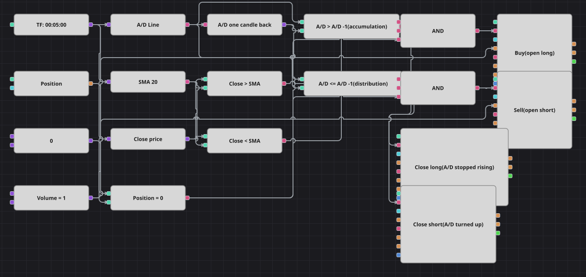

# Diagramm der Trendstrategie mit der Accumulation/Distribution Line
[English](README.md) | [Русский](README_ru.md) | [中文](README_zh.md) | [Español](README_es.md) | [Português](README_pt.md) | [日本語](README_ja.md)

Die Richtung gibt hier das Volumen vor. Die Accumulation/Distribution Line summiert, wo jede Kerze innerhalb ihrer eigenen Spanne geschlossen hat, gewichtet mit dem gehandelten Volumen: Eine steigende Linie heißt, die Käufer haben das Angebot aufgenommen, eine fallende das Gegenteil. Das Diagramm vergleicht die Linie mit ihrem Wert eine Kerze zuvor und stellt sich auf die Seite, die das Volumen stützt, sofern der einfache gleitende Durchschnitt zustimmt.

## Strategieübersicht

- Die Accumulation/Distribution Line bekommt die ganze Kerze, denn sie braucht Hoch, Tief, Schluss und Volumen zusammen.
- Ein Baustein für den Vorwert hält den Messwert einer Kerze zuvor, sodass die Steigung der Linie ein einfacher Vergleich wird und kein zweiter Indikator.
- Der einfache gleitende Durchschnitt ist der Freigabefilter: Volumen mag zufließen, gekauft wird aber nur, wenn die Kerze zusätzlich über dem Durchschnitt schließt.
- Beide Einstiege tragen die Bedingung Position eröffnen, beide Ausstiege die Bedingung Position schließen, also wird immer nur eine Position gehalten und nie vergrößert.

## Ein- und Ausstiegsregeln

- **Long-Einstieg**: Die A/D-Linie liegt über ihrem Vorwert, die Kerze schließt über dem einfachen gleitenden Durchschnitt und die Position ist neutral. Die Order kauft das gemeinsame Volumen zum Marktpreis.
- **Short-Einstieg**: Die A/D-Linie liegt auf oder unter ihrem Vorwert, die Kerze schließt unter dem einfachen gleitenden Durchschnitt und die Position ist neutral. Die Order verkauft das gemeinsame Volumen zum Marktpreis.
- **Ausstieg**: Allein die Steigung schließt den Trade, ohne Preisbedingung: Fällt die Linie zurück, wird ein Long geschlossen, dreht sie nach oben, ein Short. Es gibt weder Stop-Loss noch Take-Profit, genau wie in der Originalstrategie.

## Parameter

| Parameter | Standard | Beschreibung |
|---|---|---|
| MA Period | 20 | Länge des einfachen gleitenden Durchschnitts, der entscheidet, welche Seite erlaubt ist. |
| Volume | 1 | Ordervolumen in Lots. |
| Candles | 00:05:00 | Zeiteinheit der Kerzen, mit der das gesamte Diagramm arbeitet. |

## Diagrammdetails

- Der Kerzenbaustein versorgt gleich drei Abnehmer: die A/D-Linie, den gleitenden Durchschnitt und den Konverter, der den Schlusskurs herauszieht.
- Der Ausgang der A/D-Linie läuft sowohl in den Vorwert-Baustein als auch direkt in zwei Vergleiche, sodass Steigen und Fallen aus demselben Zahlenpaar abgelesen werden.
- Jedes logische UND verbindet die Steigung der Linie, die Seite des gleitenden Durchschnitts und die Prüfung auf Neutralstellung, bevor es einen Einstiegsbaustein auslöst.
- Die beiden Ausstiegsbausteine hängen direkt an den Steigungsvergleichen und tragen die Bedingung Position schließen, wodurch jeder nur eine Seite bedient.

## Verwendung

Importieren Sie die `.json`-Datei in Designer, testen Sie sie im Backtester mit historischen Daten und passen Sie danach Parameter oder Bausteine an Ihr Instrument an, bevor Sie live handeln.
