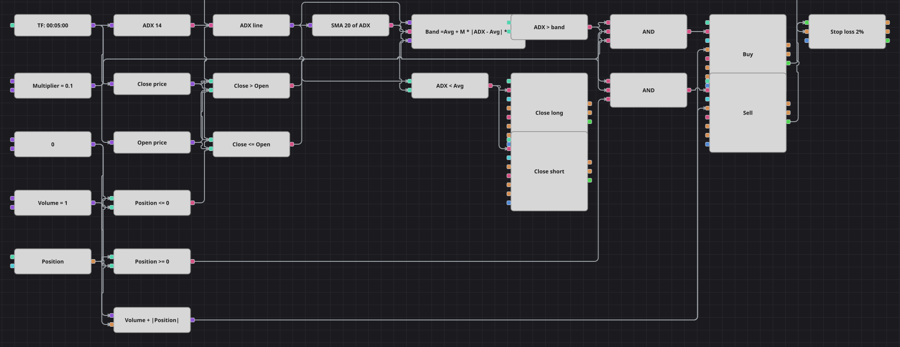

# ADX 突破策略图
[English](README.md) | [Русский](README_ru.md) | [Español](README_es.md) | [Deutsch](README_de.md) | [Português](README_pt.md) | [日本語](README_ja.md)

多数图把指标与固定水平作比较，本图则让平均趋向指数与自己比较：以 ADX 线的简单移动平均为中心，用两者当前的距离在其周围构造一条带，突破这条带就被视为趋势强度的突然爆发。方向取自制造突破的那根K线——收盘高于开盘则买入，其余情况则卖出。

## 策略概览

- 整个结构唯一的输入是平均趋向指数的 ADX 线，+DI 与 -DI 线并未使用。
- 该线送入第二个指标方块，即二十周期简单移动平均，因此本图是在指标之上再算指标。
- 公式方块把带构造为：均线加上乘数乘以 ADX 与其均线绝对距离的两倍，与原始代码的算法完全一致。
- 入场用一笔订单即可反手，因为下单数量等于共享数量加上已有持仓的绝对值。

## 入场与出场规则

- **做多入场**: ADX 线高于带，K线收盘高于开盘，且持仓不是多头。订单买入共享数量加上已有空头的数量，一笔市价单即可平空并开多。
- **做空入场**: ADX 线高于带，K线收盘等于或低于开盘，且持仓不是空头。订单卖出共享数量加上已有多头的数量。
- **离场**: 只要 ADX 线回落到自己的移动平均之下就平仓：多头用平仓模式的卖单，空头用平仓模式的买单。此外，持仓保护方块承载原策略 2% 的止损；原策略的止盈设为零即关闭，因此本图也没有目标位。优化之前值得知道一点：只要乘数小于 0.5，带条件在代数上就等同于“ADX 高于其均线”，所以在默认值 0.1 下带没有起任何作用，图可以直接读作 ADX 上穿与下穿自身均线。乘数仍保留为常量，以便取较大值时行为与原策略一致。

## 参数

| 参数 | 默认值 | 说明 |
|---|---|---|
| ADX Length | 14 | 平均趋向指数的平均周期。 |
| Average Length | 20 | 平滑 ADX 线的简单移动平均周期。 |
| Multiplier | 0.1 | 带宽乘数；小于 0.5 时带会塌陷到移动平均线本身。 |
| Stop Loss % | 2 | 止损与入场价的距离，以百分比表示。 |
| Volume | 1 | 加上现有持仓之前的下单数量（手）。 |
| Candles | 00:05:00 | 整张图使用的K线周期。 |

## 图表详情

- K线方块给 ADX 指标以及读取开盘价、收盘价的两个转换方块供数。
- 一个转换方块从复合指标值中取出 ADX 线，同时送往移动平均方块和各个比较方块。
- 一个公式方块用单一表达式算出整条带，把原始代码的算术集中在一个可读之处，而不是拆成一串小方块。
- 第二个公式方块把持仓绝对值加到共享数量上；两个离场方块直接由“ADX 低于其均线”的比较触发，只有在有持仓可平时才动作。

## 使用方法

将 `.json` 文件导入 Designer，在回测器中用历史数据运行，然后根据自己的交易品种调整参数或方块，确认无误后再用于实盘。
