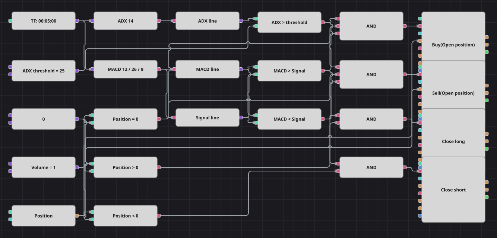

# ADX + MACD 策略图
[English](README.md) | [Русский](README_ru.md) | [Español](README_es.md) | [Deutsch](README_de.md) | [Português](README_pt.md) | [日本語](README_ja.md)

两个经典指标各司其职：MACD 与自身信号线的关系判断市场偏向哪一边，ADX 判断这段走势是否强到值得交易。入场需要两者同时满足，而离场只听 MACD，因此动能一旦反转就平仓，即使趋势强度仍然很高。

## 策略概览

- ADX 线从平均趋向指数的复合值中取出，并与单一的强度阈值比较。
- 方向来自 MACD 线相对信号线的位置，而不是交叉发生的瞬间，因此只要 MACD 停留在某一侧，随时都可能开新仓。
- 强度过滤只保护入场：离场完全依据 MACD 越到另一侧，图中没有止损和止盈。

## 入场与出场规则

- **做多入场**: ADX 高于阈值，MACD 线在信号线之上，且当前空仓。修改持仓方块以市价买入公共数量。
- **做空入场**: ADX 高于阈值，MACD 线在信号线之下，且当前空仓。修改持仓方块以市价卖出公共数量。
- **离场**: MACD 线跌破信号线时平掉多头，升破信号线时平掉空头；离场时不再检查 ADX 过滤条件。

## 参数

| 参数 | 默认值 | 说明 |
|---|---|---|
| ADX Length | 14 | 平均趋向指数的周期，同时决定方向指数及其平滑。 |
| ADX Threshold | 25 | 允许入场前 ADX 线必须超过的强度水平。 |
| Fast EMA length | 12 | MACD 内部快速 EMA 的周期。 |
| Slow EMA length | 26 | MACD 内部慢速 EMA 的周期。 |
| Signal EMA length | 9 | 在 MACD 线上计算的信号 EMA 周期。 |
| Volume | 1 | 下单数量（手）。 |
| Candles | 00:05:00 | 整张图使用的K线周期。 |

## 图表详情

- K线方块同时供给两个指标；转换方块从平均趋向指数中取出 ADX 线，从 MACD 指标中取出 MACD 线与信号线。
- 三个比较方块给出市场条件——趋势强度、MACD 高于信号线、MACD 低于信号线——另有三个把持仓与零比较。
- 入场的逻辑与方块把强度、方向和空仓合并；离场的逻辑与方块把方向与反向持仓合并。
- C# 策略在两次交易之间保持的 100 根K线暂停无法用 Designer 方块搭建，因此本图的进出场次数多于原策略。

## 使用方法

将 `.json` 文件导入 Designer，在回测器中用历史数据运行，然后根据自己的交易品种调整参数或方块，确认无误后再用于实盘。
