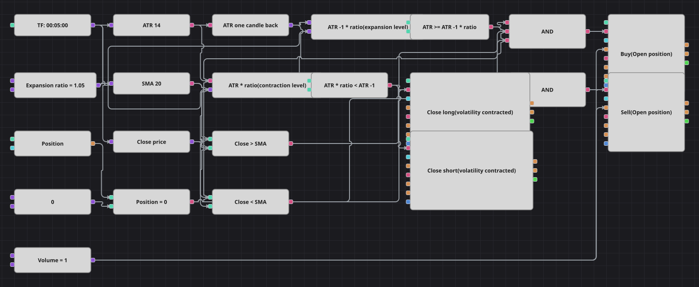

# Diagramm der Strategie zur ATR-Ausweitung
[English](README.md) | [Русский](README_ru.md) | [中文](README_zh.md) | [Español](README_es.md) | [Português](README_pt.md) | [日本語](README_ja.md)

Das Signal ist hier die Volatilität selbst. Die Average True Range wird mit ihrem eigenen Wert eine Kerze zuvor verglichen: Steigt sie mindestens um das angegebene Verhältnis, hat sich etwas in Bewegung gesetzt, und das Diagramm schließt sich dieser Bewegung in der Richtung an, die der einfache gleitende Durchschnitt vorgibt. Schrumpft die Spanne im selben Verhältnis wieder, gilt die Bewegung als beendet und die Position wird geschlossen.

## Strategieübersicht

- Die Average True Range misst die Größe der letzten Kerzen, und ein Baustein für den Vorwert hält den Stand einer Kerze zuvor bereit, damit beide verglichen werden können.
- Ausweitung heißt: ATR mindestens so groß wie die vorherige ATR mal dem Verhältnis; Verengung ist das Spiegelbild, die vorherige ATR über der ATR mal demselben Verhältnis.
- Der einfache gleitende Durchschnitt bestimmt nur die Seite: Schließt die Kerze darüber, wird aus der Ausweitung ein Long, schließt sie darunter, ein Short.
- Beide Einstiegsbausteine tragen die Eröffnungsbedingung und beide Ausstiegsbausteine die Schließbedingung, sodass das Diagramm stets nur eine Position hält und sie nie vergrößert.

## Ein- und Ausstiegsregeln

- **Long-Einstieg**: Die Volatilität weitet sich aus, die Kerze schließt über dem einfachen gleitenden Durchschnitt und die Position ist neutral. Die Order kauft das gemeinsame Volumen zum Markt.
- **Short-Einstieg**: Die Volatilität weitet sich aus, die Kerze schließt unter dem einfachen gleitenden Durchschnitt und die Position ist neutral. Die Order verkauft das gemeinsame Volumen zum Markt.
- **Ausstieg**: Die Volatilität verengt sich, das heißt die ATR mal dem Verhältnis fällt unter die vorherige ATR. Die jeweils offene Seite wird vom passenden Schließbaustein zum Markt glattgestellt; einen Stop-Loss oder Take-Profit gibt es nicht, genau wie im Original.

## Parameter

| Parameter | Standard | Beschreibung |
|---|---|---|
| ATR Period | 14 | Glättungsperiode der Average True Range, die die Volatilität misst. |
| MA Period | 20 | Periode des einfachen gleitenden Durchschnitts, der die Einstiegsrichtung bestimmt. |
| Expansion ratio | 1.05 | Um wie viel die neue ATR die vorherige übertreffen muss, damit es als Ausweitung gilt; der Kehrwert ist die Schwelle für die Verengung, die die Position schließt. |
| Volume | 1 | Ordervolumen in Lots, gemeinsam für beide Einstiegsbausteine. |
| Candles | 00:05:00 | Zeiteinheit der Kerzen, mit der das gesamte Diagramm arbeitet. |

## Diagrammdetails

- Der Kerzenbaustein speist die ATR, den gleitenden Durchschnitt und einen Konverter, der den Schlusskurs liest.
- Ein Vorwert-Baustein hält die ATR der vorangegangenen Kerze, und zwei Formelbausteine multiplizieren das Verhältnis hinein: einer baut das Ausweitungsniveau, der andere das Verengungsniveau.
- Zwei Vergleichsbausteine machen daraus ein Ausweitungs- und ein Verengungskennzeichen, zwei weitere stellen den Schlusskurs dem gleitenden Durchschnitt gegenüber.
- Jedes logische UND verbindet Volatilität, Richtung und den Vergleich der Position mit null und löst einen der beiden Einstiegsbausteine aus; das Verengungskennzeichen allein löst die beiden Schließbausteine aus, deren Richtung entscheidet, welche Seite sie schließen dürfen.
- Zwei Dinge aus dem C#-Original fehlen: die Pause von fünfhundert Kerzen nach jedem Trade, für die es keinen passenden Baustein gibt, und die Minutenkerzen, ersetzt durch die Fünf-Minuten-Kerzen der mitgelieferten Historie.
- Auch der ungenutzte Parameter Lookback des Originals entfällt, weil der Code ihn nie ausliest.

## Verwendung

Importieren Sie die `.json`-Datei in Designer, testen Sie sie im Backtester mit historischen Daten und passen Sie danach Parameter oder Bausteine an Ihr Instrument an, bevor Sie live handeln.
