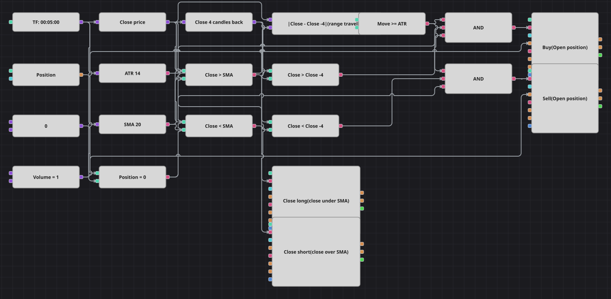

# Diagrama de la estrategia de ruptura del rango por ATR
[English](README.md) | [Русский](README_ru.md) | [中文](README_zh.md) | [Deutsch](README_de.md) | [Português](README_pt.md) | [日本語](README_ja.md)

Aquí todo lo decide un solo número: cuánto ha recorrido el cierre en las últimas velas, medido con el Average True Range. Un movimiento de al menos un ATR se considera una ruptura a la que merece la pena sumarse, y el lado es sencillamente el lado hacia el que se movió el precio. La media móvil simple no interviene en la entrada: es la salida, y la posición se abandona en cuanto el cierre vuelve a atravesarla.

## Resumen de la estrategia

- Un bloque de valor anterior guarda el cierre de cuatro velas atrás y un bloque de fórmula lo resta del cierre actual y toma el valor absoluto: esa es la distancia recorrida.
- El Average True Range es la vara de medir. Cuando la distancia lo alcanza, el mercado ha recorrido en esas cuatro velas más de lo que suele recorrer en una, y el diagrama lo llama ruptura.
- La dirección no necesita indicador: el cierre por encima del cierre anterior significa largo, por debajo, corto.
- La media móvil tiene una sola tarea, cerrar la posición: el largo termina en el primer cierre por debajo de ella y el corto en el primer cierre por encima.

## Reglas de entrada y salida

- **Entrada en largo**: La distancia recorrida en las últimas cuatro velas es de al menos un ATR, el cierre está por encima del cierre de cuatro velas atrás y la posición está plana. La orden compra a mercado el volumen compartido.
- **Entrada en corto**: La distancia recorrida en las últimas cuatro velas es de al menos un ATR, el cierre está por debajo del cierre de cuatro velas atrás y la posición está plana. La orden vende a mercado el volumen compartido.
- **Salida**: El largo se cierra en la primera vela que cierra por debajo de la media móvil simple y el corto en la primera que cierra por encima. Ambos bloques de salida llevan la condición de cierre, de modo que cada uno solo actúa sobre su lado. No hay stop de pérdidas ni toma de beneficios, igual que en la estrategia original.

## Parámetros

| Parámetro | Por defecto | Descripción |
|---|---|---|
| ATR Period | 14 | Periodo de suavizado del Average True Range que fija la anchura mínima de una ruptura. |
| MA Period | 20 | Periodo de la media móvil simple que cierra la posición. |
| Lookback shift | 4 | Cuántas velas atrás se compara el precio; el original mide sobre la ventana de observación menos una, es decir cuatro velas por defecto. |
| Volume | 1 | Volumen de la orden, en lotes, compartido por los dos bloques de entrada. |
| Candles | 00:05:00 | Marco temporal de las velas con el que trabaja todo el diagrama. |

## Detalles del diagrama

- El bloque de velas alimenta el ATR, la media móvil y un conversor que lee el precio de cierre; el bloque de valor anterior cuelga de ese conversor.
- El bloque de fórmula calcula la diferencia absoluta entre los dos cierres y una comparación la contrasta con el ATR para decidir si el movimiento es lo bastante amplio.
- Otras dos comparaciones del mismo par de cierres dan la dirección, y una comparación de la posición con una constante cero impide que las entradas se acumulen.
- Cada Y lógica reúne amplitud, dirección y posición plana y dispara un bloque de apertura; las dos comparaciones con la media móvil disparan directamente los bloques de cierre, ya que la dirección de un bloque de cierre decide por sí sola qué lado puede cerrar.
- El original en C# mide solo cada quinta vela, sobre ventanas que no se solapan, y congela el precio de referencia en la vela intermedia. Ese contador modular no tiene bloque equivalente, así que el diagrama usa una ventana deslizante y comprueba en cada vela, lo que produce más señales que el original.
- La pausa de quinientas velas que el original mantiene tras cada operación se omite por la misma razón, y el diagrama trabaja con las velas de cinco minutos del histórico que acompaña a la galería en lugar del minuto del código en C#.

## Uso

Importe el archivo `.json` en Designer, ejecútelo sobre datos históricos en el probador y después ajuste los parámetros o los propios bloques a su instrumento antes de operar en real.
