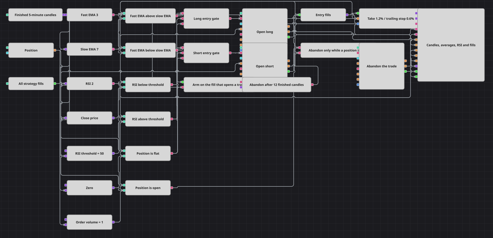

# Abandon After N Bars Strategy Diagram
[Русский](README_ru.md) | [中文](README_zh.md) | [Español](README_es.md) | [Deutsch](README_de.md) | [Português](README_pt.md) | [日本語](README_ja.md)

Two short moving averages and a two-period RSI decide when to open a trade, but the point of this diagram is the rule that ends one. A trade that has reached neither its target nor its stop within a fixed number of candles is given up and closed at market. The countdown is measured by an N values block, and it starts on the fill that actually opened the position, not on the signal that asked for it.

## Strategy Overview

- Finished five-minute candles feed a fast and a slow exponential moving average, a two-period RSI, and a converter that pulls the close price out of each candle.
- Two comparisons read the trend from the averages: fast above slow, and fast below slow. Two more read momentum against a threshold variable: RSI below it, and RSI above it.
- The Position block is compared with zero twice, once for equality and once for inequality, so the diagram has both a flat test for entries and an open test for the abandon rule.
- Each entry is a logical AND of three signals — trend, momentum and a flat position — and both entry blocks are set to open only, so the diagram holds one position at a time and never adds to it.
- Position protection watches the entry fills and manages the trade with a percentage take-profit and a trailing stop-loss that follows the price once it moves in favour of the position.
- Strategy trades reports every own fill. A Flag block, reset while the position is flat, lets through only the first fill of a trade, which is the fill that opened it.
- That single pulse arms the N values block, which then counts finished candles and emits once the count is reached.
- The abandon signal passes a second AND with the open-position test before it reaches a Position modify block set to close, so the countdown can only ever end a trade that is still running.

## Entry and Exit Rules

- **Long entry**: The fast average is above the slow one, RSI is below its threshold, and the position is flat. The combination buys weakness inside a rising short-term trend. Position modify buys the order volume at market, opening only.
- **Short entry**: The fast average is below the slow one, RSI is above its threshold, and the position is flat — strength inside a falling short-term trend. Position modify sells the order volume at market, opening only.
- **Exit**: There are two independent ways out. Position protection can close the trade first, at 1.2% profit or on a trailing stop 0.6% behind the best price reached. If neither happens, the abandon rule takes over: twelve finished candles after the opening fill, the N values block fires, the open-position test confirms there is still something to close, and a Position modify block set to close flattens whichever side is held.

## Parameters

| Parameter | Default | Description |
|---|---|---|
| Candles | 00:05:00 | Time frame of the candles the whole diagram works on; the abandon countdown is measured in these candles. |
| Fast EMA Length | 3 | Length of the fast exponential moving average. |
| Slow EMA Length | 7 | Length of the slow exponential moving average; keep it longer than the fast one or the trend test loses its meaning. |
| RSI Length | 2 | Length of the RSI. A very short length makes it swing across the threshold often, which is what produces frequent entries. |
| RSI Threshold | 50 | Level the RSI is measured against. A long buys below it and a short sells above it, so raising it makes long entries more frequent and short entries rarer. |
| Order Volume | 1 | Size of each entry order, in instrument units. |
| Take Profit, % | 1.2 | Take-profit distance, in percent of the entry price. |
| Trailing Stop, % | 0.6 | Trailing stop distance, in percent: the stop starts this far from the entry and follows the best price reached, never moving back. |
| Bars Before Abandon | 12 | How many finished candles a trade is allowed to run before it is given up and closed at market. Lower it to abandon faster; raise it to leave the exit to the take-profit and the trailing stop. |

## Diagram Details

- The countdown is started by a fill rather than by a signal, so the clock measures how long the trade has actually existed and not how long ago the diagram wanted it.
- The strategy-fills block also reports exits, which would otherwise restart the countdown on every closing fill. The Flag block prevents that: it is reset only while the position is flat, so once a trade is running its later fills are ignored.
- The open-position test on the second AND is what keeps a countdown that expires on a flat account harmless — the close block is triggered only when there is a position to close.
- Both entry blocks send their fills into a Combination, so Position protection is armed by a single input whichever side was opened, and the close price feeds the same block, giving the take-profit and the trailing stop a value to work from on every finished candle.
- The chart panel draws the candles, both averages, the RSI, the entry and abandon orders, the protective orders and every fill, so a trade that was abandoned is easy to tell apart from one that reached its target.

## Usage

Import the `.json` file into Designer, run it in the backtester on historical data, then adjust the parameters or the blocks themselves to fit your instrument before trading it live.
