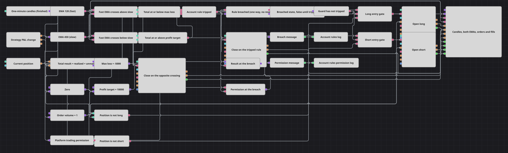

# アカウントルール・ガード戦略ダイアグラム
[English](README.md) | [Русский](README_ru.md) | [中文](README_zh.md) | [Español](README_es.md) | [Deutsch](README_de.md) | [Português](README_pt.md)

このダイアグラムは、確定した1分足で EMA(120) と EMA(450) のクロスを売買し、その通常のエントリーをアカウント単位の監視機構で包み込みます。損益変化 (P&L change)、数式、2つの比較、論理 OR、フラグ (Flag) のラッチ、そして保存されたフラグが一体となって、稼働中の合計金額結果を監視します。その結果が損失限度または利益目標に達した瞬間、監視機構はポジションを決済し、何が起きたかをログに書き出し、稼働が終わるまで以降のエントリーをすべて遮断します。

## 戦略の概要

- 確定した1分足は、短期 EMA と長期 EMA の2つのインジケーター (Indicator) ブロックに入力され、2つのクロス (Crossing) ブロックがその組を両方向で読み取ります。
- 損益変化 (P&L change) は実現損益と含み損益を同一の更新で報告し、数式 (Formula) がその2つを合算して1つの合計結果とし、損益が更新されるたびに再計算されます。
- 2つの比較 (Comparison) ブロックが合計結果を Max Loss 水準および Profit Target 水準と照合し、OR 演算子を用いた論理条件 (Logical condition) が、どちらかの答えを単一の「ルール発動」シグナルにまとめます。
- フラグ (Flag) は、そのシグナルが最初に真になった時点でラッチします。リセット入力は意図的に未接続のままなので、監視機構は稼働の残り全体にわたって一方向のスイッチとして働きます。
- フラグ型の変数 (Variable) がラッチ状態を保持し、ローソク足ごとに再出力します。これが論理 AND の動作に必要な形です。NOT 演算子を用いた論理条件が、保存された状態を、エントリーゲートが読み取る許可へと変換します。
- 各エントリーゲートは3つの条件の論理 AND です。すなわち、その方向のクロス、監視機構の許可、そして現在ポジション (Current position) とゼロとの比較から作られたポジションチェックです。
- ポジション変更 (Position modify) は、ポジション建て条件で Volume 1単位を成行で建てるため、エントリーはノーポジションの状態からのみ行われます。反対方向のクロスは2つ目のポジション変更に入力され、こちらは保有中のポジションを決済して、ドテンせずにダイアグラムをノーポジションに戻します。
- ルールが発動すると、3つ目のポジション変更がポジションを解消し、変数がその瞬間の結果をスナップショットとして取得し、文字列フォーマッター (String formatter) がそれを整形し、通知 (Notification) が、プラットフォームの取引許可を説明する2行目とともにログへ書き出します。

## エントリーとエグジットの条件

- **ロングエントリー**: 短期 EMA が長期 EMA を上抜けた確定足で、監視機構が発動しておらず、ポジションが買いでない場合、Volume 1単位を成行で買います。ポジション建て条件により、エントリーはノーポジションの状態からのみ行われます。すでにポジションを保有している間に同じシグナルが届いても、積み増しはされず、拒否されます。
- **ショートエントリー**: 短期 EMA が長期 EMA を下抜けた確定足で、監視機構が発動しておらず、ポジションが売りでない場合、Volume 1単位を成行で売ります。買い側と同様、ポジション建て条件はノーポジションの状態からのみエントリーを認めます。
- **エグジット**: 通常の決済は反対方向のクロスです。決済用のポジション変更ブロックが保有中のポジションをすべて解消するため、ダイアグラムはドテンせずにノーポジションへ戻り、新しいクロスを待ちます。緊急の決済は監視機構です。実現損益と含み損益の合計が Max Loss 水準または Profit Target 水準に達した瞬間、ポジションは成行で決済され、ラッチがセットされ、金額とプラットフォームの取引許可がログに書き出され、その稼働中は以降のエントリーが一切認められなくなります。

## パラメーター

| パラメーター | 既定値 | 説明 |
|---|---|---|
| Candles | 00:01:00 | ローソク足系列の時間軸。移動平均、ラッチ状態の再出力、数量パルス、許可の読み取りを動かすのは確定足だけです。 |
| Fast EMA Length | 120 | 短期指数移動平均の期間。 |
| Slow EMA Length | 450 | 長期指数移動平均の期間。 |
| Max Loss | -5000 | この値以下になると監視機構が発動する、実現損益と含み損益の合計(アカウントの通貨建て)。負の数で記述され、意図的に広く取ってあります。近すぎる限度を設定すると、ダイアグラムが結果を示すだけの売買を行う前に停止してしまいます。 |
| Profit Target | 10000 | この値以上になると監視機構が発動する、実現損益と含み損益の合計。到達すると、損失の場合と同じように稼働が終了します。すなわち、ポジションの決済、ラッチのセット、以降のエントリーなしです。 |
| Volume | 1 | 両方のエントリーブロックが使用する固定数量。2つの決済ブロックは保有中のポジションから数量を取るため、この値を無視します。 |

## ダイアグラムの詳細

- [損益変化 (P&L change)](https://doc.stocksharp.com/en/topics/designer/strategies/using_visual_designer/elements/common/pnl_strategy.html) は実現損益と含み損益をまとめて出力し、[数式 (Formula)](https://doc.stocksharp.com/en/topics/designer/strategies/using_visual_designer/elements/common/formula.html) `r + u` がそれらを合算して、2つの[比較 (Comparison)](https://doc.stocksharp.com/en/topics/designer/strategies/using_visual_designer/elements/common/comparison.html) ブロックが判定する値を作ります。このブロックはアカウントが実際に動くまで何も出力しないため、監視機構が最初の約定より前に発動することはありません。また、2つの限度値の変数は合計結果そのものによってトリガーされるので、各比較の両辺は常に同じ更新で到着します。
- 許可はストリーム配信ではなく保存されます。[フラグ (Flag)](https://doc.stocksharp.com/en/topics/designer/strategies/using_visual_designer/elements/common/flag.html) はセットされた瞬間にしか出力せず、これは論理 AND では利用できません。AND はすべての入力に値が届くのを待ち、発火すると入力をクリアするからです。そのためラッチ状態は、既定値が false で、Trigger 入力がローソク足のストリームであるフラグ型の[変数 (Variable)](https://doc.stocksharp.com/en/topics/designer/strategies/using_visual_designer/elements/data_sources/variable.html) に保持されます。ローソク足ごとに現在の状態を再出力し、NOT 演算子を用いた[論理条件 (Logical condition)](https://doc.stocksharp.com/en/topics/designer/strategies/using_visual_designer/elements/common/logical_condition.html) がそれをエントリー許可に変換します。
- 発動シグナルに OR 演算子を使うのは意図的な選択です。AND とは異なり、すべての入力に値が届くのを待たないため、どちらか一方の限度だけでもシグナルを立てられます。また、動きのない更新のたびに false の答えも出力しますが、これは後段で何のコストにもなりません。フラグは false のトリガーを無視し、スナップショット用の変数も無視し、[ポジション変更 (Position modify)](https://doc.stocksharp.com/en/topics/designer/strategies/using_visual_designer/elements/positions/modify.html) は false では動作しないため、否定的な答えによって注文が送られることはありません。
- 決済用のブロックはポジション決済条件を使用し、数量の入力を一切必要としません。数量は保有中のポジションから取られます。エントリー用のブロックは自身の Volume を保持し、ゼロと比較された[現在ポジション (Current position)](https://doc.stocksharp.com/en/topics/designer/strategies/using_visual_designer/elements/positions/current.html) が、エントリー規則が示すとおりの「買いでない」「売りでない」というチェックを各ゲートに与えます。
- [取引許可判定 (Is trade allowed)](https://doc.stocksharp.com/en/topics/designer/strategies/using_visual_designer/elements/time/trade_allow.html) はローソク足ごとにプラットフォーム自身の許可を読み取りますが、意図的にエントリーゲートには組み込んでいません。記録済みのヒストリーでは稼働中ずっと「不許可」と答えるため、これを土台にしたゲートは決して開かず、ダイアグラムはまったく売買しなくなるからです。その答えは変数に取り込まれ、[文字列フォーマッター (String formatter)](https://doc.stocksharp.com/en/topics/designer/strategies/using_visual_designer/elements/notifying/string_format.html) によって整形されて[通知 (Notification)](https://doc.stocksharp.com/en/topics/designer/strategies/using_visual_designer/elements/notifying/notification.html) の2行目になります。そこがふさわしい置き場所です。ダイアグラムを黙らせるのではなく、ルールが発動した瞬間のプラットフォームの状態を説明するからです。通知はログ種別に設定されており、これはヒストリーの再生中に配信される唯一の種別です。

## 使い方

`.json` ファイルを Designer に読み込み、バックテスターで過去データを使って実行し、実運用の前にパラメーターやブロック自体を自分の銘柄に合わせて調整してください。
