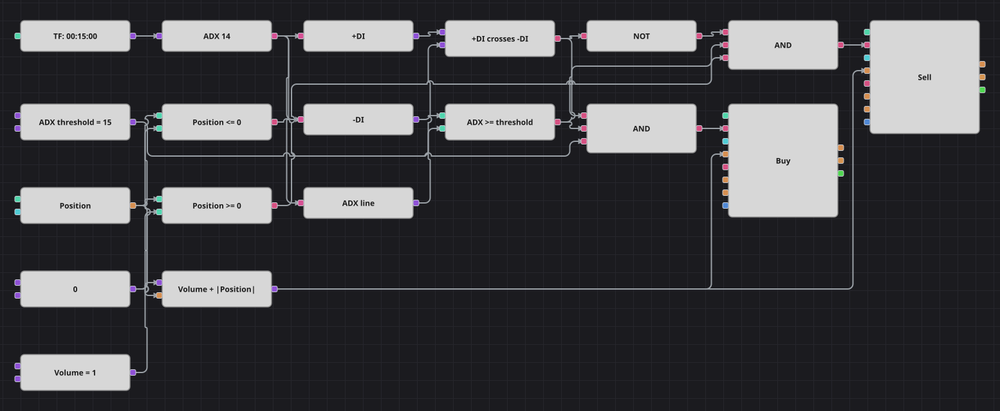

# ADX と DI クロス戦略のダイアグラム
[English](README.md) | [Русский](README_ru.md) | [中文](README_zh.md) | [Español](README_es.md) | [Deutsch](README_de.md) | [Português](README_pt.md)

ウェルズ・ワイルダーの方向性指標システムを1枚のダイアグラムにまとめました。Average Directional Index ブロックは +DI、-DI、そして ADX 本体という3つの値を同時に出力します。方向線のクロスが売買の向きを決め、ADX の水準が「そもそも仕掛けるだけのトレンドがあるか」を判断します。

## 戦略の概要

- 1つの AverageDirectionalIndex ブロックが3つのコンバーターに値を渡し、同じ複合指標値から +DI、-DI、ADX を取り出します。
- クロスブロックは +DI と -DI を比較し、2本の線が実際に入れ替わった足でのみ発火します。
- ADX がしきい値以上であることを求めるため、方向感のないもみ合いは除外されます。
- 数式ブロックが基準数量にポジションの絶対値を加えるので、1本の成行注文で手仕舞いと新規建てを同時に行えます。

## エントリーとエグジットの条件

- **ロングエントリー**: +DI が -DI を上抜き、ADX がしきい値以上で、かつ買い持ちでないとき。注文は基準数量に売り建玉の大きさを足して買い、売り持ちならドテン、ノーポジションなら新規の買いになります。
- **ショートエントリー**: +DI が -DI を下抜き、ADX がしきい値以上で、かつ売り持ちでないとき。注文は基準数量に買い建玉の大きさを足して売り、買い持ちならドテン、ノーポジションなら新規の売りになります。
- **エグジット**: 専用のエグジットブロックはありません。ポジションは DI 線が逆方向にクロスするまで保有され、ドテン注文が手仕舞いと反対建てを同時に行います。

## パラメーター

| パラメーター | 既定値 | 説明 |
|---|---|---|
| ADX Period | 14 | ADX と +DI/-DI が共有する平滑化期間。 |
| ADX Threshold | 15 | 取引に値するトレンドとみなす ADX の下限値。 |
| Volume | 1 | 基準の注文数量（ロット）。実際の発注量にはポジションの大きさが加算されます。 |
| Candles | 00:15:00 | ダイアグラム全体が用いるローソク足の時間軸。 |

## ダイアグラムの詳細

- ローソク足ブロックが指標ブロックに値を渡し、3つのコンバーターが Dx.Plus、Dx.Minus、MovingAverage を取り出します。
- クロスブロックは +DI が上抜けたとき true、下抜けたとき false を出すため、論理否定を通すだけで売りシグナルになります。
- 1つの比較ブロックが ADX としきい値の定数を比べ、もう2つがポジションとゼロを売買それぞれについて比べます。
- 各論理積がクロス、トレンドフィルター、ポジション判定を結び、数式ブロックから数量を受け取るポジション変更ブロックを起動します。

## 使い方

`.json` ファイルを Designer に読み込み、バックテスターで過去データを使って実行し、実運用の前にパラメーターやブロック自体を自分の銘柄に合わせて調整してください。
