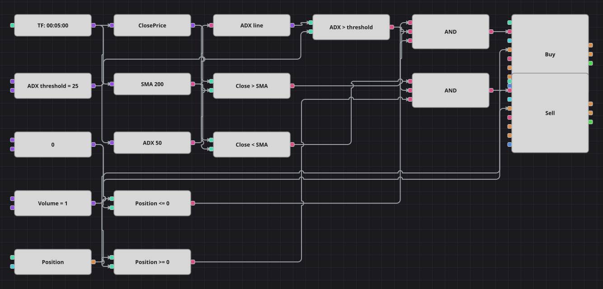

# Diagrama da estratégia de cruzamento de média com filtro ADX
[English](README.md) | [Русский](README_ru.md) | [中文](README_zh.md) | [Español](README_es.md) | [Deutsch](README_de.md) | [日本語](README_ja.md)

O diagrama negocia o candle que pisa uma média móvel simples longa, mas apenas enquanto o ADX confirma que o mercado está mesmo em tendência. Um candle conta como cruzamento quando abre de um lado da média e fecha do outro; a posição é então virada para o lado do fechamento. O original roda em candles de um minuto; este diagrama usa os candles de cinco minutos do histórico incluído.

## Visão geral da estratégia

- A SMA de 200 é a linha de referência e um bloco de valor anterior guarda o valor de um candle atrás, de modo que a abertura é medida contra a média do próprio candle e o fechamento contra a atual.
- O OU exclusivo dessas duas comparações é verdadeiro exatamente nos candles que atravessam a média — é assim que o código original define o cruzamento, e não como o cruzamento de duas linhas de indicadores.
- O ADX de comprimento cinquenta filtra cada entrada: um candle que cruza a média em mercado parado é ignorado.
- Não há stop nem alvo — a posição só é virada pelo cruzamento contrário, e o volume da ordem é o volume compartilhado mais o que já está em carteira.

## Regras de entrada e saída

- **Entrada comprada**: O ADX está acima do limiar, o candle cruzou a média, o fechamento está acima da SMA atual e a posição não está comprada. A ordem compra o volume compartilhado mais o tamanho da venda aberta, então uma única ordem fecha a venda e abre a compra.
- **Entrada vendida**: O ADX está acima do limiar, o candle cruzou a média, o fechamento está na SMA atual ou abaixo dela e a posição não está vendida. A ordem vende o volume compartilhado mais o tamanho da compra aberta.
- **Saída**: Não existe saída própria: a posição é mantida até que o cruzamento contrário a inverta, exatamente como no código original, que não implementa stop loss nem take profit.

## Parâmetros

| Parâmetro | Padrão | Descrição |
|---|---|---|
| ADX Length | 50 | Período de suavização do índice direcional médio. |
| ADX Threshold | 25 | Valor de ADX que o mercado precisa superar para liberar uma entrada. |
| SMA Length | 200 | Período da média móvel simples contra a qual os candles são medidos. |
| Volume | 1 | Volume da ordem, em lotes, antes de somar a posição aberta. |
| Candles | 00:05:00 | Tempo gráfico dos candles com que todo o diagrama trabalha. |

## Detalhes do diagrama

- Dois conversores leem a abertura e o fechamento de cada candle finalizado, enquanto a média móvel e o ADX são calculados sobre o próprio candle.
- Um bloco de valor anterior atrasa a SMA em um candle; as duas comparações que usam o valor antigo e o atual são unidas por um OU exclusivo, que é o teste de cruzamento.
- Um NÃO lógico transforma a condição «fechamento acima da média» na condição do lado vendido, de forma que uma comparação serve às duas direções.
- Um bloco de fórmula soma o módulo da posição ao volume compartilhado, permitindo que uma ordem a mercado feche o lado antigo e abra o novo de uma só vez.

## Uso

Importe o arquivo `.json` no Designer, execute-o sobre dados históricos no backtester e depois ajuste os parâmetros ou os próprios blocos ao seu instrumento antes de operar ao vivo.
