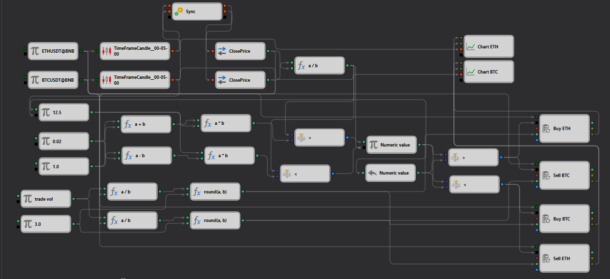
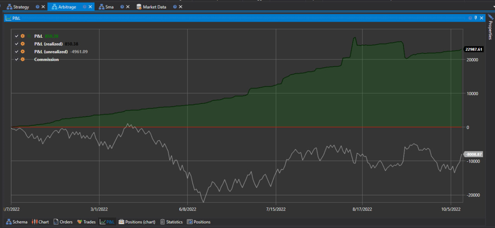

# Pair Trading Strategy on BTC and ETH

## Overview

The Pair Trading Strategy on BTC and ETH is designed for trading two popular cryptocurrencies—Bitcoin (BTC) and Ethereum (ETH). This cryptocurrency arbitrage strategy is based on identifying arbitrage opportunities between these two assets, allowing traders to capitalize on moments when the price difference between BTC and ETH reaches a certain threshold.

The strategy implements mechanisms for buying one cryptocurrency while simultaneously selling another, aiming to profit from temporary discrepancies in their values. This makes the strategy appealing for those looking for earning opportunities from minimal market fluctuations without being tied to the general market trend.

## Installation

To activate and use this strategy, StockSharp Designer must be installed. The strategy is available for download and installation from the [strategy gallery](https://doc.stocksharp.com/topics/designer/strategy_gallery.html). This allows for easy integration and customization of the strategy according to individual trader requirements.

## Parameters

- **Asset 1**: ETHUSDT@BNB
- **Asset 2**: BTCUSDT@BNB
- **Threshold**: 0.02 (absolute)
- **Trade Volume**: 5000 (absolute)
- **Slippage**: 1.0 (absolute)
- **Max Orders**: 3 (absolute)

## How It Works

1. **Price Data Collection**: The strategy collects price data for BTC and ETH from the Binance exchange.
2. **Price Calculation**: It calculates the price ratio between BTC and ETH.
3. **Signal Generation**: When the price ratio exceeds the defined threshold, the strategy generates buy and sell signals.
4. **Order Execution**: The strategy executes market orders to buy the undervalued asset and sell the overvalued asset.
5. **Profit Calculation**: It calculates the profit based on the executed trades and monitors the market for further opportunities.

## Testing

It is important to test the strategy on historical data to assess its effectiveness and potential risks before applying it on the real market. This will help determine optimal parameters for the threshold of price discrepancies and capital management.

## Additional Resources

For more information and resources, visit the [StockSharp documentation](https://doc.stocksharp.com/).
