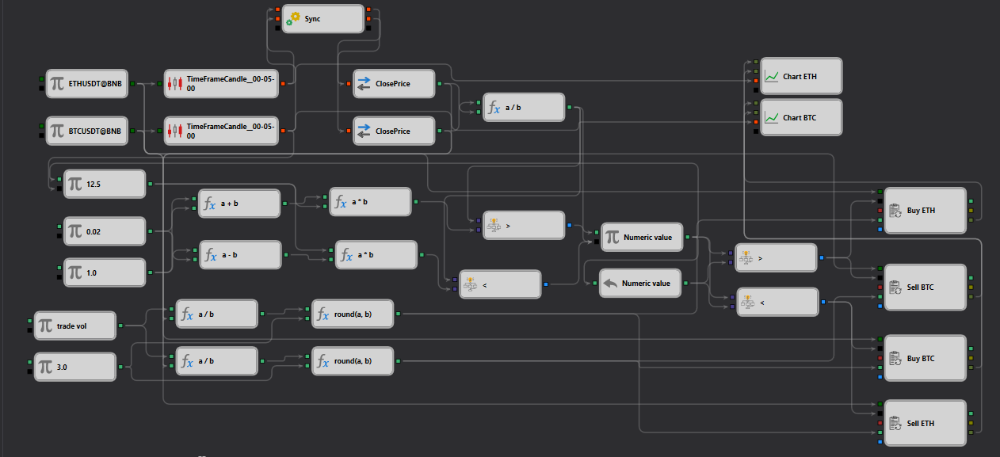
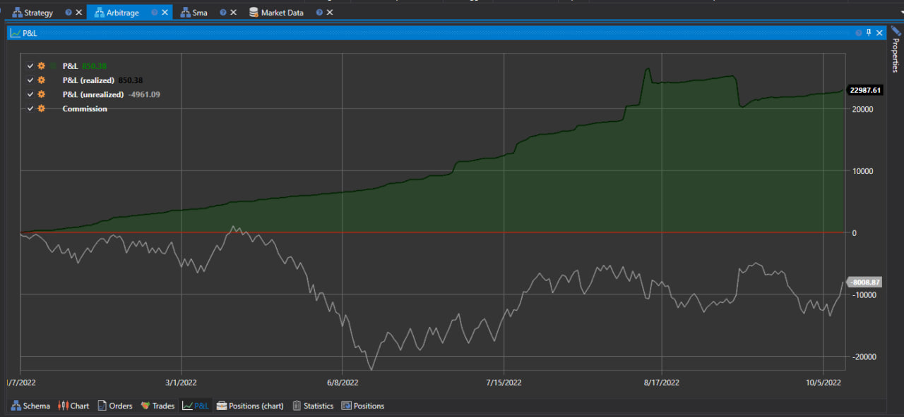

# Estrategia de Trading por Pares en BTC y ETH
[English](README.md) | [Русский](README_ru.md) | [中文](README_zh.md) | [Deutsch](README_de.md) | [Português](README_pt.md) | [日本語](README_ja.md)

## Descripción general

La Estrategia de Trading por Pares en BTC y ETH está diseñada para operar con dos criptomonedas populares: Bitcoin (BTC) y Ethereum (ETH). Esta estrategia de arbitraje de criptomonedas se basa en identificar oportunidades de arbitraje entre estos dos activos, permitiendo a los traders capitalizar los momentos en que la diferencia de precio entre BTC y ETH alcanza un determinado umbral.

La estrategia implementa mecanismos para comprar una criptomoneda mientras simultáneamente se vende la otra, con el objetivo de obtener beneficios de las discrepancias temporales en sus valores. Esto hace que la estrategia sea atractiva para aquellos que buscan oportunidades de ganancia con fluctuaciones mínimas del mercado sin depender de la tendencia general del mercado.

## Instalación

Para activar y usar esta estrategia, es necesario instalar StockSharp Designer. La estrategia está disponible para descargar e instalar desde la [galería de estrategias](https://doc.stocksharp.com/topics/designer/strategy_gallery.html). Esto permite una fácil integración y personalización de la estrategia según los requisitos individuales del trader.

## Parámetros

- **Activo 1**: ETHUSDT@BNB
- **Activo 2**: BTCUSDT@BNB
- **Umbral**: 0.02 (absoluto)
- **Volumen de Trading**: 5000 (absoluto)
- **Deslizamiento**: 1.0 (absoluto)
- **Órdenes Máximas**: 3 (absoluto)

## Cómo funciona

1. **Recopilación de datos de precio**: La estrategia recopila datos de precio de BTC y ETH del exchange Binance.
2. **Cálculo de precio**: Calcula la relación de precios entre BTC y ETH.
3. **Generación de señales**: Cuando la relación de precios supera el umbral definido, la estrategia genera señales de compra y venta.
4. **Ejecución de órdenes**: La estrategia ejecuta órdenes de mercado para comprar el activo infravalorado y vender el activo sobrevalorado.
5. **Cálculo de ganancias**: Calcula el beneficio basado en las operaciones ejecutadas y monitorea el mercado en busca de más oportunidades.

## Pruebas

Es importante probar la estrategia con datos históricos para evaluar su efectividad y los riesgos potenciales antes de aplicarla en el mercado real. Esto ayudará a determinar los parámetros óptimos para el umbral de discrepancias de precios y la gestión del capital.

## Recursos adicionales

Para más información y recursos, visite la [documentación de StockSharp](https://doc.stocksharp.com/).
