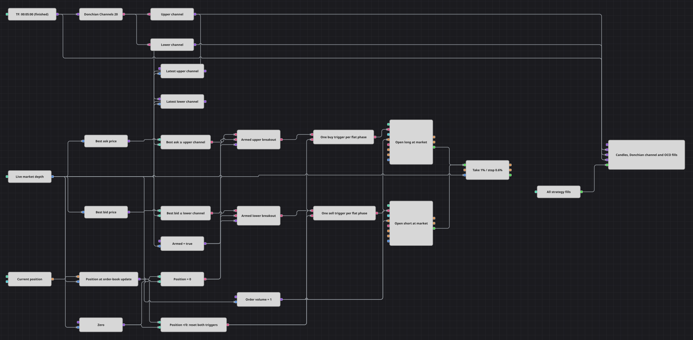

# Diagrama da estratégia OCO com gatilhos de preço armados
[English](README.md) | [Русский](README_ru.md) | [中文](README_zh.md) | [Español](README_es.md) | [Deutsch](README_de.md) | [日本語](README_ja.md)

Este diagrama mantém dois gatilhos virtuais de rompimento ao redor de um canal de Donchian calculado com candles concluídos de cinco minutos. O melhor preço de venda e o melhor preço de compra do livro ao vivo são comparados aos limites mais recentes do canal; o primeiro lado elegível abre uma posição a mercado, depois administrada por proteção percentual de lucro e perda.

## Visão geral da estratégia

- Candles concluídos de cinco minutos alimentam Donchian Channels(20), que produz os limites superior e inferior do rompimento.
- Cada atualização da profundidade de mercado amostra os últimos valores formados do canal e lê `BestAsk.Price` e `BestBid.Price` do livro de ofertas.
- Um rompimento superior pode comprar e um rompimento inferior pode vender somente enquanto `Armed` estiver ativado e a posição estiver zerada.
- Um bloco Flag libera o primeiro pulso válido de cada lado e suprime repetições até que uma mudança de posição redefina as duas portas de uso único.
- A proteção de posição encerra a entrada executada com lucro de 1% ou perda de 0,6%, enquanto o gráfico mostra candles, os dois limites do canal e todas as execuções.

## Regras de entrada e saída

- **Entrada comprada**: Quando `Armed` é true, a posição está zerada e o melhor ask é maior ou igual ao limite superior mais recente de Donchian, é enviada uma compra a mercado com `Volume`.
- **Entrada vendida**: Quando `Armed` é true, a posição está zerada e o melhor bid é menor ou igual ao limite inferior mais recente de Donchian, é enviada uma venda a mercado com `Volume`.
- **Saída**: A posição aberta é encerrada quando o livro ao vivo atinge o alvo de lucro de 1% ou o limite de perda de 0,6%, medidos a partir da execução da entrada.

## Parâmetros

| Parâmetro | Padrão | Descrição |
|---|---|---|
| Channel Length | 20 | Número de candles concluídos usados por Donchian Channels. |
| Armed | true | Chave geral que habilita as duas rotas de entrada por rompimento. |
| Take Profit, % | 1 | Distância percentual entre a execução da entrada e o alvo de lucro. |
| Stop Loss, % | 0.6 | Distância percentual entre a execução da entrada e o limite de perda. |
| Volume | 1 | Volume da ordem a mercado usado em qualquer direção de entrada. |
| Candles | 00:05:00 | Período dos candles concluídos usados para calcular o canal. |

## Detalhes do diagrama

- Os conversores UpperBand e LowerBand extraem os dois limites de Donchian. Dois blocos Variable os armazenam e emitem seus valores mais recentes no contexto causal de cada atualização da profundidade.
- Antes de Donchian Channels(20) estar formado, as variáveis de limite não têm valor armazenado e as comparações de entrada permanecem inativas.
- Os caminhos `BestAsk.Price` e `BestBid.Price` dos conversores do livro fornecem os preços ao vivo usados nas duas comparações.
- Cada porta de entrada combina três valores booleanos: a comparação de preço correspondente, `position = 0` e o parâmetro exposto `Armed`.
- Os dois blocos Flag implementam um comportamento OCO virtual de uso único sem deixar ordens pendentes na bolsa. Depois que um lado é executado, a posição diferente de zero bloqueia ambas as entradas até ser encerrada pela proteção.
- Os dois blocos Modify position usam ordens a mercado. Suas execuções de entrada alimentam diretamente Position protection, e a profundidade de mercado fornece os preços para avaliar os níveis de saída.

## Uso

Importe o arquivo `.json` no Designer, execute-o sobre dados históricos no backtester e depois ajuste os parâmetros ou os próprios blocos ao seu instrumento antes de operar ao vivo.
