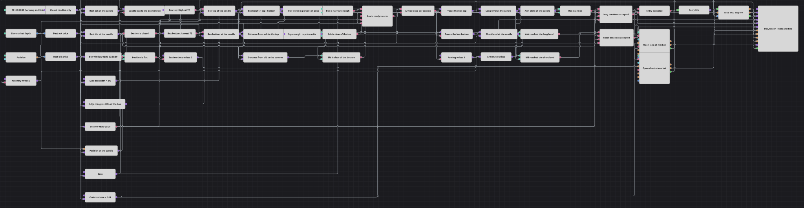

# Diagrama de la estrategia Armed Session Box
[English](README.md) | [Русский](README_ru.md) | [中文](README_zh.md) | [Deutsch](README_de.md) | [Português](README_pt.md) | [日本語](README_ja.md)

Una noche tranquila suele terminar en algún punto. Este diagrama mide el rango que el mercado mantuvo entre dos horas nocturnas, espera a que abra la sesión de negociación y se arma una sola vez, congelando el techo y el suelo de esa caja como los dos precios que va a operar. A partir de ahí vigila las mejores cotizaciones del libro de órdenes y compra o vende en cuanto se alcanza uno de los niveles congelados.

## Resumen de la estrategia

- Se suscriben velas de cinco minutos con actualizaciones intermedias, y un bloque Final value deja pasar solo las velas cerradas; cada decisión del diagrama se toma sobre una barra terminada.
- Un bloque Working time marca la ventana de medición y una Variable de tipo vela se dispara con esa señal, de modo que solo las velas que caen dentro de la ventana nocturna llegan a los indicadores: la caja se construye a partir de esa ventana y de nada más.
- Highest y Lowest sobre el flujo filtrado son el techo y el suelo de la caja, y dos variables conservan las últimas lecturas para que el resto del diagrama pueda mirar la caja en cualquier vela, horas después de haber sido medida.
- Market depth se lee para el mejor ask y el mejor bid, y otras dos variables retienen esas cotizaciones al ritmo de la vela: el libro se actualiza cientos de veces por barra y nunca coincidiría con una condición construida sobre velas.
- Las fórmulas convierten la caja en su anchura como porcentaje del precio y en un margen de borde medido sobre esa anchura, de modo que los mismos dos ajustes significan lo mismo en un instrumento cotizado en decenas de miles y en otro cotizado en unidades.
- Un segundo bloque Working time abre la sesión de negociación, y una condición lógica reúne cuatro respuestas: la caja es estrecha, el ask está despejado del techo, el bid está despejado del suelo y la posición está plana.
- El Flag convierte esa condición en un único evento de armado por sesión y congela ambos niveles; la caja que hay detrás puede volver a dibujarse la noche siguiente, pero los niveles armados no se moverán.
- Las entradas son órdenes a mercado desde posición plana cuando una cotización retenida alcanza su nivel congelado, y Position protection se hace cargo de la operación a partir de ahí.

## Reglas de entrada y salida

- **Entrada en largo**: Dentro de la sesión, con la caja armada y la posición plana, el mejor ask retenido en la vela alcanza el nivel superior congelado. Position modify compra el volumen de la orden a mercado.
- **Entrada en corto**: Dentro de la misma sesión y bajo las mismas condiciones de armado y posición plana, el mejor bid retenido en la vela cae hasta el nivel inferior congelado. Position modify vende el volumen de la orden a mercado.
- **Salida**: No hay señal de salida en el diagrama. Position protection se hace cargo de la operación en cuanto está abierta y la cierra con un take-profit o un stop-loss del uno por ciento respecto al precio de entrada, leyendo el precio actual del libro de órdenes y no de una vela. Una entrada aceptada también devuelve el estado de armado a cero, de modo que una sesión da una operación y el siguiente armado espera al día siguiente.

## Parámetros

| Parámetro | Por defecto | Descripción |
|---|---|---|
| Candles | 00:05:00 | Marco temporal de la serie de velas sobre la que funciona todo el diagrama. |
| Box From | 02:00:00 | Inicio de la ventana en la que se mide la caja. |
| Box Until | 07:59:59 | Fin de la ventana de medición; la última vela que abre antes de ese momento todavía cuenta. |
| Box Top Length | 72 | Sobre cuántas velas de la ventana de medición se toma el techo de la caja. |
| Box Bottom Length | 72 | Sobre cuántas velas de la ventana de medición se toma el suelo de la caja. |
| Max Box Width, % | 3 | Caja más ancha, en porcentaje del precio, que todavía se considera lo bastante tranquila para operar. |
| Edge Margin, % | 20 | A qué distancia de un borde tiene que situarse el precio en el momento del armado, en porcentaje de la altura de la caja. |
| Session From | 08:00:00 | Inicio de la sesión en la que se permiten el armado y las entradas. |
| Session Until | 20:00:00 | Fin de la sesión; después de él se libera el flag y se borra el estado de armado. |
| Order Volume | 0.01 | Tamaño de orden que envían ambas entradas. |
| Take Profit, % | 1 | Distancia del take-profit, en porcentaje del precio de entrada. |
| Stop Loss, % | 1 | Distancia del stop-loss, en porcentaje del precio de entrada. |

## Detalles del diagrama

- La caja es un Highest y un Lowest móviles de la longitud configurada sobre las velas que cayeron dentro de la ventana de medición, no un rango reconstruido desde cero cada noche. Al principio de la ventana todavía queda en el búfer la cola de la noche anterior; al final de la ventana las lecturas son exactamente las de la noche recién medida, que es cuando se utilizan.
- El estado de armado se guarda como un número, no como la salida del Flag. El Flag emite su único valor verdadero y después permanece en silencio, así que lo que las condiciones de entrada pueden leer en cada vela es una variable que se pone a uno al armar, a cero cuando se cierra la sesión y a cero después de una entrada.
- Cada valor que entra en una comparación o en una condición lógica se vuelve a emitir en cada vela cerrada a través de una variable de retención. Una comparación solo se dispara cuando ambos lados han llegado desde la última vez que se disparó, así que un nivel capturado una vez al día tiene que volver a entregarse barra a barra.
- El armado se comprueba en cada vela de la sesión, no solo en su primer minuto: el primer momento en que el precio se sitúa holgadamente dentro de una caja estrecha es el momento en que los niveles se congelan. Por eso el armado y la primera entrada posible están siempre separados al menos por una vela.
- Las entradas son órdenes a mercado al tocar un nivel, y la salida protectora es un porcentaje del precio de entrada y no el borde opuesto de la caja, de modo que ambos lados de la operación se expresan en las mismas unidades y sobreviven a un cambio de instrumento.

## Uso

Importe el archivo `.json` en Designer, ejecútelo sobre datos históricos en el probador y después ajuste los parámetros o los propios bloques a su instrumento antes de operar en real.
