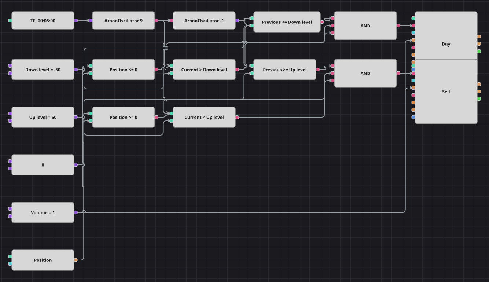

# Diagrama de la estrategia de cambio de signo del Aroon Oscillator
[English](README.md) | [Русский](README_ru.md) | [中文](README_zh.md) | [Deutsch](README_de.md) | [Português](README_pt.md) | [日本語](README_ja.md)

El Aroon Oscillator pregunta qué es más reciente, el máximo más alto o el mínimo más bajo de las últimas velas, y responde con un número entre -100 y +100. Este diagrama no opera el extremo en sí, sino el momento en que el mercado lo abandona: una lectura que vuelve por encima del nivel inferior compra, y una que cae por debajo del nivel superior vende. La estrategia original trabaja con velas de cuatro horas; el diagrama usa velas de cinco minutos para que el mes de historial incluido tenga barras suficientes para operar.

## Resumen de la estrategia

- AroonOscillator se calcula sobre velas cerradas de un solo instrumento y oscila entre -100 y +100.
- Un bloque de valor anterior guarda la lectura de la vela previa, de modo que un cruce real del nivel se distingue de una barra que simplemente se mantiene por encima.
- Los dos lados son asimétricos a propósito: se compra cuando se agota un sesgo bajista fuerte y se vende cuando se agota uno alcista fuerte.
- La posición actual participa en ambas decisiones, así que ninguna orden aumenta una posición ya abierta.

## Reglas de entrada y salida

- **Entrada en largo**: La lectura anterior del AroonOscillator estaba en el nivel inferior o por debajo, la actual está por encima y la posición no es larga. La orden compra un lote: abre un largo desde plano o cierra un corto existente.
- **Entrada en corto**: La lectura anterior del AroonOscillator estaba en el nivel superior o por encima, la actual está por debajo y la posición no es corta. La orden vende un lote: abre un corto desde plano o cierra un largo existente.
- **Salida**: No hay bloque de salida ni stop de protección, igual que en la estrategia original: la señal contraria deja la posición en cero, porque todas las órdenes usan el mismo volumen.

## Parámetros

| Parámetro | Por defecto | Descripción |
|---|---|---|
| Aroon Length | 9 | Número de velas que el Aroon Oscillator mira hacia atrás. |
| Down Level | -50 | Nivel inferior; cruzarlo hacia arriba es la señal de compra. |
| Up Level | 50 | Nivel superior; cruzarlo hacia abajo es la señal de venta. |
| Volume | 1 | Volumen de la orden, en lotes. |
| Candles | 00:05:00 | Marco temporal de las velas de todo el diagrama; el original usaba cuatro horas. |

## Detalles del diagrama

- El bloque de velas alimenta el bloque de indicador con AroonOscillator, y el bloque de valor anterior toma esa misma salida una vela atrás.
- Cuatro bloques de comparación construyen los dos cruces: la lectura anterior frente a un nivel y la actual frente al mismo nivel.
- Otros dos bloques comparan la posición con una constante cero, y cada Y lógica reúne tres condiciones en una señal.
- Ambos bloques de modificación de posición envían órdenes a mercado y toman el volumen de una única constante compartida.

## Uso

Importe el archivo `.json` en Designer, ejecútelo sobre datos históricos en el probador y después ajuste los parámetros o los propios bloques a su instrumento antes de operar en real.
