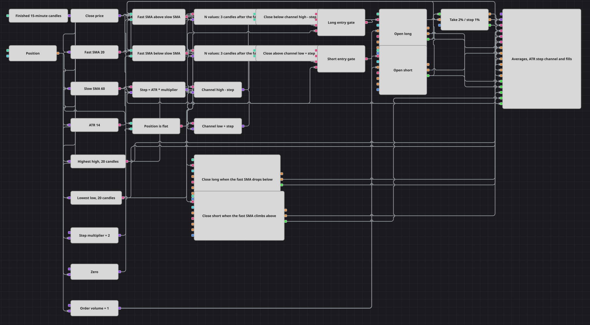

# ATR Step Streak Strategy Diagram
[Русский](README_ru.md) | [中文](README_zh.md) | [Español](README_es.md) | [Deutsch](README_de.md) | [Português](README_pt.md) | [日本語](README_ja.md)

Two moving averages decide the direction, but nothing is bought at the moment they change places. The diagram waits a fixed number of finished candles after that moment and only then asks whether the trade is still worth taking. The waiting is done by an N values block, which is armed by the comparison of the two averages and speaks once the candles it was told to count have gone by. A second condition measures how much room is left to the edge of the recent range, and it is measured in volatility rather than in price: the close has to be at least one ATR step away from the highest high before a purchase, and the same step above the lowest low before a sale.

## Strategy Overview

- Finished fifteen-minute candles feed a converter that pulls out the close price and five indicators: a fast and a slow simple moving average, an ATR, and the highest high and lowest low of the recent channel.
- Two Comparison blocks read the averages against each other and report on every candle: one is true while the fast average is above the slow one, the other while it is below.
- Each comparison arms its own N values block. The block takes the candle stream on its input, counts the finished candles that follow the arming signal, releases a single pulse when the count runs out, and arms itself again on the next true comparison, so the entry side of the diagram runs on a slower clock than the market data.
- A Formula multiplies the ATR by the step multiplier, and two more Formulas turn that step into a pair of guard levels: the highest high minus the step, and the lowest low plus the step.
- Two further comparisons ask whether the close is still below the upper guard, or still above the lower one — that is, whether the price has moved so far into the channel that there is no room left for the trade.
- A Position block is measured against a zero variable, so the entry side knows whether the account is flat.
- Each side gathers four conditions in a Logical condition set to And: the pulse from N values, the average comparison checked again at that instant, the room to the channel edge, and the flat position. Only when all four arrive together does the gate speak.
- Modify position opens the trade at market with the volume taken from a variable, two more Modify position blocks close it on the opposite comparison, Position protection is armed by every entry fill, and the chart panel draws the candles, both averages, both channel extremes, all orders and all fills.

## Entry and Exit Rules

- **Long entry**: The fast average is above the slow one, the N values block for that side releases its pulse on this candle, the close is at least one ATR step below the highest high of the channel, and the position is flat. All four meet in the long And, and Modify position buys the order volume at market. The block is set to open only, so nothing is bought while a position of any side is already held.
- **Short entry**: The mirror image: the fast average is below the slow one, the bearish N values block releases its pulse, the close is at least one ATR step above the lowest low of the channel, and the position is flat. The short And passes the signal to a Modify position block that sells the order volume at market, again opening only.
- **Exit**: There are two ways out. The averages changing places is the first: the comparison that is true after the change drives a close block for the side that is held, and that block sends the whole position at market. Position protection is the second — armed by every entry fill, it takes profit at 2% and stops the loss at 1%, measured against the close price of finished candles that is fed into its price input. Because both entry blocks open only, the comparison that ends a trade never opens the opposite one; the next entry has to wait for the next pulse that finds the account flat.

## Parameters

| Parameter | Default | Description |
|---|---|---|
| Candles | 00:15:00 | Time frame of the candles the whole diagram works on. Every count in the diagram — the averages, the ATR, the channel, the waiting period — is measured in these candles. |
| Fast SMA Length | 20 | Length of the fast average. Shorten it and the two averages change places more often, which arms the waiting block more often and produces more entries. |
| Slow SMA Length | 60 | Length of the slow average. The gap between this and the fast length decides how long a trend has to last before it is recognised at all. |
| Bull Streak Bars | 3 | How many finished candles the long-side N values block counts between the moment the averages line up and the pulse it releases. One makes the diagram enter on the candle after the crossing; a large value delays the entry deep into the move and, because the block re-arms after every pulse, also spaces the entries further apart. |
| Bear Streak Bars | 3 | The same wait on the short side. Keep it equal to the long one unless the two directions are meant to be confirmed over different lengths of time. |
| ATR Length | 14 | Window of the ATR that measures volatility. It sets the unit in which the distance to the channel edge is expressed. |
| Step Multiplier | 2 | How many ATRs of room the price must have left to the channel edge. Raise it and entries are only taken well away from the extreme, which is rarer; lower it towards zero and the condition all but disappears, leaving the delayed trend signal on its own. |
| Channel High Length | 20 | How many candles the highest high is taken over. It is the ceiling a long entry has to stay under by the step distance. |
| Channel Low Length | 20 | How many candles the lowest low is taken over. It is the floor a short entry has to stay above by the step distance. Keep it equal to the high window unless an asymmetric channel is what you are after. |
| Order Volume | 1 | Volume sent by both entry blocks. The closing blocks take no volume: they send whatever the position holds. |
| Take Profit, % | 2 | Profit target of the protective block, as a percentage of the fill price. |
| Stop Loss, % | 1 | Loss limit of the protective block, as a percentage of the fill price. Together with the target it decides how many trades end on protection rather than on the averages changing places. |

## Diagram Details

- The N values block is a delay, not a counter of consecutive bars: it is armed by the first true comparison it sees, counts the finished candles that follow, and speaks once. It does not check that the condition held for the whole window, which is why the same comparison is asked again inside the And at the moment the pulse arrives — a trend that fell apart during the wait fails that second question and no order is sent.
- A Logical condition clears its inputs as soon as it has spoken, so the entry gate can only be judged on the candles that carry a pulse. Between two pulses the comparisons keep refreshing, but nothing reaches the entry blocks, and that is what keeps a diagram whose conditions are true for hours from trading on every candle.
- The guard levels are drawn with the same ATR that measures volatility, so the distance the price has to keep from the channel edge grows when the market moves faster and shrinks when it quiets down. Both channel indicators include the candle being judged, so the level moves with the extremes rather than lagging behind them.
- The constants of the diagram — zero, the order volume and the step multiplier — are all triggered by the candle stream, so their values land on the same tick as the indicator values they are compared and multiplied with.
- The close blocks are wired straight to the average comparisons, so they are triggered on every candle on which the averages hold that order. Their closing condition does the filtering: when there is no position on that side the block does nothing at all, and no order leaves the diagram.

## Usage

Import the `.json` file into Designer, run it in the backtester on historical data, then adjust the parameters or the blocks themselves to fit your instrument before trading it live.
