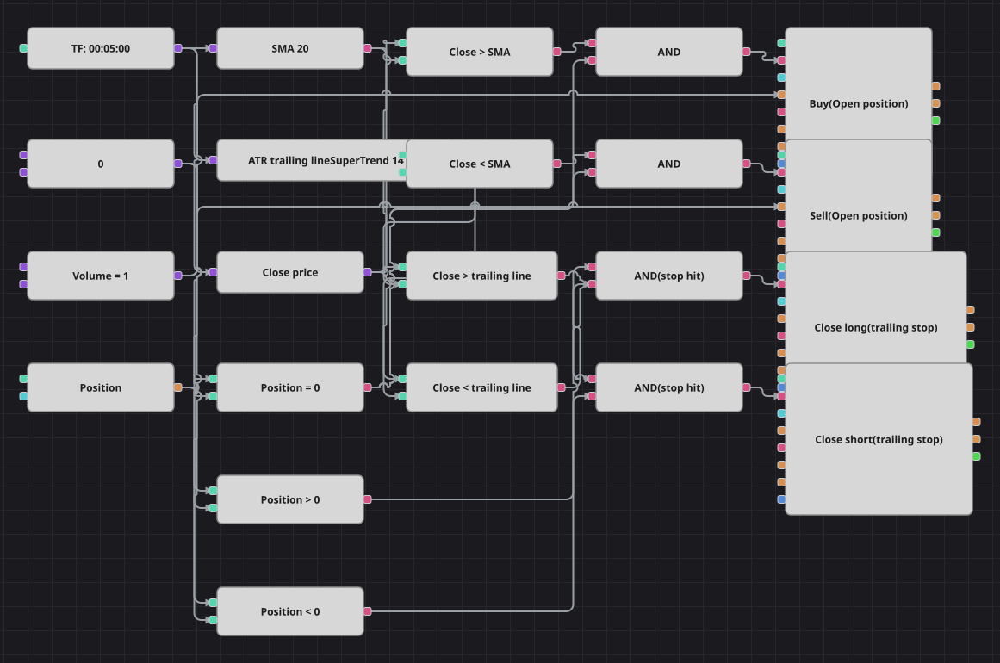

# Diagramm der Strategie mit ATR-Trailing-Stop
[English](README.md) | [Русский](README_ru.md) | [中文](README_zh.md) | [Español](README_es.md) | [Português](README_pt.md) | [日本語](README_ja.md)

Die Einstiege sind der einfache Teil: Aus der Neutralstellung kauft ein Schlusskurs über dem gleitenden Durchschnitt und verkauft einer darunter. Interessant ist der Ausstieg, ein ATR-Trailing-Stop — eine Linie, die im Abstand mehrerer Average True Ranges vom Kurs geführt wird, einer günstigen Bewegung folgt und nie zurückweicht; sie schließt die Position, sobald der Schlusskurs sie durchbricht.

## Strategieübersicht

- Ein einfacher gleitender Durchschnitt über zwanzig Perioden teilt den Chart in eine obere und eine untere Seite, und die Lage des Schlusskurses dazu bestimmt die Einstiegsrichtung.
- Der Trailing-Stop ist ein SuperTrend-Baustein: genau ein ATR-Band mit Sperrklinke, sodass der Stopabstand mit der Volatilität atmet statt eine feste Punktzahl zu sein.
- Jeder Einstieg erfolgt nur aus der Neutralstellung und jeder Ausstieg nur aus einer Position der passenden Seite — das hält die vier Orderbausteine voneinander frei.
- Der Stop ist bewusst weit gesetzt — dreimal ein ATR über vierzehn Perioden — damit eine Position normales Rauschen übersteht und erst aufgegeben wird, wenn die Bewegung wirklich dreht.

## Ein- und Ausstiegsregeln

- **Long-Einstieg**: Die Position ist neutral und die Kerze schließt über dem einfachen gleitenden Durchschnitt. Die Order kauft das gemeinsame Volumen zum Markt, und die ATR-Linie unter dem Kurs wird zum Stop dieses Longs.
- **Short-Einstieg**: Die Position ist neutral und die Kerze schließt unter dem einfachen gleitenden Durchschnitt. Die Order verkauft das gemeinsame Volumen zum Markt, und die ATR-Linie über dem Kurs wird zum Stop dieses Shorts.
- **Ausstieg**: Ein Long wird geschlossen, wenn der Schlusskurs unter die ATR-Linie fällt, ein Short, wenn er darüber steigt. Es gibt keinen Take-Profit und keine Drehung: Nach dem Stop wartet das Diagramm neutral auf das nächste Signal des Durchschnitts.

## Parameter

| Parameter | Standard | Beschreibung |
|---|---|---|
| MA Period | 20 | Periode des einfachen gleitenden Durchschnitts, der die Einstiegsrichtung bestimmt. |
| ATR Period | 14 | ATR-Periode innerhalb der Trailing-Linie; größere Werte lassen den Stop träger auf Volatilitätsänderungen reagieren. |
| ATR Multiplier | 3 | Wie viele ATR die Linie vom Kurs entfernt geführt wird; größere Werte geben der Position mehr Luft und führen zu weniger Ausstiegen. |
| Volume | 1 | Ordervolumen in Lots, gemeinsam für alle vier Orderbausteine. |
| Candles | 00:05:00 | Zeiteinheit der Kerzen, mit der das gesamte Diagramm arbeitet. |

## Diagrammdetails

- Der Kerzenbaustein speist den gleitenden Durchschnitt, die SuperTrend-Linie und einen Konverter, der den Schlusskurs liest.
- Zwei Vergleiche stellen den Schlusskurs dem Durchschnitt gegenüber, zwei weitere der Trailing-Linie, sodass derselbe Kurs einmal gelesen und von beiden Hälften des Diagramms genutzt wird.
- Drei Vergleiche gegen eine Nullkonstante machen aus der Position die Kennzeichen neutral, long und short, die Einstiege und Ausstiege getrennt freigeben.
- Die beiden Einstiegsbausteine tragen die Eröffnungsbedingung, die beiden Ausstiegsbausteine die Schließbedingung, sodass ein Signal, das nicht zur aktuellen Position passt, schlicht nichts bewirkt.
- Die ursprüngliche Strategie berechnet ihr Stopniveau als laufendes Maximum aus Schlusskurs minus mehreren ATR; diese Sperrklinke lässt sich nicht als Bausteinkette ausdrücken, daher tritt die SuperTrend-Linie an ihre Stelle, die genauso arbeitet.
- Zwei weitere Vereinfachungen sind erwähnenswert: Für die Pause von fünfhundert Kerzen nach jedem Trade gibt es keinen Baustein, sie entfällt; und das Diagramm läuft auf Fünf-Minuten-Kerzen statt der Minutenkerzen des C#-Codes, weil die Galerie genau diese Historie mitbringt.

## Verwendung

Importieren Sie die `.json`-Datei in Designer, testen Sie sie im Backtester mit historischen Daten und passen Sie danach Parameter oder Bausteine an Ihr Instrument an, bevor Sie live handeln.
