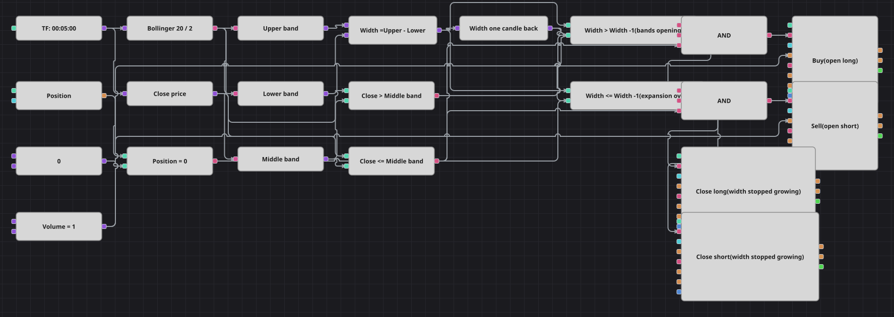

# Diagrama da estratégia de expansão da largura das Bandas de Bollinger
[English](README.md) | [Русский](README_ru.md) | [中文](README_zh.md) | [Español](README_es.md) | [Deutsch](README_de.md) | [日本語](README_ja.md)

O sinal é a distância entre as duas Bandas de Bollinger, e não o preço tocando nelas. Um bloco de fórmula subtrai a banda inferior da superior, e o resultado é retido por um candle para que as duas leituras possam ser comparadas. No instante em que as bandas começam a abrir, o diagrama assume posição, e o lado é decidido apenas por onde o candle fechou em relação à banda média.

## Visão geral da estratégia

- As Bandas de Bollinger fornecem três linhas de uma vez; três blocos conversores extraem a banda superior, a inferior e a média do mesmo valor do indicador.
- A largura é calculada por um bloco de fórmula e guardada por um bloco de valor anterior, o que transforma a expansão numa simples comparação de dois números.
- A direção não é um teste de rompimento: qualquer expansão abre uma operação e a banda média apenas diz se é compra ou venda. É exatamente assim que a estratégia original se ramifica.
- Assim que a largura para de crescer, os dois blocos de fechamento disparam e o lado aberto é zerado.

## Regras de entrada e saída

- **Entrada comprada**: A largura é maior que no candle anterior, o candle fechou acima da banda média e a posição está zerada. A ordem compra o volume compartilhado a mercado.
- **Entrada vendida**: A largura é maior que no candle anterior, o candle fechou na banda média ou abaixo dela e a posição está zerada. A ordem vende o volume compartilhado a mercado.
- **Saída**: A largura deixou de crescer, ou seja, está igual ou abaixo da largura do candle anterior. Os dois blocos de fechamento são acionados e aquele que corresponde ao lado aberto o liquida a mercado. A estratégia original não tem stop loss nem take profit, e este diagrama também não.

## Parâmetros

| Parâmetro | Padrão | Descrição |
|---|---|---|
| Bollinger Period | 20 | Período de suavização das Bandas de Bollinger, que define a rapidez de reação da largura. |
| Bollinger Width | 2 | Multiplicador do desvio padrão das bandas; um valor maior aumenta a distância entre elas. |
| Volume | 1 | Volume da ordem, em lotes. |
| Candles | 00:05:00 | Tempo gráfico dos candles com que todo o diagrama trabalha. |

## Detalhes do diagrama

- O bloco de candles alimenta o indicador de Bandas de Bollinger e, à parte, um conversor que lê o preço de fechamento.
- O bloco de fórmula toma a banda superior como a e a inferior como b e devolve a diferença como largura das bandas.
- A largura vai tanto para o bloco de valor anterior quanto direto para duas comparações, então a expansão e a sua ausência são lidas do mesmo par de números.
- Cada E lógico une expansão, lado da banda média e checagem de posição zerada; os blocos de saída ficam ligados diretamente à comparação de contração.

## Uso

Importe o arquivo `.json` no Designer, execute-o sobre dados históricos no backtester e depois ajuste os parâmetros ou os próprios blocos ao seu instrumento antes de operar ao vivo.
