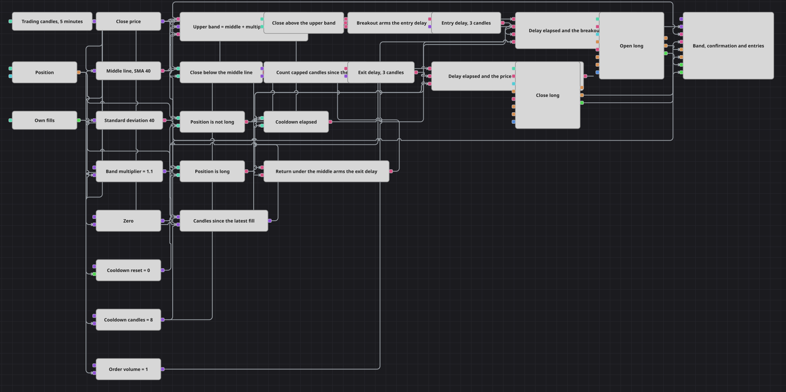

# Diagrama da estratégia de atraso de confirmação de banda
[English](README.md) | [Русский](README_ru.md) | [中文](README_zh.md) | [Español](README_es.md) | [Deutsch](README_de.md) | [日本語](README_ja.md)

Um sinal não precisa ser executado no segundo em que aparece. Este diagrama constrói uma banda de volatilidade acima de uma média móvel e, quando o fechamento a rompe, o diagrama não compra. Em vez disso, ele arma um bloco de atraso, espera um número fixo de candles e só então faz a mesma pergunta de novo: o preço ainda está acima da banda? A resposta naquele momento, e não a que iniciou a espera, decide a operação.

## Visão geral da estratégia

- Uma única série de candles de cinco minutos, apenas candles finalizados, alimenta tudo no diagrama.
- Uma média móvel fornece a linha média e um desvio padrão fornece a largura; uma fórmula os combina em uma banda superior, a média mais o multiplicador vezes o desvio.
- Duas comparações reduzem todo o quadro a duas perguntas: o fechamento está acima da banda e o fechamento está abaixo da linha média.
- Uma condição lógica combina o rompimento com uma posição que não está comprada e arma o bloco de atraso de entrada. Enquanto o bloco está contando, novos rompimentos são ignorados, de modo que uma espera nunca é reiniciada pelo candle seguinte.
- Quando o bloco de atraso termina a contagem, ele emite um único impulso, e uma segunda condição lógica junta esse impulso com um rompimento recalculado na hora, um cooldown já decorrido e uma posição ainda zerada. Sem essa segunda condição, o diagrama compraria às cegas, apoiado em um sinal que já poderia ter desaparecido.
- A saída é construída da mesma forma, em espelho: um fechamento abaixo da linha média com posição comprada arma o segundo bloco de atraso, e seu impulso, somado a um retorno ainda válido para baixo da linha média, encerra a operação.
- Um contador de cooldown corre em paralelo: cada execução própria o zera, cada candle o incrementa até o seu limite, e uma comparação mantém novas entradas bloqueadas até que candles suficientes tenham passado.
- Entradas e saídas são ordens a mercado por meio de blocos Position modify, abrindo a partir de zero e fechando a posição inteira; o painel de gráfico desenha os candles, os dois indicadores, as ordens e as execuções.

## Regras de entrada e saída

- **Entrada comprada**: O fechamento termina acima da banda superior enquanto a posição não está comprada. Isso arma o atraso de entrada. Um número configurado de candles depois, o atraso libera seu impulso e, se naquele momento o fechamento ainda estiver acima da banda, o cooldown desde a última execução tiver se esgotado e a posição ainda estiver zerada, o bloco Position modify compra o volume da ordem a mercado.
- **Entrada vendida**: Não há entradas vendidas. Abaixo da banda, o diagrama simplesmente fica de fora; a única ordem que ele chega a enviar contra uma posição comprada é a que a encerra.
- **Saída**: O fechamento termina abaixo da linha média enquanto uma posição comprada está aberta, o que arma o atraso de saída. Um número configurado de candles depois, chega o impulso e, se o fechamento ainda estiver abaixo da linha média e a posição ainda estiver comprada, o bloco Position modify de fechamento vende a posição inteira a mercado. Não existe bloco de stop-loss nem de take-profit: este diagrama trata de aguardar uma confirmação, e a linha média é a única coisa que encerra uma operação.

## Parâmetros

| Parâmetro | Padrão | Descrição |
|---|---|---|
| Candles | 00:05:00 | Time frame da única série de candles sobre a qual todo o diagrama funciona. |
| Middle Line Length | 40 | Comprimento da média móvel que desenha a linha média e uma das metades da banda. |
| Deviation Length | 40 | Comprimento do desvio padrão que define a largura da banda; normalmente mantido igual ao comprimento da linha média. |
| Band Multiplier | 1.1 | Quantos desvios acima da linha média fica a banda superior. Aumente para rompimentos mais raros e mais esticados. |
| Entry Confirm Candles | 3 | Candles que o atraso de entrada conta entre o rompimento e a reverificação que pode comprar. |
| Exit Confirm Candles | 3 | Candles que o atraso de saída conta entre o retorno para baixo da linha média e a reverificação que pode fechar. |
| Cooldown Candles | 8 | Candles que devem passar após uma execução própria antes que uma nova entrada seja permitida. |
| Order Volume | 1 | Tamanho da ordem, em lotes, enviado na entrada; a saída sempre fecha o que estiver aberto. |

## Detalhes do diagrama

- O bloco de atraso conta os valores que chegam até ele depois de ele ter sido armado, e não candles verdadeiros consecutivos. Um novo armamento é ignorado enquanto ele conta, e o bloco se reinicia assim que dispara, de modo que a espera é uma pausa de verdade e não uma contagem corrente de barras favoráveis.
- É exatamente por isso que o impulso liberado é combinado com uma comparação nova em vez de ir direto para a ordem. O impulso diz que a espera acabou; a comparação diz se o motivo dela ainda existe.
- O comprimento da confirmação é deliberadamente maior que um candle aqui, para que o bloco de atraso tenha algo visível a fazer. Defina os dois atrasos em um candle e o diagrama opera no próprio candle do rompimento, que é a mesma estrutura sem a pausa.
- O bloco de candles emite apenas candles finalizados. Uma atualização de um candle em formação carrega o horário de abertura da barra, e uma ordem construída a partir dela fica datada atrás do relógio e é rejeitada.
- O cooldown é um contador, não um temporizador: uma variável que mantém seu valor entre candles, é zerada pelas execuções próprias e é incrementada por uma fórmula limitada ao comprimento do cooldown, de modo que não pode se descolar e nunca pode bloquear entradas permanentemente.

## Uso

Importe o arquivo `.json` no Designer, execute-o sobre dados históricos no backtester e depois ajuste os parâmetros ou os próprios blocos ao seu instrumento antes de operar ao vivo.
