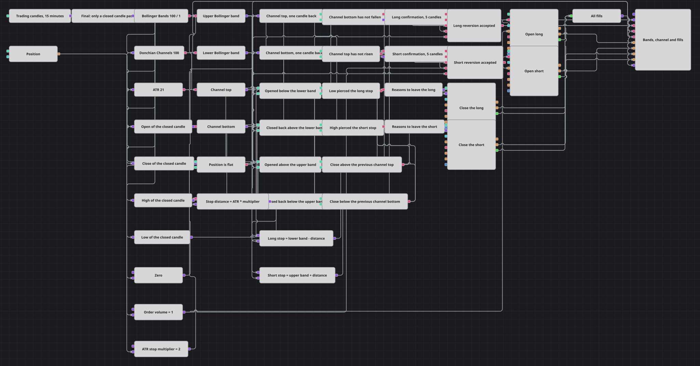

# 波动带确认回归策略图
[English](README.md) | [Русский](README_ru.md) | [Español](README_es.md) | [Deutsch](README_de.md) | [Português](README_pt.md) | [日本語](README_ja.md)

一根在波动带外开盘、又收回带内的 K 线，是行情被拒绝的经典形态，本图买卖的正是这种形态。它之所以不只是一根 K 线的形态，在于形态与下单之间还隔着两道关卡：一条价格通道，其边界必须一直守得住；以及一个计数模块，只有在设定数量的 K 线走完之后才会放出确认。只有当形态、通道与计数在同一根 K 线上同时成立时，才会开仓。

## 策略概览

- 整张图只由一路 15 分钟 K 线序列驱动，进入图中的每个值都先经过一个终值（Final）模块，因此后续环节永远看不到尚未走完的 K 线。
- 三个指标以该数据流为输入：围绕移动平均线的波动带、由最高价与最低价构成的价格通道，以及衡量一根普通 K 线幅度的平均真实波幅。
- 转换模块把波动带拆成上轨与下轨，把通道拆成上沿与下沿，并从每根已收盘的 K 线中取出开盘价、收盘价、最高价和最低价。
- 两个前值（Previous value）模块保存上一根 K 线的通道边界，两个比较模块分别判断下沿是否已停止下移、上沿是否已停止上移：这就是本图对「通道守得住」的定义。
- 这两个判断结果各自触发一个 N 值（N values）模块：模块随后对设定数量的已收盘 K 线计数，并放出一次确认脉冲；计数进行期间，新的触发会被忽略。
- 多头一侧由一个逻辑条件把五件事汇到一起：K 线在下轨之下开盘、又收回到下轨之上，通道下沿此刻守得住，确认脉冲刚刚到达，且当前没有持仓。空头一侧是围绕上轨与通道上沿的镜像条件。
- 两侧入场都是通过持仓修改（Position modify）模块发出的市价委托，且设置为仅在无持仓时开仓，因此交易进行中到来的信号无法再叠加第二笔。
- 两个组合（Combination）模块汇集离场理由——由平均真实波幅构成的止损距离，以及收盘价突破上一根 K 线的通道——并交给负责平仓的持仓修改模块；同时图表面板绘制 K 线、三个指标、委托与成交。

## 入场与出场规则

- **做多入场**: 一根已收盘的 K 线在下轨之下开盘、又收回到下轨之上，通道下沿不低于上一根 K 线时的位置，多头计数模块刚刚放出确认，且当前没有持仓。此时持仓修改模块按市价买入设定的委托手数。计数正是把交易拉开间隔的东西：每次放出确认后，模块会在下一根通道下沿仍然守得住的 K 线上重新触发，因此紧邻的下一根 K 线上出现同样的形态不会带来第二次入场。
- **做空入场**: 镜像情形。一根已收盘的 K 线在上轨之上开盘、又收回到上轨之下，通道上沿不高于上一根 K 线时的位置，空头计数模块已放出确认，且当前没有持仓。持仓修改模块按市价卖出设定的委托手数。
- **离场**: 每一侧都有自己的组合模块，其中装着两类离场理由。第一类是波动止损：当 K 线最低价跌破「下轨减去平均真实波幅乘以止损倍数」时平掉多头，当 K 线最高价升破「上轨加上同样距离」时平掉空头。由于波动带随行情移动，这个止损会自行跟随，本图无需记住入场价格。第二类理由是通道突破：收盘价高于上一根 K 线的通道上沿，或低于上一根 K 线的通道下沿，都会结束相应一侧的交易——向上是把多头的利润收下，向下是把多头的亏损止住，空头则相反。两个平仓模块都设置为平掉持仓，因此各自只作用于所属的一侧，并且总是发出全部手数。

## 参数

| 参数 | 默认值 | 说明 |
|---|---|---|
| Candles | 00:15:00 | 全图所依据的那一路 K 线序列的周期。周期越短，形态和交易越多；周期越长，则越少越慢。 |
| Bollinger Length | 100 | 波动带取平均所用的 K 线数量。它同时决定预热长度：在走完这么多根 K 线之前不会进行交易。 |
| Bollinger Width | 1 | 每条带偏离均线多少个标准差。这里设得较窄，好让 K 线经常在带外开盘、又收回带内；调宽则得到更罕见、更极端的拒绝形态。 |
| Donchian Length | 100 | 价格通道跨越的 K 线数量。通道越长，其边界变化越慢，正是这一点让「边界不再朝不利方向移动」成为一个有意义的过滤条件。 |
| ATR Length | 21 | 计算平均真实波幅所用的 K 线数量。它决定了止损距离以什么为单位来表示。 |
| Long Confirm Candles | 5 | 多头计数模块从触发到放出确认之间等待的 K 线数量。取 1 相当于完全取消等待，每个形态都交易；取值越大，入场越稀疏。 |
| Short Confirm Candles | 5 | 空头计数模块等待的 K 线数量。它是独立的设置，便于把两侧相互调校。 |
| ATR Stop Multiplier | 2 | 多头止损位于下轨之下多少倍平均真实波幅，空头止损位于上轨之上多少倍。调小可获得更紧、更频繁的离场。 |
| Order Volume | 1 | 入场时发出的委托数量，以手为单位。离场总是平掉当前持仓，本身不设数量。 |

## 图表详情

- K 线模块设置为只输出已完成的 K 线，其后的终值模块在图内再次强制同一规则。未走完 K 线的更新携带的是该 K 线的开盘时间，用这种值生成的委托时间戳落后于当前时钟，会被拒绝，因此全部逻辑都建立在已收盘的 K 线上。
- N 值模块统计的是触发之后到达它的值，并不检查触发条件在整个过程中是否始终成立。正因如此，触发它的那个通道比较也被直接接入了入场条件：脉冲说明等待已经结束，而实时的比较说明等待的理由是否仍然存在。
- 离场所用的通道边界取自上一根 K 线。由最高价与最低价构成的通道，其当前上沿已经包含了当前 K 线自身的最高价，收盘价永远无法高过它；而以上一根 K 线的边界为准，突破才是一个真实事件。
- 止损锚定在波动带上，而不是交易的开仓价格上。除非另加一个变量来保存，图本身并不记得入场价格；何况入场本来就发生在波动带处，因此它给出的保护距离相同，还会随行情一起移动。
- 对持仓的防护是有意做了两道：无持仓的比较放在入场条件里，入场模块本身又设置为仅在持仓为零时开仓。前者让图更易读，后者才是在两者步调不一致时真正拦下重复委托的东西。

## 使用方法

将 `.json` 文件导入 Designer，在回测器中用历史数据运行，然后根据自己的交易品种调整参数或方块，确认无误后再用于实盘。
