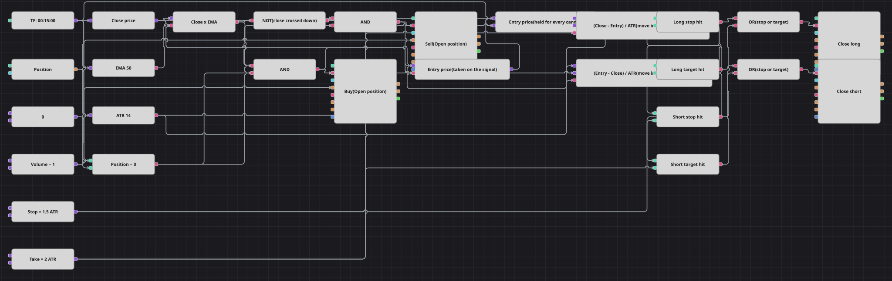

# ATR 止损止盈策略图
[English](README.md) | [Русский](README_ru.md) | [Español](README_es.md) | [Deutsch](README_de.md) | [Português](README_pt.md) | [日本語](README_ja.md)

这是一堂关于按波动率度量风险的短课。收盘价上穿或下穿 50 周期 EMA 时开仓，该K线的收盘价被记为入场价，此后图表用平均真实波幅（ATR）为单位衡量价格离入场价的距离。一个 ATR 倍数以亏损离场，另一个以盈利离场，因此离场距离在行情平静时放大、在行情活跃时收窄，而不是固定的点数。

## 策略概览

- 只使用一个品种和一条K线序列：50 周期 EMA 给出方向，14 周期 ATR 提供离场的标尺。
- 入场价由两个变量方块保存：第一个取产生信号那根K线的收盘价，第二个在其后每根K线上重新输出，使离场条件可以持续检验。
- 两个公式方块把与入场价的距离换算成 ATR 倍数，一个按多头方向计，一个按空头方向计，因此同样的两个阈值可服务于两个方向。
- 离场是在已完成K线上的市价单，与原策略一致：交易所并没有挂着止损单，所以K线内的插针不会把仓位打掉。

## 入场与出场规则

- **做多入场**: 收盘价上穿 EMA 且当前空仓。买入一手，该K线的收盘价成为入场价。
- **做空入场**: 收盘价下穿 EMA 且当前空仓。卖出一手，该K线的收盘价成为入场价。
- **离场**: 在价格相对入场价逆向走出 StopFactor 个 ATR 或顺向走出 TakeFactor 个 ATR 的第一根完成K线上平仓。两个修改持仓方块都设为平仓模式，因此各自只在对应方向触发。

## 参数

| 参数 | 默认值 | 说明 |
|---|---|---|
| EMA Length | 50 | 收盘价需要穿越的指数移动平均线周期。 |
| ATR Length | 14 | 用于缩放止损与止盈的平均真实波幅周期。 |
| Stop, ATR | 1.5 | 止损距离（以 ATR 计）：触发离场的亏损。 |
| Take, ATR | 2 | 止盈距离（以 ATR 计）：触发离场的盈利。 |
| Volume | 1 | 下单数量（手）。 |
| Candles | 00:15:00 | 整张图使用的K线周期。 |

## 图表详情

- K线方块向收盘价转换方块、EMA 与 ATR 供数；交叉方块比较收盘价与 EMA，逻辑非把向下穿越转成做空信号。
- 当前持仓与零常量比较，每个逻辑与把该判断与一次穿越合并，因此只有空仓时才会开新仓。
- 入场价由一对变量方块保存；第二个由K线序列触发，这也是它在K线方块的连接中排在最后的原因——正因如此，入场当根K线上的离场判断也用的是正确价格。
- 四个比较方块把两个 ATR 距离与止损、止盈常量对比，两个逻辑或把它们合并，两个设为平仓的修改持仓方块发出离场订单。
- 原策略在两笔交易之间等待六根K线。这样的计数器在方块中没有对应物，因此图中省略，下一次穿越即可入场。

## 使用方法

将 `.json` 文件导入 Designer，在回测器中用历史数据运行，然后根据自己的交易品种调整参数或方块，确认无误后再用于实盘。
