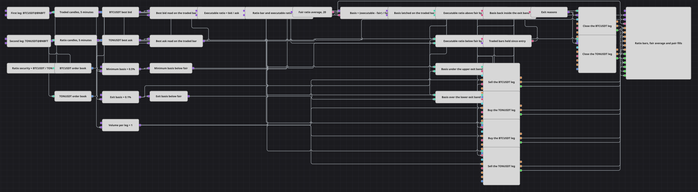

# Diagrama da estratégia de arbitragem de base percentual
[English](README.md) | [Русский](README_ru.md) | [中文](README_zh.md) | [Español](README_es.md) | [Deutsch](README_de.md) | [日本語](README_ja.md)

Um par tem dois preços: aquele que ele vale e aquele pelo qual é possível negociá-lo. O diagrama constrói o primeiro como um instrumento sintético e sua média móvel, lê o segundo nos dois livros de ofertas, expressa a distância entre eles em porcentagem e abre as duas pernas quando essa distância ultrapassa um limiar.

## Visão geral da estratégia

- Um bloco de índice constrói um único instrumento sintético dividindo o preço do primeiro instrumento pelo preço do segundo, uma série de candles é assinada sobre ele, e uma média móvel sobre esses candles é o valor justo do par.
- Dois blocos de livro de ofertas fornecem os preços pelos quais o par pode de fato ser negociado: um conversor toma a melhor oferta de compra do primeiro instrumento, outro toma a melhor oferta de venda do segundo.
- Um livro muda muitas vezes dentro de uma mesma barra, por isso os dois melhores preços não alimentam as condições diretamente: duas variáveis guardam a última cotação de cada um e a liberam quando um candle negociado se fecha, e uma fórmula divide um pelo outro, produzindo a razão executável.
- Um bloco Sync retém a razão executável e o candle de razão do mesmo horário e os libera juntos, de modo que o valor justo e o preço negociável comparados pertençam sempre à mesma barra.
- Uma fórmula transforma o par liberado em um único número: a distância da razão executável até a média justa, em porcentagem da média. Esse número é a base.
- Uma variável prende a base ao candle negociado, e toda comparação a jusante é avaliada nessa barra, de modo que cada ordem fica datada pela barra em que foi decidida.
- A base é comparada com o limiar de entrada e com esse mesmo limiar negativado, o que dá um portão por direção, e com uma faixa bem mais estreita em torno do valor justo, cujas duas respostas uma condição lógica une no sinal de retorno.
- Um bloco de atraso armado por qualquer uma das entradas conta as barras negociadas concluídas e levanta um único flag assim que o limite de manutenção é atingido; um bloco Combination funde esse flag com o sinal de retorno em um único fluxo de saída, e dois blocos de fechamento desmontam o par, um por instrumento.

## Regras de entrada e saída

- **Entrada comprada**: A razão executável está abaixo da média justa em mais do que a base mínima: o diagrama compra o primeiro instrumento e vende o segundo, um volume de ordem em cada perna. Cada perna está configurada para abrir apenas a partir de uma posição própria zerada, de modo que um sinal que se repete enquanto o par já está montado não acrescenta nada a ele.
- **Entrada vendida**: A razão executável está acima da média justa em mais do que a base mínima: o diagrama vende o primeiro instrumento e compra o segundo, um volume de ordem em cada perna. A mesma condição de posição zerada protege cada perna separadamente.
- **Saída**: As duas pernas são desmontadas pelo que vier primeiro: a base retorna para dentro da faixa estreita em torno do valor justo, ou o bloco de atraso contou o limite de manutenção em barras negociadas concluídas desde a entrada que o armou. Ambos os motivos chegam ao mesmo gatilho por um único bloco de fusão. Os blocos de fechamento não carregam lado e calculam o próprio volume a partir do que está aberto, e um bloco de fechamento acionado sobre uma perna zerada simplesmente não faz nada.

## Parâmetros

| Parâmetro | Padrão | Descrição |
|---|---|---|
| Traded Candles | 00:05:00 | Duração dos candles sobre os quais as decisões são tomadas e as ordens são registradas. |
| Index Expression | BTCUSDT@BNBFT/TONUSDT@BNBFT | A expressão a partir da qual o instrumento sintético é construído: o preço do primeiro instrumento dividido pelo preço do segundo. Ambos os instrumentos precisam existir nos dados conectados, e ambos são negociados. |
| Ratio Candles | 00:05:00 | Duração dos candles sobre os quais o valor justo é construído. Mantenha-a igual à da série negociada, ou as duas não se encontrarão em um mesmo conjunto. |
| Sync Interval | 00:05:00 | Intervalo de agrupamento usado pelo bloco Sync. Mantenha-o igual à duração do candle: um intervalo menor separa o par de valores que pertencem um ao outro, um maior junta valores de barras diferentes. |
| Fair Average Length | 20 | Número de candles de razão na média móvel de onde o valor justo é tirado. |
| Minimum Basis, % | 0.5 | Quão longe a razão negociável precisa estar do valor justo, em porcentagem, antes que as duas pernas sejam abertas. |
| Exit Basis, % | 0.1 | Quão perto a base precisa voltar do valor justo, em porcentagem, antes que o par seja desmontado. |
| Volume Per Leg | 1 | Tamanho da ordem de cada perna, em lotes. As duas pernas recebem o mesmo tamanho. |
| Max Hold Bars | 72 | Por quantas barras negociadas concluídas o par pode ser mantido antes de ser fechado independentemente da base. |

## Detalhes do diagrama

- O livro de ofertas nunca é lido diretamente para dentro de uma condição. Ele se atualiza muitas vezes por barra, enquanto as condições vivem na barra; as duas variáveis de retenção são o que coloca ambos no mesmo relógio, e o gatilho delas é o candle negociado, não o livro.
- Nada que registre uma ordem é disparado a partir de uma saída do Sync. Um conjunto liberado é datado pelo mais antigo de seus membros, e uma ordem datada antes do horário atual é recusada, de modo que o Sync alimenta a aritmética enquanto o candle negociado aciona todos os gatilhos.
- Ambas as séries de candles estão configuradas apenas para candles finalizados. Uma atualização de uma barra em formação dataria a ordem pelo momento em que a barra abriu, que já está no passado quando a barra é decidida.
- As constantes são reenviadas a cada candle negociado. Uma comparação precisa que os seus dois valores cheguem de novo a cada avaliação, de modo que uma constante enviada uma única vez silenciosamente paralisa a condição que ela alimenta.
- Os limiares inferiores não são constantes próprias, mas fórmulas sobre os superiores, de modo que ambas as faixas permanecem simétricas quaisquer que sejam os limiares configurados, e o limite de manutenção é contado em barras finalizadas, e não em tempo de relógio.

## Uso

Importe o arquivo `.json` no Designer, execute-o sobre dados históricos no backtester e depois ajuste os parâmetros ou os próprios blocos ao seu instrumento antes de operar ao vivo.
