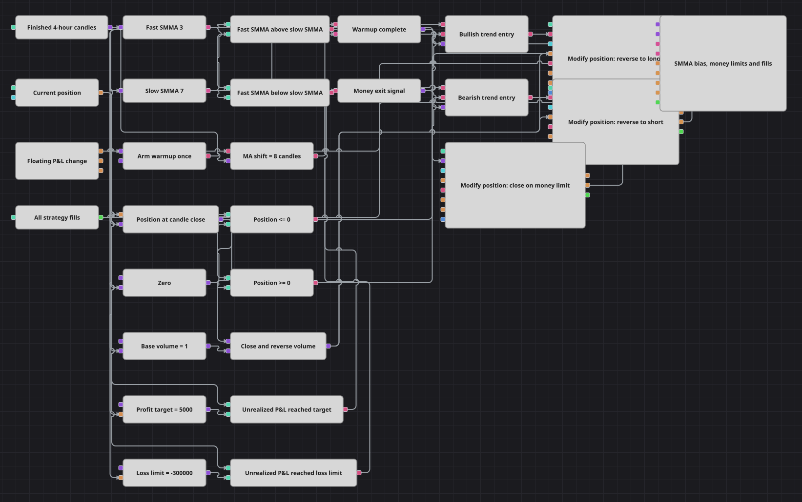

# Схема одноинструментного тренда по SMMA
[English](README.md) | [中文](README_zh.md) | [Español](README_es.md) | [Deutsch](README_de.md) | [Português](README_pt.md) | [日本語](README_ja.md)

Несмотря на историческое имя позиции галереи, это не корзина. Схема следует текущему VectorStrategy: одна бумага стратегии, быстрая и медленная сглаженные средние на четырёхчасовых свечах, нетто-развороты позиции и выход по плавающему результату в деньгах.

## Обзор стратегии

- Завершённые четырёхчасовые свечи поступают в SMMA(3) и SMMA(7); их взаимное положение задаёт бычье или медвежье направление.
- Одноразовый Flag взводит N values, который запрещает торговлю на первых восьми завершённых свечах.
- Бычье направление разрешает покупку при Position <= 0, медвежье — продажу при Position >= 0.
- Объём равен abs(Position) плюс базовый объём, объединяя пару закрытия и открытия из кода в один нетто-разворот.
- P&L change закрывает экспозицию при нереализованном результате +5000 или -300000 в валюте счёта.

## Правила входа и выхода

- **Вход в лонг**: После прогрева быстрая SMMA выше медленной, а Position нулевая или короткая. Modify position отправляет рыночную покупку, которая закрывает шорт и оставляет одну базовую единицу лонга.
- **Вход в шорт**: После прогрева быстрая SMMA ниже медленной, а Position нулевая или длинная. Modify position отправляет рыночную продажу, которая закрывает лонг и оставляет одну базовую единицу шорта.
- **Выход**: Противоположное направление сразу разворачивает позицию. Независимо от него результат не ниже +5000 или не выше -300000 вызывает рыночный ClosePosition; если тренд сохраняется, следующая подходящая свеча может войти снова.

## Параметры

| Параметр | По умолчанию | Описание |
|---|---|---|
| Candle Time Frame | 04:00:00 | Интервал завершённых свечей для обеих сглаженных средних и решений по позиции. |
| Fast SMMA Length | 3 | Число значений в быстрой SmoothedMovingAverage. |
| Slow SMMA Length | 7 | Число значений в медленной SmoothedMovingAverage. |
| MA Shift Warmup | 8 | Начальное число завершённых свечей, на которых трендовые входы запрещены. |
| Base Volume | 1 | Размер позиции, остающийся после входа с нуля или нетто-разворота. |
| Profit Target, money | 5000 | Нереализованная прибыль в валюте счёта, вызывающая ClosePosition. |
| Loss Limit, money | -300000 | Граница нереализованного убытка в валюте счёта; значение должно быть отрицательным. |

## Детали диаграммы

- GetWorkingSecurities исходника возвращает только (Security, CandleType). Поэтому Index, Sync, вторая бумага и подтверждение корзины намеренно отсутствуют.
- ProfitPercent 0,5 и LossPercent 30 пересчитаны от стартового тестового баланса 1 000 000 в +5000 и -300000.
- Designer отдаёт нереализованный P&L в деньгах, но не стартовый баланс, поэтому процентные пороги стали явными суммами в валюте счёта.
- Прогрев считает первые восемь завершённых свечей, как защита processedBars в коде; SMMA(7) успевает сформироваться до торговли.

## Использование

Импортируйте файл `.json` в Designer, прогоните схему на исторических данных в тестере, затем подстройте параметры или сами кубики под свой инструмент, прежде чем торговать вживую.
