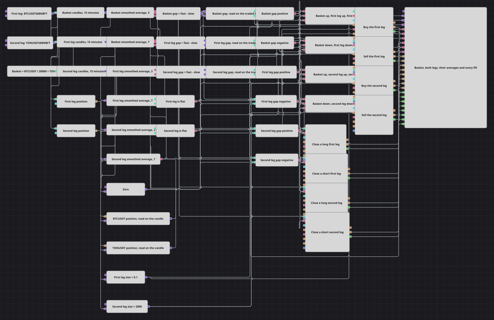

# Weighted Basket Trend Strategy Diagram
[Русский](README_ru.md) | [中文](README_zh.md) | [Español](README_es.md) | [Deutsch](README_de.md) | [Português](README_pt.md) | [日本語](README_ja.md)

The diagram trades two instruments as one basket, and it decides on three price series rather than two. A synthetic instrument is assembled from both traded instruments, with a divisor inside its expression that scales the expensive leg down until the cheap one can still move the result; the trend of that synthetic instrument is what the diagram calls the direction of the basket. Each leg is then measured the same way on its own. A leg is bought or sold only when its own trend agrees with the basket's, and when the basket turns, every leg now facing the wrong way is closed. Nothing else closes a position: there is no target and no stop, and the sign of the basket is both the reason to be in and the reason to leave.

## Strategy Overview

- A security index block builds one synthetic instrument out of the two traded instruments. The weight lives inside its expression, so the two legs contribute on a comparable scale instead of the larger price drowning out the smaller one.
- Three candle series run on the same timeframe: one on the synthetic basket and one on each leg. All three are subscribed as finished candles only, so every reading downstream belongs to a bar that has already closed.
- Each series feeds a fast and a slow smoothed moving average, and a formula subtracts the slow from the fast. The result is a signed trend gap, and there are three of them: one for the basket, one for each leg.
- Each gap is caught by a variable that holds it and releases it when a candle of the first leg finishes, so a decision is never assembled from a basket reading taken at one moment and a leg reading taken at another.
- The value comes from whichever series produced it last, the moment comes from the traded candle, and everything downstream therefore carries the timestamp of the bar the order is sent on.
- Six comparisons turn the three latched gaps into signed flags against zero: basket up or down, first leg up or down, second leg up or down.
- Two position blocks, one bound to each instrument, report what is already held, and two more comparisons say whether that leg is currently flat. This is what keeps a repeated signal from stacking a second entry into the same leg.
- Four logical conditions gather three flags each - basket direction, leg direction, leg is flat - and each one triggers a market order block. Four further order blocks handle the exits, driven straight from the two basket flags.

## Entry and Exit Rules

- **Long entry**: A leg is bought when the basket gap is positive, that leg's own gap is positive, and nothing is held in that leg. The two legs are decided independently on the same bar, so both can be long at once, one can be long while the other stays out, or neither may qualify.
- **Short entry**: A leg is sold when the basket gap is negative, that leg's own gap is negative, and nothing is held in that leg. The short side is the exact mirror of the long side, and the same independence between the legs applies.
- **Exit**: The only exit is a change in the sign of the basket gap. A negative basket fires the two close blocks that carry a sell direction, and a positive basket fires the two that carry a buy direction. The direction on a close block is a filter rather than an instruction: the block acts only on a position facing the opposite way, so a sell-side close block touches a long leg and does nothing at all when that leg is flat or already short. A leg whose own gap has turned but whose basket has not is left alone until the basket agrees.

## Parameters

| Parameter | Default | Description |
|---|---|---|
| First Leg | BTCUSDT@BNBFT | The first traded instrument. It feeds its own candle series, its own pair of averages, its own position block and its own four order blocks; changing it moves that entire leg. |
| Second Leg | TONUSDT@BNBFT | The second traded instrument, wired the same way as the first. The two legs are symmetrical, and neither is subordinate to the other. |
| Basket Index | BTCUSDT@BNBFT / 20000 + TONUSDT@BNBFT | The expression the synthetic basket instrument is built from. The divisor is what puts the two legs on a comparable scale - raise it to let the second leg dominate, lower it to give the first leg more weight - and the sign of this series is what authorises every entry. |
| Basket Candles | 00:15:00 | Timeframe of the basket candles. Keep it equal to the leg timeframes: the three streams are meant to be read as one bar. |
| First Leg Candles | 00:15:00 | Timeframe of the first leg candles. This series is also the trading clock: it triggers the latches, the constants and therefore the moment every order is sent. |
| Second Leg Candles | 00:15:00 | Timeframe of the second leg candles. Kept equal to the first leg so that both legs are judged on bars of the same length. |
| Basket Fast Length | 3 | Length of the fast average on the basket. Shorter reacts sooner and flips the basket sign more often, which both opens and closes positions more frequently. |
| Basket Slow Length | 7 | Length of the slow average on the basket. The distance between this and the fast length sets how decisive a move has to be before the basket is considered to have turned. |
| First Leg Fast Length | 3 | Length of the fast average on the first leg. It only decides whether that leg agrees with the basket; it never sets the basket direction itself. |
| First Leg Slow Length | 7 | Length of the slow average on the first leg. Widening the gap between the two lengths makes this leg confirm less often, so the basket may turn without it joining. |
| Second Leg Fast Length | 3 | Length of the fast average on the second leg, playing the same confirming role for that instrument. |
| Second Leg Slow Length | 7 | Length of the slow average on the second leg. The two legs can be tuned differently on purpose if one of them is the noisier of the pair. |
| First Leg Volume | 0.1 | Size of an order in the first leg, in that instrument's own units. It is worth setting this together with the second leg volume so that a full basket puts comparable money into each side. |
| Second Leg Volume | 2000 | Size of an order in the second leg. The two volumes are separate because the instruments are priced on completely different scales, and a single shared number would make one leg trivial. |

## Diagram Details

- The weight that balances the two legs is part of the index expression, not a number wired onto the diagram. Rebalancing the basket means editing that one parameter string, and the whole synthetic series is rebuilt from it.
- Candles are subscribed as finished only. An order routed from an updating candle carries the timestamp of the bar's opening, which is earlier than the moment it is actually sent, and is refused on that ground; taking only closed bars keeps every order stamped with the moment it belongs to.
- The three latching variables are what make the basket usable at all. A synthetic instrument is assembled from two feeds and its bar is completed later than an ordinary one, so a block that waits for all three readings to fall inside one window waits for a set that never arrives. Latching each reading onto the traded candle takes the value as it stands and the moment from the candle, and the comparisons, the logical conditions and the orders all run on the traded bar's clock.
- Entry blocks are set to open a position, so an entry acts only from flat. A signal that stays true across several bars therefore produces one order, not one per bar, and the exit blocks are the only way back to flat.
- The chart panel draws all three candle series, all six moving averages, and every order and fill from all eight order blocks, so a bar can be read against the basket that authorised it and the leg that confirmed it.

## Usage

Import the `.json` file into Designer, run it in the backtester on historical data, then adjust the parameters or the blocks themselves to fit your instrument before trading it live.
