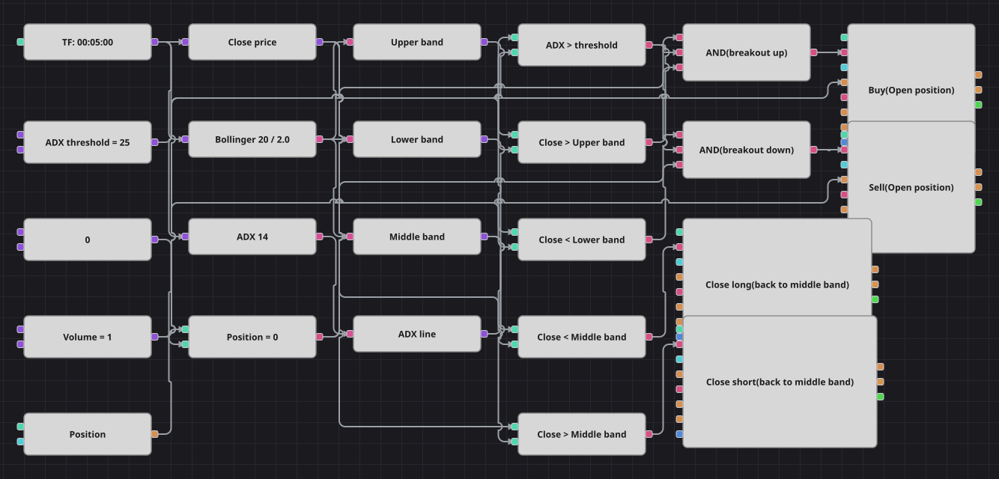

# Диаграмма стратегии пробоя полос Боллинджера с фильтром ADX
[English](README.md) | [中文](README_zh.md) | [Español](README_es.md) | [Deutsch](README_de.md) | [Português](README_pt.md) | [日本語](README_ja.md)

Пробой стоит брать только тогда, когда рынок действительно куда-то идёт. Схема ждёт закрытия за полосой Боллинджера — это значит, что движение необычно велико для текущей волатильности, — и спрашивает у ADX, стоит ли за ним тренд. Если оба согласны, позиция открывается по направлению пробоя и отдаётся, как только цена возвращается к средней линии.

## Обзор стратегии

- Полосы Боллинджера считаются по завершённым свечам одного инструмента: верхняя и нижняя задают уровни пробоя, а средняя линия — та же скользящая средняя — задаёт выход.
- ADX измеряет силу тренда, ничего не говоря о его направлении, поэтому используется чисто как фильтр: ниже порога любой пробой игнорируется.
- Текущая позиция участвует в обоих входах, а два закрывающих кубика работают в режиме закрытия, а не открытия, поэтому каждый может сработать только на своей стороне.
- Исходная стратегия после любой сделки блокирует себя на сто баров, включая выходы. Такому счётчику среди кубиков соответствия нет, поэтому схема его опускает: выход по средней линии работает всегда, что к тому же разумнее.

## Правила входа и выхода

- **Вход в лонг**: Цена закрытия выше верхней полосы Боллинджера, ADX выше порога, позиция нулевая. Покупается один лот по рынку.
- **Вход в шорт**: Цена закрытия ниже нижней полосы Боллинджера, ADX выше порога, позиция нулевая. Продаётся один лот по рынку.
- **Выход**: Лонг закрывается на первом закрытии ниже средней линии, шорт — на первом закрытии выше неё. Стоп-лосса и тейк-профита нет, ровно как в исходной стратегии.

## Параметры

| Параметр | По умолчанию | Описание |
|---|---|---|
| Bollinger Length | 20 | Период усреднения полос Боллинджера и их средней линии. |
| Bollinger Width | 2.0 | Множитель стандартного отклонения, задающий ширину полос. |
| ADX Length | 14 | Период индекса среднего направленного движения (ADX). |
| ADX Threshold | 25 | Уровень, выше которого ADX считается достаточно сильным, чтобы торговать пробой. |
| Volume | 1 | Объём заявки в лотах. |
| Candles | 00:05:00 | Таймфрейм свечей, на котором работает вся диаграмма. |

## Детали диаграммы

- Кубик свечей питает два кубика индикаторов и конвертер цены закрытия; ещё три конвертера достают из одного значения Боллинджера верхнюю, нижнюю и среднюю линии, а ещё один — линию ADX из её значения.
- Работу делают пять кубиков сравнения: два на пробой, два на возврат к средней линии и один на фильтр тренда против пороговой константы.
- Каждое логическое И объединяет условие пробоя, фильтр тренда и проверку позиции, после чего запускает кубик изменения позиции в режиме открытия, берущий объём из общей константы.
- Два сравнения на выход управляют кубиками изменения позиции в режиме закрытия — им собственный объём не нужен, кубик закрывает то, что открыто.
- В исходном коде сила тренда считается вручную как несглаженный DX. В схеме стоит штатный ADX — сглаженная по Уайлдеру версия той же величины, поэтому моменты прохождения порога слегка отличаются.

## Использование

Импортируйте файл `.json` в Designer, прогоните схему на исторических данных в тестере, затем подстройте параметры или сами кубики под свой инструмент, прежде чем торговать вживую.
