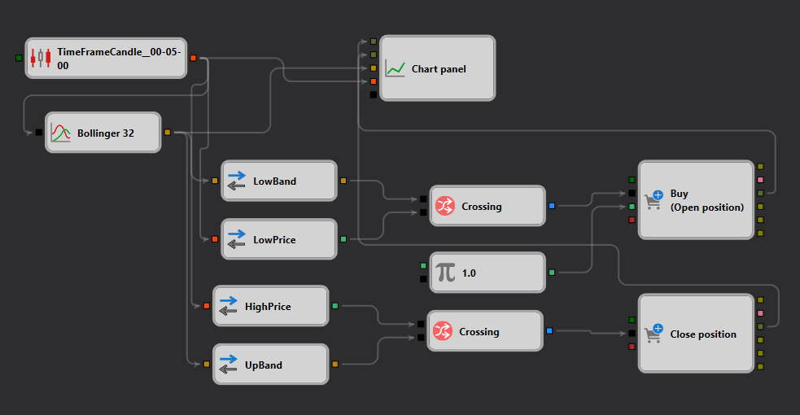

# Bollinger Bands Strategy Description

## Strategy Overview

The "Bollinger Bands" strategy is designed for [StockSharp Designer](https://doc.stocksharp.com/topics/designer.html) and focuses on utilizing Bollinger Bands to capitalize on volatility patterns. This strategy detects the price crossing the bands to determine entry and exit points in the market.

## Strategy Details

### Components

1. **Candle Formation**: Uses a five-minute timeframe to generate [candles](https://doc.stocksharp.com/topics/designer/strategies/using_visual_designer/elements/data_sources/candles.html) and triggers analysis when each candle closes.
2. **Bollinger Bands Indicator**: Computes the upper and lower bands of the [Bollinger Bands](https://doc.stocksharp.com/topics/designer/strategies/using_visual_designer/elements/common/indicator.html) using a 32 period length and a standard deviation multiplier of 2.0.
3. **Trade Signals**:
   - **Buy Signal**: A buy signal is generated when the [low price](https://doc.stocksharp.com/topics/designer/strategies/using_visual_designer/elements/converters/converter.html) of the candle [crosses](https://doc.stocksharp.com/topics/designer/strategies/using_visual_designer/elements/common/crossing.html) below the lower Bollinger Band, suggesting an oversold condition.
   - **Sell Signal**: A sell signal is triggered when the [high price](https://doc.stocksharp.com/topics/designer/strategies/using_visual_designer/elements/converters/converter.html) of the candle [crosses](https://doc.stocksharp.com/topics/designer/strategies/using_visual_designer/elements/common/crossing.html) above the upper Bollinger Band, indicating an overbought condition.

### Trade Execution

- **Order Type**: [Market orders](https://doc.stocksharp.com/topics/designer/strategies/using_visual_designer/elements/positions/modify.html) are used for both entry and exit to ensure quick execution.
- **Position Management**: Positions are opened based on the crossing signals and closed either on a crossing in the opposite direction or based on predefined stop-loss or take-profit conditions.

### Risk Management

- **Stop-Loss and Take-Profit**: Configurable settings allow for fixed or percentage-based [stop-loss and take-profit](https://doc.stocksharp.com/topics/designer/strategies/using_visual_designer/elements/common/protect_position.html) levels to manage risk effectively.
- **Money Management**: The strategy includes parameters to adjust the size of trades based on the available account balance and risk levels.

## Conclusion

The "Bollinger Bands" strategy provides a systematic approach to trading based on volatility and market conditions, making it suitable for traders looking for a robust, automated trading system within the StockSharp platform. It combines technical indicators with precise trade execution rules to enhance trading performance in varying market environments.
