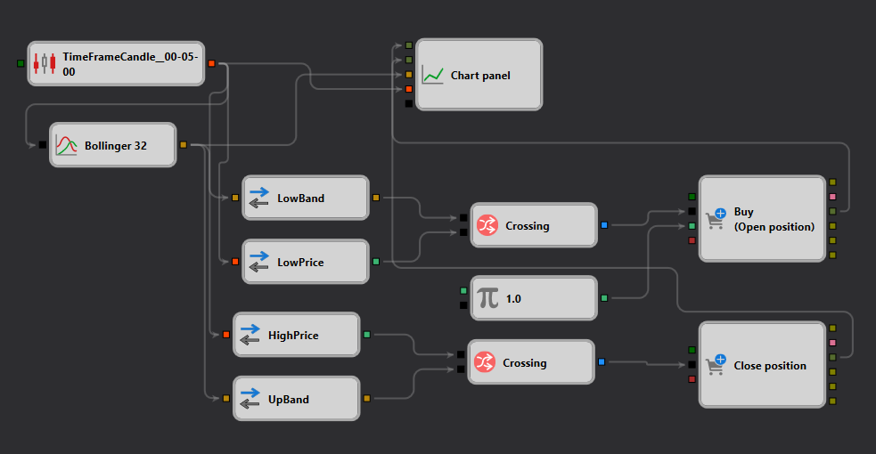

# Descripción de la Estrategia Bollinger Bands
[English](README.md) | [Русский](README_ru.md) | [中文](README_zh.md) | [Deutsch](README_de.md) | [Português](README_pt.md) | [日本語](README_ja.md)

## Descripción general de la estrategia

La estrategia "Bollinger Bands" está diseñada para [StockSharp Designer](https://doc.stocksharp.com/topics/designer.html) y se centra en aprovechar las Bollinger Bands para capitalizar los patrones de volatilidad. Esta estrategia detecta el cruce del precio con las bandas para determinar los puntos de entrada y salida en el mercado.

## Detalles de la estrategia

### Componentes

1. **Formación de velas**: Utiliza un marco temporal de cinco minutos para generar [velas](https://doc.stocksharp.com/topics/designer/strategies/using_visual_designer/elements/data_sources/candles.html) y activa el análisis al cierre de cada vela.
2. **Indicador Bollinger Bands**: Calcula las bandas superior e inferior de las [Bollinger Bands](https://doc.stocksharp.com/topics/designer/strategies/using_visual_designer/elements/common/indicator.html) con un período de 32 y un multiplicador de desviación estándar de 2.0.
3. **Señales de trading**:
   - **Señal de compra**: Se genera una señal de compra cuando el [precio mínimo](https://doc.stocksharp.com/topics/designer/strategies/using_visual_designer/elements/converters/converter.html) de la vela [cruza](https://doc.stocksharp.com/topics/designer/strategies/using_visual_designer/elements/common/crossing.html) por debajo de la banda inferior de las Bollinger Bands, lo que sugiere una condición de sobreventa.
   - **Señal de venta**: Se activa una señal de venta cuando el [precio máximo](https://doc.stocksharp.com/topics/designer/strategies/using_visual_designer/elements/converters/converter.html) de la vela [cruza](https://doc.stocksharp.com/topics/designer/strategies/using_visual_designer/elements/common/crossing.html) por encima de la banda superior de las Bollinger Bands, lo que indica una condición de sobrecompra.

### Ejecución de operaciones

- **Tipo de orden**: Se utilizan [órdenes de mercado](https://doc.stocksharp.com/topics/designer/strategies/using_visual_designer/elements/positions/modify.html) tanto para la entrada como para la salida, a fin de garantizar una ejecución rápida.
- **Gestión de posiciones**: Las posiciones se abren en función de las señales de cruce y se cierran ya sea con un cruce en dirección opuesta o basándose en condiciones predefinidas de stop-loss o take-profit.

### Gestión del riesgo

- **Stop-Loss y Take-Profit**: La configuración personalizable permite establecer niveles fijos o basados en porcentaje de [stop-loss y take-profit](https://doc.stocksharp.com/topics/designer/strategies/using_visual_designer/elements/common/protect_position.html) para gestionar el riesgo de manera efectiva.
- **Gestión del dinero**: La estrategia incluye parámetros para ajustar el tamaño de las operaciones en función del saldo de la cuenta disponible y los niveles de riesgo.

## Conclusión

La estrategia "Bollinger Bands" proporciona un enfoque sistemático al trading basado en la volatilidad y las condiciones del mercado, lo que la hace adecuada para los traders que buscan un sistema de trading automatizado y robusto dentro de la plataforma StockSharp. Combina indicadores técnicos con reglas precisas de ejecución de operaciones para mejorar el rendimiento del trading en diversos entornos de mercado.
