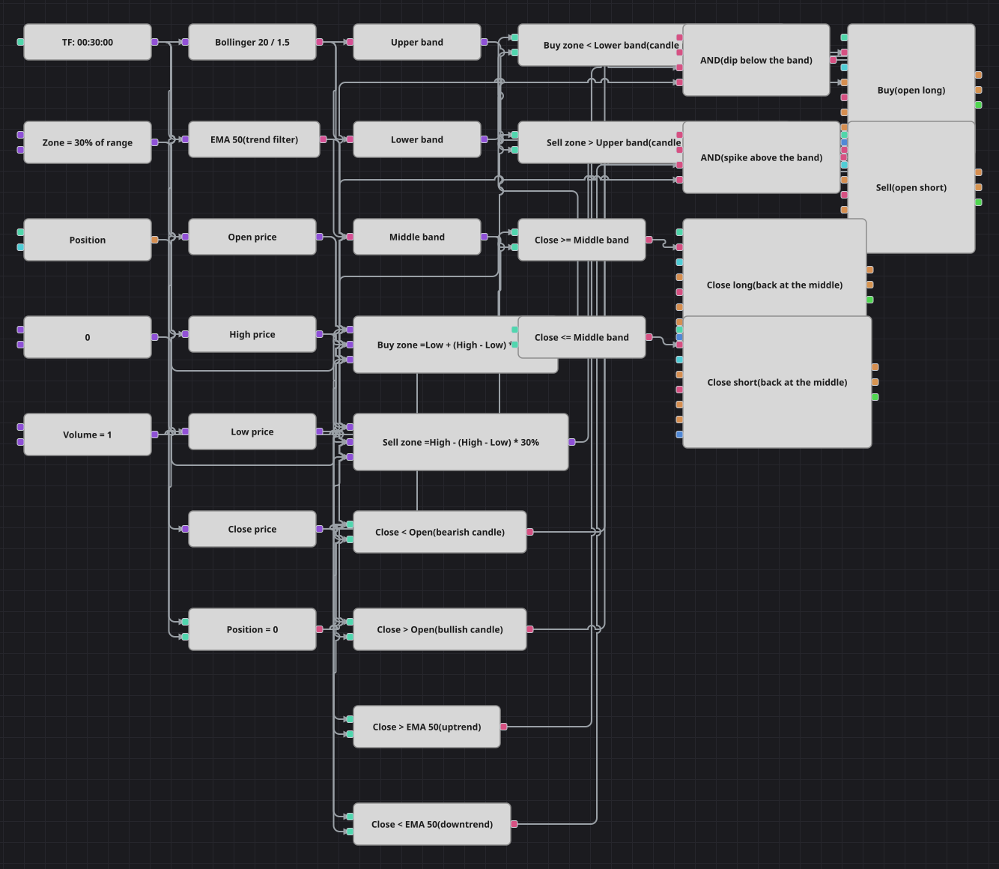

# Bollinger Zone Breakout Strategy Diagram
[Русский](README_ru.md) | [中文](README_zh.md) | [Español](README_es.md) | [Deutsch](README_de.md) | [Português](README_pt.md) | [日本語](README_ja.md)

The name says breakout, but the diagram trades the snap back: it waits for a candle whose lower zone has punched through the lower Bollinger band while the market still holds above its EMA 50, and buys that dip. The mirror image sells a spike through the upper band. Every position is given up as soon as price returns to the middle band. The RSI confirmation of the original code (below 45 for longs, above 55 for shorts) is left out here so that the diagram stays readable; it hardly narrows a signal that already demands a candle beyond the band.

## Strategy Overview

- Bollinger Bands (20, 1.5) mark the stretched edge of the range on 30-minute candles, while an EMA 50 says which side of the trend the market is on.
- Instead of comparing one price with the band, the diagram builds a penetration zone out of the candle itself: 30% of the candle range measured up from its low for longs and down from its high for shorts.
- Entries are taken from a flat position only, and the middle Bollinger band is the single exit for both directions.

## Entry and Exit Rules

- **Long entry**: The zone Low + 30% of the candle range lies below the lower Bollinger band, the candle is bearish (Close below Open), Close is above EMA 50 and the position is flat. One lot is bought at market.
- **Short entry**: The zone High - 30% of the candle range lies above the upper Bollinger band, the candle is bullish (Close above Open), Close is below EMA 50 and the position is flat. One lot is sold at market.
- **Exit**: A long is closed on the first candle that closes at or above the middle Bollinger band, a short on the first candle that closes at or below it; both exits are position-closing blocks, so each one acts only on the side that is really open.

## Parameters

| Parameter | Default | Description |
|---|---|---|
| Bollinger Length | 20 | Averaging length of the Bollinger Bands. |
| Bollinger Width | 1.5 | Standard deviation multiplier of the bands; 1.5 keeps them tight, so candles reach them often. |
| EMA Length | 50 | Length of the EMA that decides the side of the trend. |
| Candle Zone, share of range | 0.3 | Share of the candle range that has to lie beyond the band before the candle counts as a penetration. |
| Volume | 1 | Order volume, in lots. |
| Candles | 00:30:00 | Candle time frame the whole diagram works on. |

## Diagram Details

- Four converter blocks read Open, High, Low and Close out of the candle, three more read the upper, lower and middle Bollinger band.
- Two formula blocks build the penetration zones, Low + (High - Low) * percent and High - (High - Low) * percent, from one shared percent constant.
- Each logical AND joins four flags: the zone beyond the band, the direction of the candle, the side of the EMA and a flat position taken from the position block compared with zero.
- The exit pair compares Close with the middle band and drives two position-closing blocks, so the diagram is free again for the next signal.

## Usage

Import the `.json` file into Designer, run it in the backtester on historical data, then adjust the parameters or the blocks themselves to fit your instrument before trading it live.
