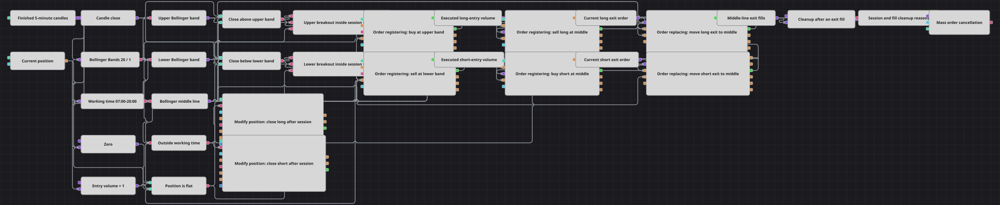

# Bollinger-Ausbruch mit Session-Orderzyklus
[English](README.md) | [Русский](README_ru.md) | [中文](README_zh.md) | [Español](README_es.md) | [Português](README_pt.md) | [日本語](README_ja.md)

Das Diagramm macht aus einem beidseitigen Bollinger-Ausbruch einen sichtbaren Pending-Order-Zyklus. Ein fertiger Schluss außerhalb der Bollinger Bands(20, 1) registriert den Einstieg am durchbrochenen Band; dessen Ausführung erzeugt ein Gegenlimit am bewegten Mittelband, Order replacing folgt ihm und das Sessionende 07:00-20:00 storniert alles und glättet die Position.

## Strategieübersicht

- Fertige Fünfminutenkerzen speisen Bollinger Bands mit Periode 20 und Breite 1 sowie den Schluss für beide Ausbruchsvergleiche.
- Working time erlaubt neue Einstiege nur von 07:00 bis 20:00; die gemeinsame Schranke Position == 0 macht das Beispiel bewusst flat-only.
- Ein bestätigter Ausbruch nach oben registriert ein Kauf-Limit am oberen Band, nach unten spiegelbildlich ein Verkauf-Limit am unteren.
- Das tatsächliche Trade.Volume des Einstiegs bestimmt die Gegenorder am Mittelband, statt Teil- oder Sonderausführungen durch eine Konstante zu ersetzen.
- Combination hält die neueste von Order replacing gelieferte Order; Ausstiegsausführung oder Sessionende entfernt alle übrigen aktiven Orders.

## Ein- und Ausstiegsregeln

- **Long-Einstieg**: Innerhalb der Working time registriert ein fertiger Schluss über dem oberen Band bei Position == 0 ein Kauf-Limit auf diesem Bandwert.
- **Short-Einstieg**: Innerhalb der Working time registriert ein fertiger Schluss unter dem unteren Band bei Position == 0 ein Verkauf-Limit auf diesem Bandwert.
- **Ausstieg**: Nach dem Einstieg wird ein Gegenlimit über genau das ausgeführte Volumen am Bollinger-Mittelband registriert und jedem neuen Wert nachgeführt. Seine Ausführung räumt Restorders ab. Außerhalb 07:00-20:00 werden alle Orders storniert und Modify position schließt Long oder Short zum Markt.

## Parameter

| Parameter | Standard | Beschreibung |
|---|---|---|
| Candle Time Frame | 00:05:00 | Fertiges Kerzenintervall; für den Monats-Replay vom C#-Standard vier Stunden angepasst. |
| Bollinger Period | 20 | Bollinger-Length und echter C#-Strategieparameter. |
| Bollinger Width | 1 | Bollinger-Standardabweichungsmultiplikator und echter C#-Parameter. |
| Session Start | 07:00:00 | Beginn der Working time aus dem README, nicht aus dem C#-Konstruktor. |
| Session End | 20:00:00 | Ende der Working time; danach werden Orders storniert und Positionen geschlossen. |
| Order Volume | 1 | Größe jeder Einstiegsorder; der Ausstieg übernimmt das echte Ausführungsvolumen. |

## Diagrammdetails

- Der ausführbare C#-Code nutzt Vierstundenkerzen. Fünf Minuten sind eine ausdrückliche Replay-Anpassung für genügend fertige Werte und Ausbrüche im Akzeptanzmonat.
- Nur BandPeriod, BandWidth und CandleType sind C#-Konstruktorparameter. Session Start und Session End stammen aus dem README und werden mit Working time umgesetzt; zusätzlich ist das Volumen exponiert.
- C# erlaubt Position <= 0 für Long und Position >= 0 für Short und dreht eine Gegenposition mit Market-Orders. Dieses Lehrdiagramm steigt absichtlich nur bei Position == 0 ein und dreht nicht.
- Auch die Ausführung ist angepasst: Die Quelle handelt zum Markt, das Diagramm legt den Einstieg ans durchbrochene Band und hält ein Ausstiegslimit am Mittelband. Der Einstieg kann auf einen Rücklauf warten.
- Order replacing liefert ein neues Orderobjekt. Anfangs- und Ersatzausgang laufen deshalb je Seite in Combination<Order>, ohne Selbstschleife.
- Preisrundung ist deaktiviert, weil das Replay-Instrument keinen Preisschritt liefert; die Indikatorniveaus bleiben unverändert.

## Verwendung

Importieren Sie die `.json`-Datei in Designer, testen Sie sie im Backtester mit historischen Daten und passen Sie danach Parameter oder Bausteine an Ihr Instrument an, bevor Sie live handeln.
