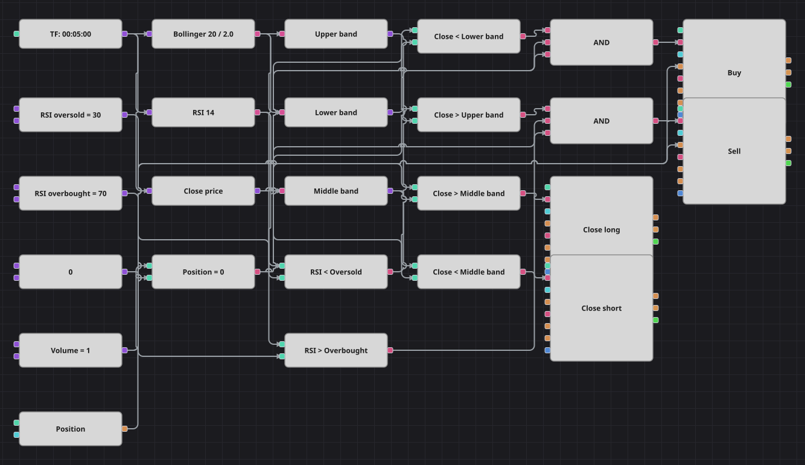

# Bollinger Bands + RSI 戦略のダイアグラム
[English](README.md) | [Русский](README_ru.md) | [中文](README_zh.md) | [Español](README_es.md) | [Deutsch](README_de.md) | [Português](README_pt.md)

ここでは2つの古典的な指標が別々の問いに答えます。Bollinger Bands は価格が自らの平均からどれだけ離れたかを示し、Relative Strength Index はその動きの勢いが尽きたかどうかを示します。両者が一致したときだけ仕掛け、価格が中心線に戻った時点で手仕舞います。

## 戦略の概要

- Bollinger Bands と Relative Strength Index は、単一銘柄の確定足で計算されます。
- バンドはダイアグラムに3つの数値を同時に渡します。上バンド、下バンド、そして中心の移動平均です。
- エントリーにはバンドの外側での終値と、対応する極端ゾーンにある RSI の両方が必要で、片方だけでは足りません。
- 中心線が目標です。そこへ戻った時点で決済するため、すでに戻り切った建玉を持ち続けることはありません。

## エントリーとエグジットの条件

- **ロングエントリー**: 終値が Bollinger の下バンドを下回り、RSI が売られすぎ水準を下回り、ポジションがないとき。注文は1ロットを買い、買い建玉を作ります。
- **ショートエントリー**: 終値が Bollinger の上バンドを上回り、RSI が買われすぎ水準を上回り、ポジションがないとき。注文は1ロットを売り、売り建玉を作ります。
- **エグジット**: 終値が中心線より上に戻れば買い建玉を、下に戻れば売り建玉を決済します。どちらの決済もクローズモードのポジション変更ブロックで行うため、対応する側の建玉があるときだけ働きます。保護的な逆指値はありません。

## パラメーター

| パラメーター | 既定値 | 説明 |
|---|---|---|
| Bollinger Length | 20 | Bollinger Bands の平滑化期間。 |
| Bollinger Width | 2 | バンド幅を決める標準偏差の倍率。 |
| RSI Length | 14 | Relative Strength Index の平滑化期間。 |
| RSI Oversold | 30 | この水準を下回ると RSI を売られすぎと判断します。 |
| RSI Overbought | 70 | この水準を上回ると RSI を買われすぎと判断します。 |
| Volume | 1 | 注文数量（ロット）。 |
| Candles | 00:05:00 | ダイアグラム全体が用いるローソク足の時間軸。 |

## ダイアグラムの詳細

- ローソク足ブロックは3つの枝に分かれ、Bollinger ブロック、RSI ブロック、終値を読む変換ブロックへ渡します。
- 3つの変換ブロックが Bollinger の値を上バンド、下バンド、中心の移動平均に分解します。
- 6つの比較ブロックが条件を組み立てます。終値と各バンド、RSI と各水準、ポジションとゼロ定数です。
- それぞれの論理積がバンド条件、RSI 条件、ポジション判定を結び、共通の定数から数量を受け取るポジション変更ブロックを起動します。
- 元の戦略は各取引の後に一定本数のバーだけ休止しますが、バーを数えるブロックは用意されていないため休止は省き、手仕舞いの判断は中心線だけに委ねています。

## 使い方

`.json` ファイルを Designer に読み込み、バックテスターで過去データを使って実行し、実運用の前にパラメーターやブロック自体を自分の銘柄に合わせて調整してください。
