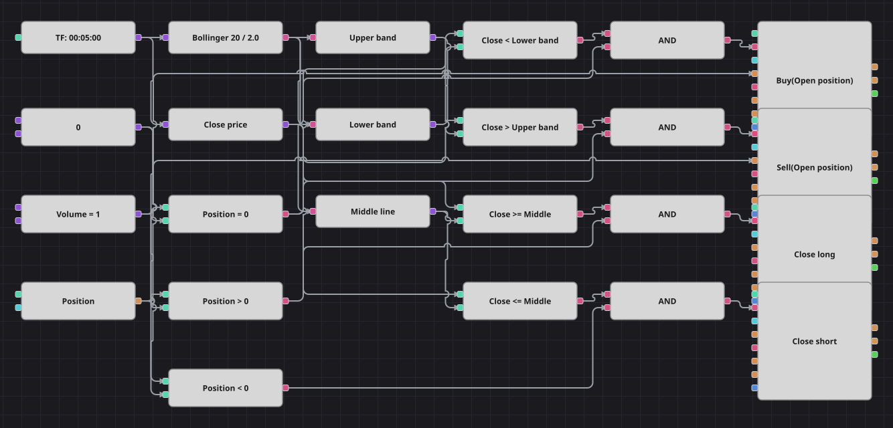

# Diagramm der Bollinger-Reversion-Strategie
[English](README.md) | [Русский](README_ru.md) | [中文](README_zh.md) | [Español](README_es.md) | [Português](README_pt.md) | [日本語](README_ja.md)

Ein Schlusskurs außerhalb eines Bollinger-Bandes gilt als Dehnung, die gleich zurückgegeben wird: Das Diagramm kauft unter dem unteren Band, verkauft über dem oberen und hält die Position nur, bis der Kurs die Mittellinie wieder berührt. Anders als ein Ausbruchsdiagramm auf denselben Bändern steigt es gegen die Bewegung ein und nimmt die Mittellinie als Ziel, nicht das gegenüberliegende Band.

## Strategieübersicht

- BollingerBands wird einmal berechnet und dreifach gelesen: oberes Band, unteres Band und der gleitende Durchschnitt in der Mitte.
- Eingestiegen wird nur aus der Neutralstellung, sodass eine Reihe von Schlusskursen außerhalb des Bandes eine bestehende Position nicht vergrößert.
- Der Ausstieg ist zum Einstieg symmetrisch: Die Mittellinie ist das Ziel, und der Schließbaustein sendet genau die Größe der offenen Position.
- Bandbreite und Periode sind als Parameter herausgeführt, sodass dasselbe Diagramm für ein ruhiges wie für ein volatiles Instrument taugt.

## Ein- und Ausstiegsregeln

- **Long-Einstieg**: Die Kerze schließt unter dem unteren Band und die Position ist neutral. Die Order kauft das Grundvolumen und eröffnet gegen die Bewegung einen Long.
- **Short-Einstieg**: Die Kerze schließt über dem oberen Band und die Position ist neutral. Die Order verkauft das Grundvolumen und eröffnet gegen die Bewegung einen Short.
- **Ausstieg**: Ein Long wird beim ersten Schlusskurs auf oder über der Mittellinie geschlossen, ein Short beim ersten Schlusskurs auf oder unter ihr. Die Originalstrategie kennt weder Stop-Loss noch Take-Profit; ihre Pause von fünfhundert Kerzen und ihre Haltegrenze von dreihundert Kerzen wurden nicht übernommen, und da die Pause länger war als die Grenze, endete im Quellcode jeder Trade tatsächlich an der Zeitgrenze und der Ausstieg an der Mittellinie kam nie zum Zug.

## Parameter

| Parameter | Standard | Beschreibung |
|---|---|---|
| Bollinger Period | 20 | Glättungsperiode der Bollinger-Bänder. |
| Bollinger Width | 2 | Bandbreite in Standardabweichungen. |
| Volume | 1 | Ordervolumen in Lots. |
| Candles | 00:05:00 | Zeiteinheit der Kerzen: Die Originalstrategie nutzte Minutenkerzen, das Diagramm arbeitet mit Fünf-Minuten-Kerzen. |

## Diagrammdetails

- Der Kerzenbaustein speist den Indikator und einen Konverter für den Schlusskurs; drei weitere Konverter lesen die Bänder und die Mittellinie aus dem Indikatorwert.
- Vier Vergleichsbausteine machen aus dem Schlusskurs Signale: außerhalb des unteren Bandes, außerhalb des oberen, zurück an der Mitte von unten und zurück an der Mitte von oben.
- Der Positionsbaustein speist drei Vergleiche mit null, die beide Einstiege und beide Ausstiege absichern.
- Die Einstiegsbausteine arbeiten mit der Bedingung zum Eröffnen und teilen sich eine Volumenkonstante, die Ausstiegsbausteine mit der Bedingung zum Schließen und beziehen ihr Volumen aus der Position selbst.

## Verwendung

Importieren Sie die `.json`-Datei in Designer, testen Sie sie im Backtester mit historischen Daten und passen Sie danach Parameter oder Bausteine an Ihr Instrument an, bevor Sie live handeln.
