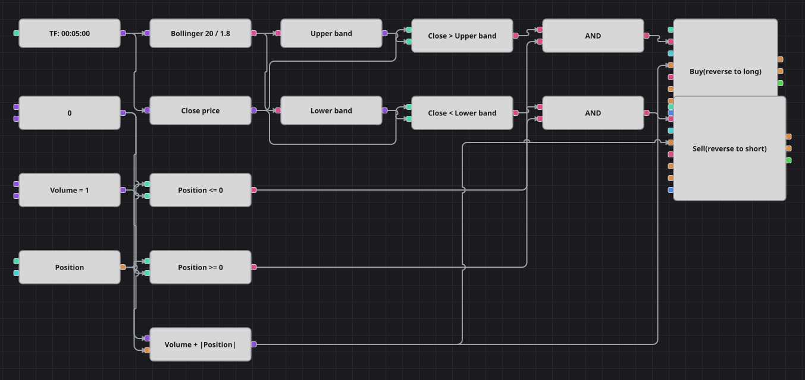

# Diagrama da estratégia de rompimento Bollinger Squeeze
[English](README.md) | [Русский](README_ru.md) | [中文](README_zh.md) | [Español](README_es.md) | [Deutsch](README_de.md) | [日本語](README_ja.md)

Um diagrama de rompimento sobre as Bandas de Bollinger: as bandas ficam a 1,8 desvio padrão de uma média de vinte períodos, e um fechamento fora delas é lido como o início de um movimento, não como um exagero a ser contrariado. O volume da ordem sempre carrega a posição aberta, de modo que cada sinal inverte o lado em vez de aumentá-lo.

## Visão geral da estratégia

- As Bandas de Bollinger são calculadas sobre candles finalizados de um único instrumento, e apenas a banda superior e a inferior participam das decisões.
- É um rompimento e não uma reversão: compra a força acima da banda superior e vende a fraqueza abaixo da inferior, ao contrário do exemplo Bollinger_Bands desta mesma galeria.
- O volume de cada ordem é o volume base mais o valor absoluto da posição atual, então um sinal contrário à posição aberta a encerra e abre o lado oposto em uma única ordem.
- Apesar do nome, não há filtro de compressão: a estratégia original em C# calcula a largura relativa das bandas, mas nunca a usa em nenhuma condição, e o diagrama reproduz o que o código de fato faz.

## Regras de entrada e saída

- **Entrada comprada**: O candle fecha acima da banda superior de Bollinger e a posição ainda não está comprada. A ordem compra o volume base mais o tamanho da posição aberta: a partir do zero abre uma compra, a partir de uma venda a inverte.
- **Entrada vendida**: O candle fecha abaixo da banda inferior de Bollinger e a posição ainda não está vendida. A ordem vende o volume base mais o tamanho da posição aberta: a partir do zero abre uma venda, a partir de uma compra a inverte.
- **Saída**: Não há saída própria nem bloco de proteção: a posição só é abandonada quando o preço fecha além da banda oposta e a ordem de inversão troca o lado.

## Parâmetros

| Parâmetro | Padrão | Descrição |
|---|---|---|
| Bollinger Period | 20 | Número de candles sobre os quais as bandas são calculadas. |
| Bollinger Width | 1.8 | Multiplicador do desvio padrão que define a distância das bandas em relação à linha média. |
| Volume | 1 | Volume base da ordem, em lotes; o tamanho da posição é somado a ele. |
| Candles | 00:05:00 | Tempo gráfico dos candles com que todo o diagrama trabalha. |

## Detalhes do diagrama

- O bloco de candles alimenta o bloco de indicador com as Bandas de Bollinger e um conversor que lê o preço de fechamento do mesmo candle.
- Dois conversores tipados como valor de indicador extraem a banda superior e a inferior da única saída do indicador.
- Dois blocos de comparação testam o fechamento contra as bandas, outros dois comparam a posição com uma constante zero, e cada E lógico une uma condição de banda a uma de posição.
- Um bloco de fórmula calcula o volume base mais o módulo da posição e alimenta os dois blocos de modificação de posição, o que transforma cada entrada em uma inversão.
- A pausa de dez candles que o código original mantém após cada entrada não foi reproduzida: entre os blocos disponíveis não há contador de candles, então apenas as verificações de posição seguram a frequência das operações.

## Uso

Importe o arquivo `.json` no Designer, execute-o sobre dados históricos no backtester e depois ajuste os parâmetros ou os próprios blocos ao seu instrumento antes de operar ao vivo.
