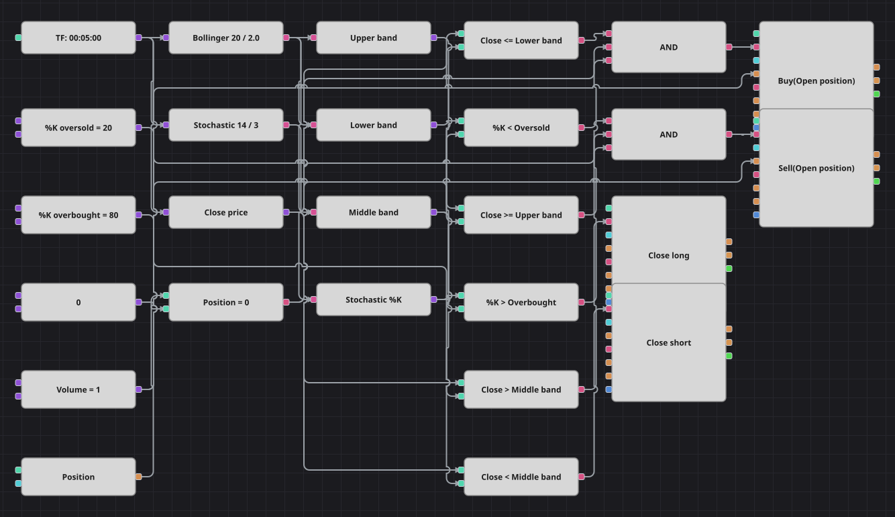

# Bollinger Bands + Stochastic Strategy Diagram
[Русский](README_ru.md) | [中文](README_zh.md) | [Español](README_es.md) | [Deutsch](README_de.md) | [Português](README_pt.md) | [日本語](README_ja.md)

Mean reversion that asks for two independent signs of an exhausted move: the close has to reach a Bollinger band, and the Stochastic %K line has to be in the matching extreme zone. The position is handed back as soon as price crosses the middle band of the same Bollinger Bands, so the trade lives exactly as long as the stretch it was opened on.

## Strategy Overview

- Bollinger Bands supply three lines from one indicator block: the upper band, the lower band and the middle moving average that serves as the exit level.
- The Stochastic Oscillator is used for its %K line only; the %D line is deliberately left unconnected, as in the original strategy.
- Entries are taken only from a flat position, so the diagram never averages into a trade that is already running.
- The original strategy also waits a fixed number of bars between trades; that cooldown counter has no block equivalent and is left out, which makes this diagram trade more often than the source.

## Entry and Exit Rules

- **Long entry**: The close is at or below the lower Bollinger band, %K is below the oversold level and the position is flat. The order buys one lot and opens a long.
- **Short entry**: The close is at or above the upper Bollinger band, %K is above the overbought level and the position is flat. The order sells one lot and opens a short.
- **Exit**: A long is closed when the close rises above the middle band, a short when the close falls below it. Both exits use position modify blocks in close mode, so they size themselves from the open position and stay idle when there is nothing to close. There are no stops or targets, exactly as in the original code.

## Parameters

| Parameter | Default | Description |
|---|---|---|
| Bollinger Length | 20 | Averaging length of the Bollinger Bands, which also sets the middle line used for the exit. |
| Bollinger Width | 2 | Standard deviation multiplier that sets how far the bands sit from the middle line. |
| %K Oversold | 20 | Level below which the Stochastic %K line confirms a buy. |
| %K Overbought | 80 | Level above which the Stochastic %K line confirms a sell. |
| Volume | 1 | Order volume, in lots. |
| Candles | 00:05:00 | Candle time frame the whole diagram works on. |

## Diagram Details

- One candle block feeds the Bollinger Bands, the Stochastic Oscillator and a converter that extracts the close price.
- Converter blocks split the indicators into single lines: upper band, lower band, middle band and %K.
- Each logical AND joins a band condition, a Stochastic condition and the flat position check before triggering a position modify block in open mode.
- The two exit blocks are triggered straight from the middle band comparisons; the close condition of the block itself decides whether an order is really needed.

## Usage

Import the `.json` file into Designer, run it in the backtester on historical data, then adjust the parameters or the blocks themselves to fit your instrument before trading it live.
