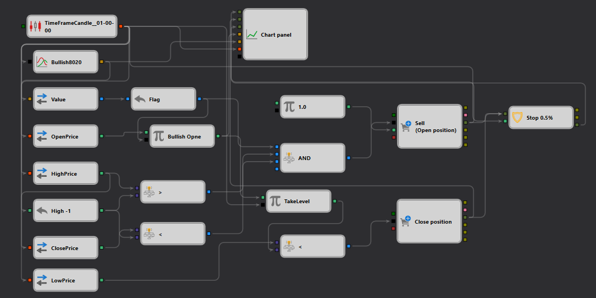

# Bullish8020 Strategy Description

## Strategy Overview

The "Bullish8020" strategy is crafted for [StockSharp Designer](https://doc.stocksharp.com/topics/designer.html) to capitalize on specific bullish candlestick patterns with high precision. This strategy aims to identify market opportunities where bullish sentiment is strong, using a unique pattern analysis combined with volume and price action.

## Strategy Details

### Pattern Detection: Bullish8020

- **Description**: This strategy detects a bullish scenario where the [opening price](https://doc.stocksharp.com/topics/designer/strategies/using_visual_designer/elements/data_sources/candles.html) is below the closing price and the body size is four times the sum of both shadows, indicating strong buying pressure.
- **Candlestick Pattern**: 'Bullish8020' which checks if `(O < C) && (B >= 4*(BS+TS))`, where `O` is open, `C` is close, `B` is body size, `BS` is bottom shadow, and `TS` is top shadow.

### Trade Execution

- **Order Type**: Market [Order](https://doc.stocksharp.com/topics/designer/strategies/using_visual_designer/elements/trading/register_order.html)
- **Entry**: Buys when the 'Bullish8020' [pattern](https://doc.stocksharp.com/topics/designer/strategies/using_visual_designer/elements/common/indicator.html) is confirmed, signaling a potential upward movement.
- **Exit Strategy**: 
  - **Stop Loss**: Set at 0.5% below the entry point to limit potential losses.
  - **Market Conditions**: Trades are executed based on current market prices to ensure quick response to pattern recognition.

### Risk Management

- **Position Sizing**: The strategy uses dynamic sizing based on the current market conditions and the trader's risk profile.
- **Stop-Loss Strategy**: A strict [stop-loss](https://doc.stocksharp.com/topics/designer/strategies/using_visual_designer/elements/common/protect_position.html) is implemented to protect against unforeseen market reversals.

## Implementation Details

- **Platform**: Implemented on the StockSharp platform utilizing its powerful API for real-time data processing and order execution.
- **Indicators Used**: Combines candlestick pattern recognition with volume analysis to improve the accuracy of trade signals.

## Conclusion

The "Bullish8020" strategy provides traders with a robust tool for exploiting specific bullish patterns in the market. It is designed to maximize gains from strong bullish setups while employing strict risk management protocols to safeguard investments.
