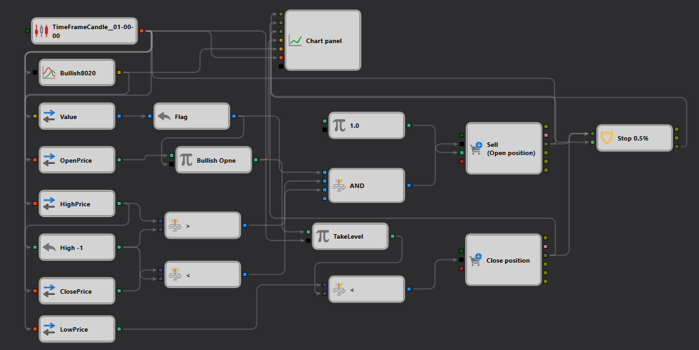

# Descrição da Estratégia Bullish8020
[English](README.md) | [Русский](README_ru.md) | [中文](README_zh.md) | [Español](README_es.md) | [Deutsch](README_de.md) | [日本語](README_ja.md)

## Visão geral da estratégia

A estratégia "Bullish8020" foi elaborada para o [StockSharp Designer](https://doc.stocksharp.com/topics/designer.html) a fim de capitalizar padrões específicos de candles de alta com grande precisão. Esta estratégia visa identificar oportunidades de mercado onde o sentimento de alta é forte, usando uma análise de padrões exclusiva combinada com volume e ação do preço.

## Detalhes da estratégia

### Detecção de padrão: Bullish8020

- **Descrição**: Esta estratégia detecta um cenário de alta onde o [preço de abertura](https://doc.stocksharp.com/topics/designer/strategies/using_visual_designer/elements/data_sources/candles.html) está abaixo do preço de fechamento e o tamanho do corpo é quatro vezes a soma de ambas as sombras, indicando forte pressão compradora.
- **Padrão de candle**: 'Bullish8020' verifica se `(O < C) && (B >= 4*(BS+TS))`, onde `O` é abertura, `C` é fechamento, `B` é tamanho do corpo, `BS` é sombra inferior e `TS` é sombra superior.

### Execução de negociações

- **Tipo de ordem**: [Ordem](https://doc.stocksharp.com/topics/designer/strategies/using_visual_designer/elements/positions/modify.html) a mercado
- **Entrada**: Compra quando o [padrão](https://doc.stocksharp.com/topics/designer/strategies/using_visual_designer/elements/common/indicator.html) 'Bullish8020' é confirmado, sinalizando um potencial movimento de alta.
- **Estratégia de saída**:
  - **Stop Loss**: Definido a 0.5% abaixo do ponto de entrada para limitar perdas potenciais.
  - **Condições de mercado**: As negociações são executadas a preços de mercado atuais para garantir resposta rápida ao reconhecimento do padrão.

### Gestão de risco

- **Dimensionamento de posições**: A estratégia usa dimensionamento dinâmico baseado nas condições atuais do mercado e no perfil de risco do trader.
- **Estratégia de Stop-Loss**: Um [stop-loss](https://doc.stocksharp.com/topics/designer/strategies/using_visual_designer/elements/common/protect_position.html) rígido é implementado para proteger contra reversões de mercado imprevistas.

## Detalhes de implementação

- **Plataforma**: Implementada na plataforma StockSharp, utilizando sua poderosa API para processamento de dados em tempo real e execução de ordens.
- **Indicadores utilizados**: Combina reconhecimento de padrões de candles com análise de volume para melhorar a precisão dos sinais de negociação.

## Conclusão

A estratégia "Bullish8020" fornece aos traders uma ferramenta robusta para explorar padrões específicos de alta no mercado. Ela foi projetada para maximizar ganhos com configurações fortemente altistas, ao mesmo tempo que emprega protocolos rigorosos de gestão de risco para proteger os investimentos.
