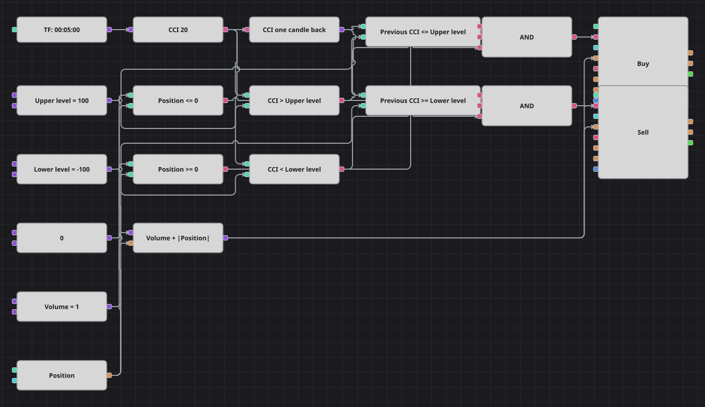

# CCI Breakout Strategy Diagram
[Русский](README_ru.md) | [中文](README_zh.md) | [Español](README_es.md) | [Deutsch](README_de.md) | [Português](README_pt.md) | [日本語](README_ja.md)

The Commodity Channel Index spends most of its life between -100 and +100, so leaving that band is treated as the start of a move rather than an excess. The diagram compares the index with its own value one candle back, which is what turns a level into a breakout, and it is always in the market: every signal reverses the position instead of merely closing it.

## Strategy Overview

- One indicator block holds the Commodity Channel Index; a previous-value block keeps the reading of the candle before, so the pair describes a crossing of the level and not just a position above it.
- The two levels are ordinary constants, so the breakout band can be widened or narrowed and optimized like any other parameter.
- The order volume is calculated as the base volume plus the absolute value of the current position, which closes an opposite position and opens the new one with a single market order.
- The original strategy skips two candles after every signal; that counter has no block equivalent and is left out, so this diagram may take a reversal one or two candles earlier than the source.
- The original strategy works on hourly candles; the diagram is scaled to five-minute candles to match the packaged sample history.

## Entry and Exit Rules

- **Long entry**: CCI closed the previous candle at or below the upper level and is now above it, and the position is not already long. The order buys the base volume plus any open short, which reverses the position into a long.
- **Short entry**: CCI closed the previous candle at or above the lower level and is now below it, and the position is not already short. The order sells the base volume plus any open long, which reverses the position into a short.
- **Exit**: There is no separate exit: the strategy stays in the market and the opposite breakout both closes the running trade and opens the new one. The original code has no stop loss or take profit either.

## Parameters

| Parameter | Default | Description |
|---|---|---|
| CCI Length | 20 | Averaging length of the Commodity Channel Index. |
| Upper level | 100 | Level the index has to cross upwards for a long breakout. |
| Lower level | -100 | Level the index has to cross downwards for a short breakout. |
| Volume | 1 | Base order volume, in lots; the reversal adds the open position on top of it. |
| Candles | 00:05:00 | Candle time frame the whole diagram works on. |

## Diagram Details

- The candle block feeds the Commodity Channel Index, whose output goes both to the comparison blocks and to a previous-value block.
- Two comparison blocks per side test the current and the previous reading against the same level constant, which reproduces the breakout condition of the source code exactly.
- Each logical AND joins the current reading, the previous reading and a position check before it triggers a position modify block.
- A formula block adds the base volume to the absolute value of the position and feeds both order blocks, so one market order performs the whole reversal.

## Usage

Import the `.json` file into Designer, run it in the backtester on historical data, then adjust the parameters or the blocks themselves to fit your instrument before trading it live.
