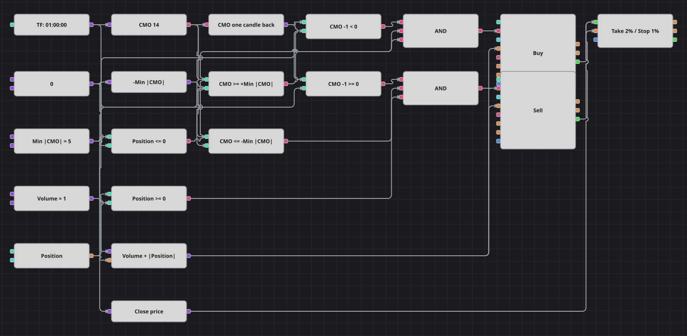

# CMO 零轴穿越策略图
[English](README.md) | [Русский](README_ru.md) | [Español](README_es.md) | [Deutsch](README_de.md) | [Português](README_pt.md) | [日本語](README_ja.md)

Chande Momentum Oscillator 在 -100 与 +100 之间摆动，当买盘与卖盘力量互换时它恰好改变符号。本图交易的正是这一符号变化，但只有当新读数已经离零轴足够远、值得下单时才动手，零轴附近的横盘漂移会被忽略。

## 策略概览

- Chande Momentum Oscillator 基于单一品种的已完成一小时K线计算。
- 穿越由两个数值判断——前一根K线的振荡值与当前振荡值——而不是使用穿越方块，这样运动方向在图上一目了然。
- 强度过滤要求新读数至少离开零轴一个最小距离，从而剔除行情停滞时出现的浅层穿越。
- 持仓参与每一次判断并决定下单数量，因此与已有仓位相反的信号会用一笔市价单直接反手。

## 入场与出场规则

- **做多入场**: 前一根K线振荡值低于零，当前振荡值达到或高于最小正水平，且持仓不是多头。订单买入共享数量加上已有空头的规模，于是一笔市价单同时平空并开多。
- **做空入场**: 前一根K线振荡值等于或高于零，当前振荡值达到或低于最小负水平，且持仓不是空头。订单卖出共享数量加上已有多头的规模。
- **离场**: 没有单独的离场方块：仓位由反向零轴穿越反手平掉，或由持仓保护方块了结。原策略使用 2000 的绝对止盈与 1000 的绝对止损；为其他品种校准的绝对价位在本段历史上根本触及不到，所以这里改写为百分之二的目标与百分之一的止损，保持二比一的比例。原策略在每次仓位变动后还会暂停四根K线；没有任何方块能在K线之间保存计数器，因此暂停被去掉，同方向的重复入场由持仓判断本身阻止。

## 参数

| 参数 | 默认值 | 说明 |
|---|---|---|
| CMO Length | 14 | Chande Momentum Oscillator 的平滑周期。 |
| Min |CMO| | 5 | 振荡值必须离开零轴的最小距离，穿越才算数。 |
| Volume | 1 | 下单数量（手）。 |
| Take profit, % | 2 | 止盈相对入场价的距离，百分比。 |
| Stop loss, % | 1 | 止损相对入场价的距离，百分比。 |
| Candles | 01:00:00 | 整张图使用的K线周期。 |

## 图表详情

- K线方块给出带 Chande Momentum Oscillator 的指标方块，以及为保护方块取收盘价的转换方块。
- 前值方块保存前一根K线的振荡值，两个比较方块判断它当时位于零轴的哪一侧。
- 强度常量直接进入多头比较，并通过一个取负的小公式进入空头比较，因此一个参数即可控制两侧。
- 每个逻辑与把先前所处的一侧、强度过滤与持仓判断合并，触发修改持仓方块，其数量来自把持仓绝对值加到共享数量上的公式。

## 使用方法

将 `.json` 文件导入 Designer，在回测器中用历史数据运行，然后根据自己的交易品种调整参数或方块，确认无误后再用于实盘。
