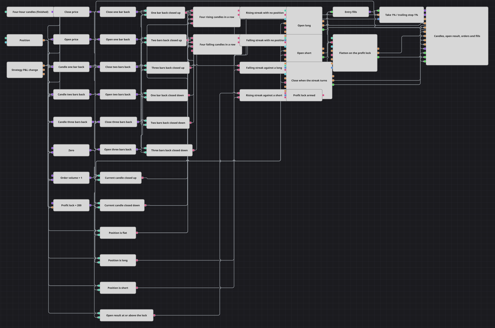

# ローソク足連続・利益ロック戦略のダイアグラム
[English](README.md) | [Русский](README_ru.md) | [中文](README_zh.md) | [Español](README_es.md) | [Deutsch](README_de.md) | [Português](README_pt.md)

同じ方向に引けたローソク足が4本続けば、それが連続（ストリーク）であり、このダイアグラムはその方向に売買します。エントリーは簡単なほうの半分にすぎず、面白いのは手仕舞いのほうです。というのも、ダイアグラムはその判断を価格水準に委ねないからです。保有ポジションの評価損益を金額で監視し、その数値が設定した金額に初めて達した時点でポジションを閉じ、利益を確定します。ラッチにより、その決済命令は一度だけ送られ、損益が更新されるたびに繰り返されることはありません。

## 戦略の概要

- 確定した4時間足は一度だけ読み込んで使い回します。現在のローソク足はそのまま終値と始値のコンバーターに渡され、3つの「前の値」（Previous value）ブロックが1本前・2本前・3本前のローソク足を返し、それぞれに専用の終値・始値コンバーターが付きます。
- 8つの比較が、この4組の値を各バーの色に変えます。終値が始値より上なら陽線、終値が始値より下なら陰線であり、始値と同値で引けたバーはどちらでもないため両方の判定に外れ、どちらの連続も伸ばすことができません。
- 1つの論理積（AND）が陽線側の4つの結果をまとめ、もう1つが陰線側の4つをまとめます。それぞれは対象となる4本すべてが一致したときだけ true を出力し、これが連続というものの定義です。
- ポジションのブロックをゼロと比較することで、ノーポジションか買い持ちか売り持ちかが分かり、下流のゲートはすべて「1つの連続」と「1つのポジション状態」の論理積になっています。
- どちらのエントリーも固定数量の成行注文で、ポジションの有無に関する条件を伴います。そのため、すでにポジションを持っている間に連続が続いても、最初の注文の上に2つ目の注文を積み増すことはできません。
- エントリーの約定は1本の線にまとめられ、ポジション保護（Position protection）に渡されます。ここでは約定価格に対する割合としてテイクプロフィットとトレーリングストップを持ち、ポジションが存続する限り注文を出し続けます。
- 戦略損益（Strategy P&L）ブロックは、保有中のポジションの評価損益を独自の周期で出力し、比較がその数値を Profit Lock と突き合わせます。その結果はフラグ（Flag）に入り、フラグは最初の true だけを通してその後は保持されるため、決済命令はちょうど1回だけ送られます。
- 保有ポジションと逆向きの連続が成立した場合は成行で決済し、フラグはどちらのエントリーゲートからでも再セットされるため、新しいポジションは毎回ロックが有効な状態から始まります。

## エントリーとエグジットの条件

- **ロングエントリー**: ノーポジションのときに、確定したローソク足が4本続けてそれぞれの始値より上で引けた場合、ポジション変更（Position modify）が Order Volume の数量を成行で買います。
- **ショートエントリー**: ノーポジションのときに、確定したローソク足が4本続けてそれぞれの始値より下で引けた場合、ポジション変更（Position modify）が Order Volume の数量を成行で売ります。
- **エグジット**: 手仕舞いの経路は3つあり、最も早く来たものでポジションが外れます。Profit Lock は、評価損益が設定した金額に達した時点で決済します。フラグがそのシグナルを一度通しているため、同じ損益がその後更新されても何も送られません。ポジション保護はテイクプロフィットまたはトレーリングストップで決済し、ストップは含み益になった後は価格に追随します。逆方向の連続もまた成行で決済しますが、そのバーで起きるのはその決済注文だけです。エントリーゲートはノーポジションであることを求めるため、ドテンは、ポジションを空にしたそのシグナルではなく、ダイアグラムが空の状態で見つかった次の連続シグナルによって建てられます。

## パラメーター

| パラメーター | 既定値 | 説明 |
|---|---|---|
| Candle Type | 04:00:00 | 連続を数える対象となるローソク足系列の時間足。連続を構成する4本は、この長さのローソク足4本です。 |
| Order Volume | 1 | 各エントリーが送る注文数量（ロット）。Profit Lock と比較される評価損益の大きさも、これに比例して変わります。 |
| Take Profit | 1% | 約定価格からテイクプロフィットまでの距離（％）。 |
| Stop Loss | 1% | 約定価格からストップロスまでの距離（％）。ストップはトレーリングで、値動きが有利に進むと価格に追随し、逆方向には戻りません。 |
| Profit Lock | 200 | ポジションを決済して利益を確定する評価損益の水準（ポートフォリオの通貨建て金額）。 |

## ダイアグラムの詳細

- 連続の長さは数値として設定するのではなく、ダイアグラムの構造そのものに組み込まれています。4本というのは、「前の値」ブロックが3つ、各連続ゲートの入力が4つということです。5本の連続にするならブロックを3つ追加し、ゲートごとに入力を1つ増やします。3本の連続ならブロックが1つ減ります。
- 各「前の値」ブロックはローソク足型として指定され、ローソク足の系列を直接読み取ります。終値と始値は、そのブロックが返したものから取り出します。先に価格を取り出してからその前の値を求めるのは順序が逆であり、この場合は比較のオペランドが欠けたままになります。
- Profit Lock はポートフォリオの通貨建ての金額であり、価格の値幅ではありません。したがって銘柄と同じくらい注文数量にも左右されます。数量を2倍にすれば到達に必要な値動きは半分になり、価格水準の異なる銘柄に変えれば意味合いは全く変わります。
- ロックとテイクプロフィットは同じ問いに対する2つの答えであり、より手前にあるほうが先に効きます。テイクプロフィットより先に発動するようにロックを設定すれば、テイクプロフィットは、バーがロックを飛び越えたときだけ届く上限になります。ロックを広く取れば、通常の手仕舞いはテイクプロフィットとなり、ロックはその背後の安全網になります。
- ダイアグラムが送る注文はすべて成行注文で、ローソク足の系列は確定したバーのみを購読します。形成途中のバーから作られたシグナルはそのバーの開始時刻を持ち、すでに過去となった時刻が付いた注文は拒否されます。

## 使い方

`.json` ファイルを Designer に読み込み、バックテスターで過去データを使って実行し、実運用の前にパラメーターやブロック自体を自分の銘柄に合わせて調整してください。
