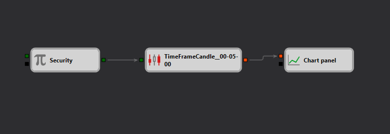

# Basic Data Source and Chart Cube Usage Diagram

This diagram provides a straightforward demonstration of how to use the "Candles" data source and "Chart" cube within the Designer platform. It is designed to help users understand the fundamentals of fetching market data and visualizing it in a chart format.

## Overview

The diagram showcases the basic setup required to retrieve candle data for a specific financial instrument and display it on a chart. This serves as a foundational example for those new to using Designer or those who wish to start with simple data visualization techniques.

## Components of the Diagram

- **Candles Data Source**: This is the primary node that fetches candle data from the selected financial instrument. Users can specify the instrument, the data range, and the candle time frame (e.g., 1-minute, 5-minute candles).

- **Chart Cube**: This node is used to plot the fetched data on a graphical interface. It can display various candle attributes such as open, high, low, and close prices.

## Functionality

- **Data Retrieval**: The diagram starts by retrieving candle data using the specified parameters in the Candles Data Source cube.
- **Data Visualization**: The retrieved data is then passed to the Chart cube, which plots the candles on a chart within the Designer environment.

## Use Case

This diagram is particularly useful for:
- New users learning how to set up data retrieval and visualization in Designer.
- Traders and analysts looking to quickly visualize market data for analysis.
- Educational purposes, demonstrating the basic interaction between data source nodes and visualization tools within the platform.

## Practical Application

By understanding and using this basic setup, users can:
- Quickly set up visual representations of market data for real-time or historical analysis.
- Extend the basic diagram by incorporating additional analytical tools or indicators available within the Designer.
- Use the chart as a building block for more complex trading strategies or data studies.

This diagram is part of a broader set of educational resources available in the Designer platform, aimed at enhancing users' proficiency in data handling and visualization.
