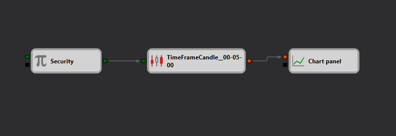

# Диаграмма базового использования источника данных и куба Chart
[English](README.md) | [中文](README_zh.md) | [Español](README_es.md) | [Deutsch](README_de.md) | [Português](README_pt.md) | [日本語](README_ja.md)

Эта диаграмма демонстрирует простое использование источника данных «Candles» и куба «Chart» в платформе Designer. Она разработана для того, чтобы помочь пользователям понять основы получения рыночных данных и их визуализации в формате графика.

## Обзор

Диаграмма демонстрирует базовую конфигурацию, необходимую для получения данных свечей по конкретному финансовому инструменту и отображения их на графике. Это служит основополагающим примером для тех, кто только начинает работать с Designer, или для тех, кто хочет начать с простых методов визуализации данных.

## Компоненты диаграммы

- **Источник данных Candles**: Это основной узел, который получает [данные свечей](https://doc.stocksharp.com/topics/designer/strategies/using_visual_designer/elements/data_sources/candles.html) для выбранного финансового инструмента. Пользователи могут указать инструмент, диапазон данных и таймфрейм свечи (например, 1-минутные, 5-минутные свечи).
- **Куб Chart**: Этот узел используется для [отображения](https://doc.stocksharp.com/topics/designer/strategies/using_visual_designer/elements/common/chart.html) полученных данных на графическом интерфейсе. Он может отображать различные атрибуты свечей, такие как цены открытия, максимума, минимума и закрытия.

## Функциональность

- **Получение данных**: Диаграмма начинается с получения данных свечей с использованием параметров, заданных в кубе «Источник данных Candles».
- **Визуализация данных**: Полученные данные затем передаются в куб Chart, который отображает свечи на графике в среде Designer.

## Варианты применения

Эта диаграмма особенно полезна для:
- Новых пользователей, изучающих настройку получения и визуализации данных в Designer.
- Трейдеров и аналитиков, желающих быстро визуализировать рыночные данные для анализа.
- Образовательных целей, демонстрируя базовое взаимодействие между узлами источника данных и инструментами визуализации в платформе.

## Практическое применение

Понимая и используя эту базовую конфигурацию, пользователи могут:
- Быстро создавать визуальные представления рыночных данных для анализа в режиме реального времени или исторических данных.
- Расширять базовую диаграмму за счёт дополнительных аналитических инструментов или индикаторов, доступных в Designer.
- Использовать график как строительный блок для более сложных торговых стратегий или исследований данных.

Эта диаграмма является частью более широкого набора образовательных ресурсов, доступных в платформе Designer, направленных на повышение квалификации пользователей в области работы с данными и визуализации.
