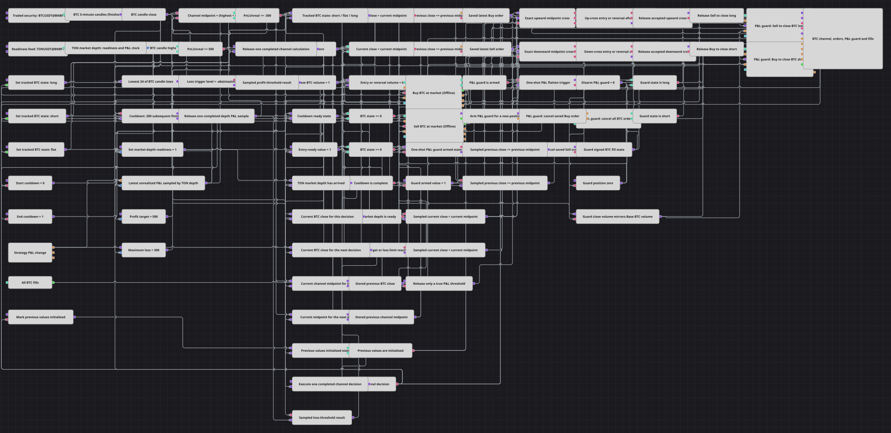

# Channel Cross with P&L Guard Strategy Diagram
[Русский](README_ru.md) | [中文](README_zh.md) | [Español](README_es.md) | [Deutsch](README_de.md) | [Português](README_pt.md) | [日本語](README_ja.md)

This diagram calculates a 24-candle channel midpoint from finished five-minute BTCUSDT@BNBFT candles and trades exact close-to-midpoint crossings after a 200-candle cooldown. TONUSDT@BNBFT market depth confirms feed readiness and clocks unrealized-P&L checks; a one-shot monetary guard requests cancellation of any entry orders that are still active and closes the BTC position at either configured threshold.

## Strategy Overview

- The BTC Security variable configures the finished five-minute candle subscription. Market orders, fills, position closing, and P&L belong to the selected Strategy Security, which must be set to BTCUSDT@BNBFT to match BTC Security.
- Highest(24) receives BTC candles and tracks their highs, while Lowest(24) tracks their lows. Their arithmetic midpoint is `(Highest + Lowest) / 2`; the first available decision stores the close and midpoint, starts the initial cooldown, and does not submit an order.
- A long crossing requires `Previous Close <= Previous Midpoint` and `Current Close > Current Midpoint`. A short crossing requires `Previous Close >= Previous Midpoint` and `Current Close < Current Midpoint`. The stored values advance on every finished BTC candle, including candles rejected by the cooldown.
- An entry or reversal is eligible only after 200 strictly subsequent finished BTC candles and after at least one TON market-depth event. Each accepted crossing restarts the 200-candle delay before its market order is submitted.
- A fill-driven signed latch records the managed BTC state: `-1` is short, `0` is flat, and `1` is long. Unrealized P&L at or above `500`, or at or below `-300`, fires a one-shot guard; a later buy or sell fill rearms it.

## Entry and Exit Rules

- **Long entry**: When the exact upward crossing occurs while the signed latch is flat or short, both readiness gates are open, and the cooldown is complete, submit a market buy. A flat entry uses Base BTC Volume; a short-to-long reversal uses twice that quantity.
- **Short entry**: When the exact downward crossing occurs while the signed latch is flat or long, both readiness gates are open, and the cooldown is complete, submit a market sell. A flat entry uses Base BTC Volume; a long-to-short reversal uses twice that quantity.
- **Exit**: An eligible opposite crossing performs an ordinary one-step reversal rather than a separate close. Independently, the P&L guard fires at `P&L >= Profit Target` or `P&L <= -abs(Maximum Loss)`, sends a mass-cancellation intent plus addressed cancellation requests for the saved entry orders, and requests a market close. This monetary close does not restart the crossing cooldown.

## Parameters

| Parameter | Default | Description |
|---|---|---|
| BTC Security | BTCUSDT@BNBFT | Security used by the five-minute candle subscription. Set Strategy Security to the same value because order actions, fills, position closing, and P&L use Strategy Security. |
| TON Readiness Security | TONUSDT@BNBFT | Security used only by the market-depth subscription that opens the feed-readiness gate and clocks P&L sampling; its quote prices are not used for BTC orders or P&L valuation. |
| Candle Series | 00:05:00 | Finished five-minute BTCUSDT candle series used for the channel, exact crossing decisions, cooldown counting, and the chart. |
| Highest Length | 24 | Number of BTC candles used by Highest to calculate the upper channel boundary. |
| Lowest Length | 24 | Number of BTC candles used by Lowest to calculate the lower channel boundary. |
| Base BTC Volume | 1 | Default market-entry quantity. The action formula is `Base BTC Volume * (1 + abs(latch))`, so a flat entry uses the base quantity and a reversal uses twice the base quantity. |
| Cooldown N | 200 | Number of strictly subsequent finished BTC candles required after initialization or an accepted crossing before another crossing can submit an order. |
| Profit Target | 500 | Unrealized-P&L level at or above which the one-shot guard requests cancellation and a market close. |
| Maximum Loss | 300 | Positive loss magnitude; the guard threshold is calculated as `-abs(Maximum Loss)`, which is `-300` by default. |

## Diagram Details

- The BTC [Variable](https://doc.stocksharp.com/en/topics/designer/strategies/using_visual_designer/elements/data_sources/variable.html) feeds only the finished [Candles](https://doc.stocksharp.com/en/topics/designer/strategies/using_visual_designer/elements/data_sources/candles.html) subscription. The TON variable feeds only [Market depth](https://doc.stocksharp.com/en/topics/designer/strategies/using_visual_designer/elements/market_depths/order_book.html); its first event writes the readiness latch, and later events also clock the latest unrealized-P&L value.
- Two [Indicator](https://doc.stocksharp.com/en/topics/designer/strategies/using_visual_designer/elements/common/indicator.html) blocks receive each BTC candle. Highest(24), Lowest(24), a midpoint formula, current-value latches, and previous-value latches preserve one complete close-and-channel decision per finished candle.
- A Delay block starts during the first decision and restarts on every accepted crossing. Because the current candle reaches its input before the decision branch runs, eligibility returns only after 200 later finished BTC candles; rejected crossings still replace the stored close and midpoint.
- Buy and sell [Order registering](https://doc.stocksharp.com/en/topics/designer/strategies/using_visual_designer/elements/orders/register.html) blocks submit market orders with `Base BTC Volume * (1 + abs(latch))`. Their MyTrade outputs write the signed state and rearm the P&L guard from actual fills.
- P&L change events and TON depth events sample the latest unrealized P&L. Strict threshold comparisons feed a shared armed gate, so reaching `500` or `-300` can produce only one guard action until a later entry fill rearms it.
- The guard invokes [Mass order cancellation](https://doc.stocksharp.com/en/topics/designer/strategies/using_visual_designer/elements/orders/mass_cancel.html), releases the saved buy and sell Order references to addressed cancellation blocks, and uses Base BTC Volume to close the current BTC exposure at market. The chart receives BTC candles, Highest(24), Lowest(24), the midpoint, P&L, submitted orders, and all strategy fills.

## Usage

Import the `.json` file into Designer, set Strategy Security to BTCUSDT@BNBFT, run it in the backtester with both candle and market-depth history, then adjust the parameters or blocks for your instrument before live trading.
