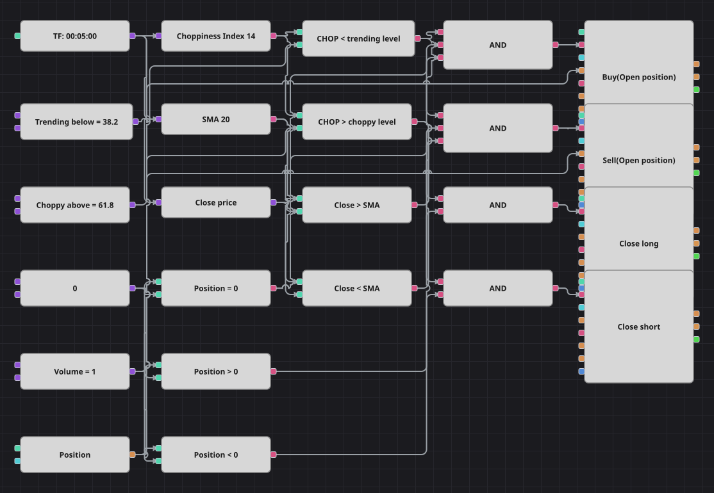

# Choppiness Index ブレイクアウト戦略のダイアグラム
[English](README.md) | [Русский](README_ru.md) | [中文](README_zh.md) | [Español](README_es.md) | [Deutsch](README_de.md) | [Português](README_pt.md)

Choppiness Index は相場がどちらへ向かうかではなく、そもそも向かっているかどうかだけを示します。このダイアグラムはそれをスイッチとして使います。指数が低い間は相場にトレンドがあるとみなし、終値が単純移動平均のどちら側にあるかで建玉を持ちます。指数がもみ合いのゾーンに戻れば、損益にかかわらず建玉を手仕舞います。

## 戦略の概要

- Choppiness Index は確定足14本から計算され、パーセントで読みます。低い値は方向性のある相場、高い値はレンジを意味します。
- 20期間の単純移動平均は方向だけを与えます。売買の可否はすでに相場状態の判定が決めているため、移動平均自体はフィルターになりません。
- エントリーはノーポジションからのみ行うので、1つのトレンド区間から生まれる売買は1回だけで、積み増しにはなりません。
- 損切りも利確もありません。建玉を開いた指数が、そのまま建玉を終わらせます。

## エントリーとエグジットの条件

- **ロングエントリー**: Choppiness Index がトレンドしきい値を下回り、足が単純移動平均より上で引け、ポジションがゼロのとき。注文は1ロットを買って新規の買いを建てます。
- **ショートエントリー**: Choppiness Index がトレンドしきい値を下回り、足が単純移動平均より下で引け、ポジションがゼロのとき。注文は1ロットを売って新規の売りを建てます。
- **エグジット**: Choppiness Index がもみ合いしきい値を上抜けた時点で建玉を閉じます。買い建てはクローズモードの売り、売り建てはクローズモードの買いです。原典コードにも損切り・利確はありません。原典から意図的に変えた点が2つあります。原典のしきい値は 99 と 99.5 で、これではエントリーのフィルターが常に開き、エグジット条件は事実上成立しません。そこで本図は指標の標準的な値である 38.2 と 61.8 を用います。これは戦略自身の README が説明している値でもあります。売買間の500本の休止も省いています。そのようなカウンターに対応するブロックが存在しないためです。

## パラメーター

| パラメーター | 既定値 | 説明 |
|---|---|---|
| SMA Length | 20 | エントリーの方向を決める単純移動平均の期間。 |
| Choppiness Length | 14 | Choppiness Index の平滑化期間。 |
| Trending Threshold | 38.2 | エントリーを許可するために指数が下回るべき値。 |
| Choppy Threshold | 61.8 | この値を超えると相場をもみ合いとみなし、建玉を閉じます。 |
| Volume | 1 | 注文数量（ロット）。 |
| Candles | 00:05:00 | ダイアグラム全体が用いるローソク足の時間軸。原典は1分足ですが、本図は同梱データの5分足を使います。 |

## ダイアグラムの詳細

- ローソク足ブロックが Choppiness Index、移動平均、そして足から終値を取り出すコンバーターにデータを供給します。
- 2つの比較ブロックが指数を2つの相場状態フラグ（一方のしきい値未満でトレンド、他方より上でもみ合い）に変え、さらに2つが終値と移動平均を比べます。
- ポジションブロックはゼロ定数と3回比較され、エントリー用のノーポジション判定と、エグジット用の買い建て・売り建て判定が得られます。
- 4つの論理積が4つのポジション変更ブロックを駆動します。2つは新規建てで共通定数から数量を取り、残る2つは既存の建玉を閉じるだけです。

## 使い方

`.json` ファイルを Designer に読み込み、バックテスターで過去データを使って実行し、実運用の前にパラメーターやブロック自体を自分の銘柄に合わせて調整してください。
