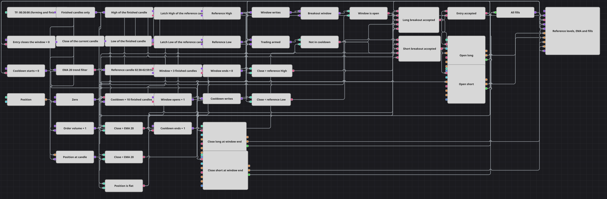

# Diagrama de la estrategia Clock Candle Breakout
[English](README.md) | [Русский](README_ru.md) | [中文](README_zh.md) | [Deutsch](README_de.md) | [Português](README_pt.md) | [日本語](README_ja.md)

Este diagrama elige cada día una vela de referencia por el reloj, memoriza su máximo y su mínimo y opera la ruptura de esos dos niveles durante las tres velas finalizadas siguientes. Un filtro de EMA 20 decide qué lado de la ruptura es operable, la ventana cierra la posición cuando expira y un enfriamiento de diez velas mantiene al diagrama fuera del mercado durante un tiempo después de cada entrada aceptada.

## Resumen de la estrategia

- Las velas de treinta minutos se entregan tanto mientras se están formando como una vez finalizadas. Un bloque Final value divide ese flujo: el nivel de referencia, el contador de la ventana y el contador del enfriamiento solo ven velas finalizadas, mientras que la prueba de ruptura lee el cierre de la vela que se está formando en ese momento.
- Working time marca la vela de referencia: la vela finalizada cuya hora de apertura cae entre 02:30:00 y 02:59:59. En un marco temporal de treinta minutos solo una vela al día cumple esa condición, y el intervalo de media hora deja margen para cambiar el marco temporal sin perder el pulso diario.
- Dos pares de bloques Variable extraen el nivel de esa vela. En cada par, la primera variable guarda el máximo (o el mínimo) de cada vela finalizada y lo libera únicamente cuando llega el pulso de Working time; la segunda retiene lo liberado y lo repite en cada actualización de vela, de modo que el nivel se mantiene en la línea entre una vela de referencia y la siguiente.
- El mismo pulso arma un contador N values ajustado a tres. Cuenta velas finalizadas y se dispara en cuanto cierra la tercera posterior a la vela de referencia, que es lo que pone fin a la ventana de negociación.
- El estado de la ventana es una única Variable numérica escrita a través de una Combination desde tres fuentes: uno cuando se toma la vela de referencia, cero cuando se dispara el contador de tres velas y cero en cuanto se acepta una entrada. Una Comparison contra cero convierte ese número en la puerta que leen ambas ramas de entrada, de manera que una ventana produce como mucho una posición.
- Un largo necesita el cierre por encima del máximo de referencia y por encima de la EMA 20; un corto necesita el cierre por debajo del mínimo de referencia y por debajo de la EMA 20. Cada lado es un bloque Logical condition AND que además exige una ventana abierta, un enfriamiento agotado y una posición plana.
- Una entrada aceptada envía una orden a mercado a través de Modify position con la condición Open position, de modo que una señal que se repite dentro de la misma vela no puede apilar una segunda orden sobre la primera. La misma señal arma un segundo contador N values de diez velas finalizadas; un segundo par de bloques Variable, unidos por su propia Combination, mantiene la bandera de enfriamiento en cero hasta que esa cuenta se agota y la restablece a uno después.
- Cuando se dispara el contador de tres velas, lo reciben dos bloques Modify position con la condición Close position. Aquel cuyo lado se opone a la posición abierta la cierra a mercado; el otro no tiene nada que cerrar y rechaza la señal.

## Reglas de entrada y salida

- **Entrada en largo**: Durante las tres velas finalizadas que siguen a la vela de referencia, con el enfriamiento agotado y la posición plana, un cierre por encima del máximo de referencia y por encima de la EMA 20 envía una compra a mercado de Order Volume a través de Open position.
- **Entrada en corto**: Durante esas mismas tres velas, con el enfriamiento agotado y la posición plana, un cierre por debajo del mínimo de referencia y por debajo de la EMA 20 envía una venta a mercado de Order Volume a través de Open position.
- **Salida**: La posición se cierra por tiempo, no por precio: cuando se dispara el contador de la ventana de tres velas, los bloques Close position cierran a mercado lo que esté abierto. No hay stop, ni objetivo, ni regla de trailing, por lo que el tiempo de mantenimiento nunca supera la ventana, y la entrada aceptada además escribe cero en la ventana para que la misma ventana no pueda operarse dos veces.

## Parámetros

| Parámetro | Por defecto | Descripción |
|---|---|---|
| Candles | 00:30:00 | Marco temporal de la serie de velas. Se entregan tanto las velas en formación como las finalizadas; solo las finalizadas definen el nivel de referencia y accionan los dos contadores. |
| EMA Length | 20 | Período de la media móvil exponencial que decide qué lado de la ruptura puede operarse. Los valores solo se publican una vez que la media está formada, así que antes de eso no es posible ninguna entrada. |
| Reference From | 02:30:00 | Inicio del intervalo diario en el que se busca la vela de referencia, leído a partir de la hora de apertura de cada vela finalizada. |
| Reference Until | 02:59:59 | Fin de ese intervalo. Junto con el inicio debe cubrir exactamente una apertura de vela al día; el par por defecto abarca una vela de treinta minutos. |
| Window Bars | 3 | Número de velas finalizadas que dura la ventana de negociación después de la vela de referencia. El mismo contador cierra la posición cuando expira. |
| Cooldown Bars | 10 | Número de velas finalizadas que se cuentan tras una entrada aceptada antes de que el diagrama pueda volver a operar. |
| Order Volume | 1 | Cantidad fija que utilizan ambas acciones Open position. Las acciones Close position no necesitan volumen, porque cierran lo que esté abierto. |

## Detalles del diagrama

- El bloque [Candles](https://doc.stocksharp.com/en/topics/designer/strategies/using_visual_designer/elements/data_sources/candles.html) publica por igual velas en formación y velas finalizadas, y [Final value](https://doc.stocksharp.com/en/topics/designer/strategies/using_visual_designer/elements/common/final_value.html) es lo que las separa. Tres [Converters](https://doc.stocksharp.com/en/topics/designer/strategies/using_visual_designer/elements/converters/converter.html) leen High y Low detrás de Final value y Close delante de él, y por eso el nivel procede siempre de una vela completada mientras que la ruptura se contrasta con un precio en vivo.
- [Working time](https://doc.stocksharp.com/en/topics/designer/strategies/using_visual_designer/elements/time/working_time.html) lee la hora de apertura de la vela finalizada que se le envía, de modo que su salida es verdadera durante una vela al día y no durante un intervalo de tiempo de reloj. El orden importa en el diagrama: los convertidores de High y Low están enlazados por delante de él, así que las [Variables](https://doc.stocksharp.com/en/topics/designer/strategies/using_visual_designer/elements/data_sources/variable.html) de almacenamiento ya contienen la vela actual cuando el pulso las libera.
- Cada uno de los dos contadores [N values](https://doc.stocksharp.com/en/topics/designer/strategies/using_visual_designer/elements/common/delay_value.html) es armado por una señal y cuenta velas finalizadas: tres para la ventana de negociación, diez para el enfriamiento. Sus salidas se encuentran con los valores de apertura y de bloqueo en dos bloques [Combination](https://doc.stocksharp.com/en/topics/designer/strategies/using_visual_designer/elements/common/combination.html), y cada Combination alimenta una Variable de estado que vuelve a publicar su número en cada actualización de vela.
- El bloque [Indicator](https://doc.stocksharp.com/en/topics/designer/strategies/using_visual_designer/elements/common/indicator.html) suministra la EMA 20. Siete bloques [Comparison](https://doc.stocksharp.com/en/topics/designer/strategies/using_visual_designer/elements/common/comparison.html) construyen las dos pruebas de ruptura, las dos pruebas de tendencia, la puerta de la ventana, la puerta del enfriamiento y la comprobación de posición plana contra una instantánea de [Position](https://doc.stocksharp.com/en/topics/designer/strategies/using_visual_designer/elements/positions/current.html) mantenida por vela; dos bloques [Logical condition](https://doc.stocksharp.com/en/topics/designer/strategies/using_visual_designer/elements/common/logical_condition.html) AND las reúnen en las dos ramas de entrada, y un bloque OR convierte cualquiera de esas ramas en la única señal que inicia el enfriamiento.
- Actúan cuatro bloques [Modify position](https://doc.stocksharp.com/en/topics/designer/strategies/using_visual_designer/elements/positions/modify.html): dos con Open position para las entradas y dos con Close position para la salida por tiempo. Cada ejecución la recoge una Combination y se dibuja, junto con las velas, la EMA 20, ambos niveles de referencia y los cuatro flujos de órdenes, en el [Chart panel](https://doc.stocksharp.com/en/topics/designer/strategies/using_visual_designer/elements/common/chart.html).

## Uso

Importe el archivo `.json` en Designer, ejecútelo sobre datos históricos en el probador y después ajuste los parámetros o los propios bloques a su instrumento antes de operar en real.
