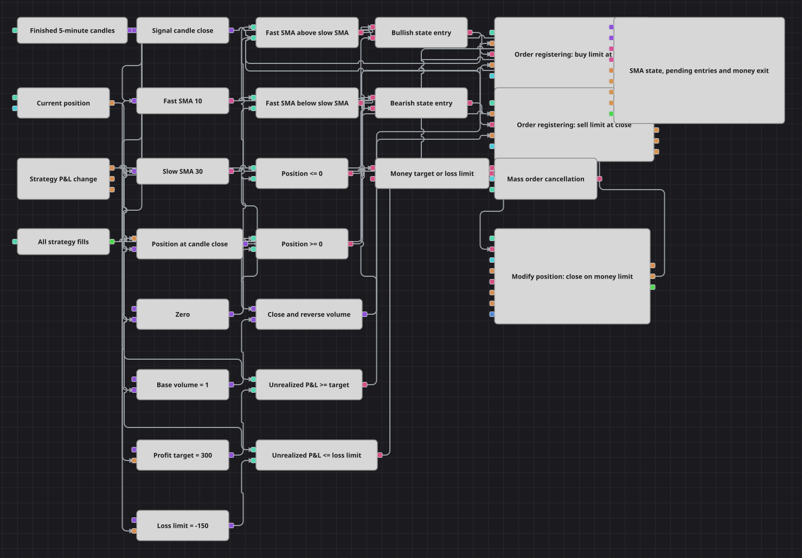

# 金額目標で決済する戦略図
[English](README.md) | [Русский](README_ru.md) | [中文](README_zh.md) | [Español](README_es.md) | [Deutsch](README_de.md) | [Português](README_pt.md)

この図はSMA(10)/SMA(30)方向ロジックに金額ベースの緊急終了を加えます。入場を保留指値にするため、含み利益・損失が境界へ達すると、ClosePositionの前にMass order cancellationが実際の注文を取り消します。

## 戦略の概要

- 確定5分足が高速・低速SMAへ入り、GreaterとLessが交差イベントではなく各足の状態を判定します。
- 強気でPosition <= 0なら終値に買い、弱気でPosition >= 0なら売り指値を置きます。
- 数量はabs(Position)+基本数量で、反転を1回のネット注文にします。
- P&L changeは含み損益を口座通貨の+300と-150に比較します。
- どちらの境界もMass order cancellationと成行ClosePositionを同時に開始します。

## エントリーとエグジットの条件

- **ロングエントリー**: 高速SMAが低速SMAより上でPositionがゼロまたはショートなら、終値買い指値がショートを閉じ基本1単位のロングを残します。
- **ショートエントリー**: 高速SMAが低速SMAより下でPositionがゼロまたはロングなら、終値売り指値がロングを閉じ基本1単位のショートを残します。
- **エグジット**: PnLUnreal >= 300または<= -150で全活動注文を取り消し、Positionを成行で閉じます。P&Lがゼロへ戻ると再び取引できます。

## パラメーター

| パラメーター | 既定値 | 説明 |
|---|---|---|
| Candle Time Frame | 00:05:00 | 両方の単純移動平均と入場判断に使う確定足時間枠。 |
| Fast SMA Length | 10 | 高速SimpleMovingAverageに含める値の数。 |
| Slow SMA Length | 30 | 低速SimpleMovingAverageに含める値の数。 |
| Base Volume | 1 | フラット入場またはネット反転後のポジション数量。 |
| Profit Target, money | 300 | 清算を起動する口座通貨の含み利益。 |
| Loss Limit, money | -150 | 口座通貨の含み損失境界。負の値にします。 |

## ダイアグラムの詳細

- C#のRequestCloseAllは呼ばれず、実行経路はSMA状態を成行で取引するだけです。本図は宣言された金額終了を実装します。
- 原典パラメータは資産水準で既定値ゼロです。本図はPnLUnrealと+300/-150を使います。
- Mass order cancellation用の作業注文を作るため、成行入場を終値指値へ変更し、再生時の価格刻み丸めを無効にします。
- 原典は清算後Stopしますが、本図は月間で複数サイクルを示すため動作を続けます。

## 使い方

`.json` ファイルを Designer に読み込み、バックテスターで過去データを使って実行し、実運用の前にパラメーターやブロック自体を自分の銘柄に合わせて調整してください。
