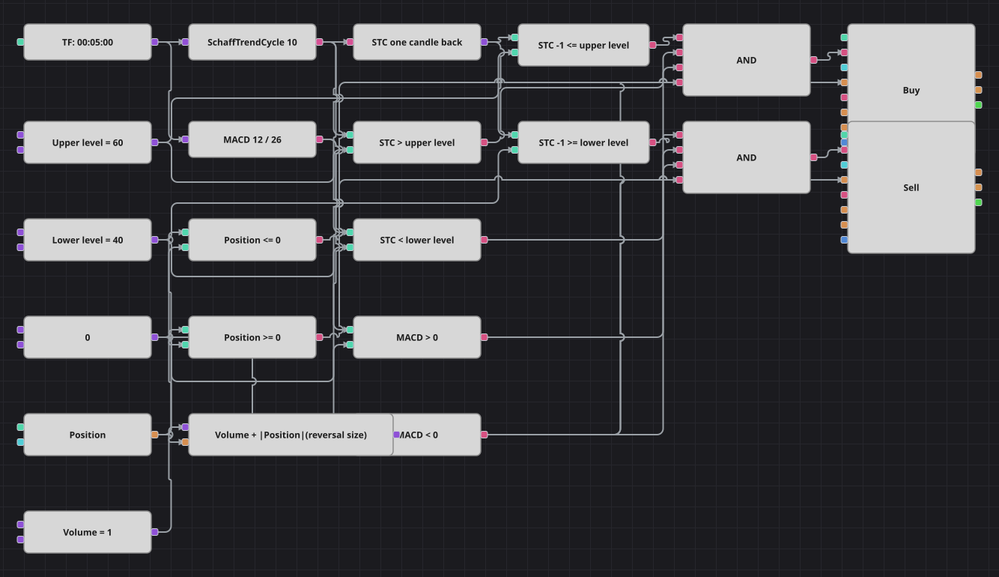

# Color Schaff Trend Cycle Strategy Diagram
[Русский](README_ru.md) | [中文](README_zh.md) | [Español](README_es.md) | [Deutsch](README_de.md) | [Português](README_pt.md) | [日本語](README_ja.md)

The Schaff Trend Cycle is a stochastic taken over the MACD histogram, so it reacts faster than a plain oscillator but still moves inside a nought to hundred band. The diagram trades the moment the cycle steps out of the middle of that band, and lets a plain MACD line decide whether the step is worth following: only breaks upwards while MACD is positive and breaks downwards while MACD is negative become orders.

## Strategy Overview

- The Schaff Trend Cycle runs on finished candles, and a previous-value block keeps its reading from one candle earlier so a level break can be told apart from simply sitting above the level.
- Two levels frame the middle of the band: crossing the upper one from below is the long trigger, crossing the lower one from above is the short trigger.
- The MACD line, the difference of a fast and a slow exponential moving average, is only a sign filter: positive allows longs, negative allows shorts.
- The strategy is always in the market once it starts: every signal reverses the position, because the order volume is the base volume plus whatever is currently held.

## Entry and Exit Rules

- **Long entry**: The cycle was at or below the upper level on the previous candle and is above it now, the MACD line is positive and the position is not long. The order buys the base volume plus the absolute position, which turns a short into a long and opens a long from flat.
- **Short entry**: The cycle was at or above the lower level on the previous candle and is below it now, the MACD line is negative and the position is not short. The order sells the base volume plus the absolute position, which turns a long into a short and opens a short from flat.
- **Exit**: There is no separate exit and no protective stop, exactly as in the original strategy: a position is left only when the opposite level break arrives and reverses it.

## Parameters

| Parameter | Default | Description |
|---|---|---|
| STC smoothing length | 10 | Smoothing length of the Schaff Trend Cycle; longer values make the cycle slower and the breaks rarer. |
| MACD fast EMA | 12 | Fast exponential moving average inside the MACD filter. |
| MACD slow EMA | 26 | Slow exponential moving average inside the MACD filter. |
| Upper level | 60 | Level the cycle has to break upwards for a long signal. |
| Lower level | 40 | Level the cycle has to break downwards for a short signal. |
| Volume | 1 | Base order volume, in lots; the absolute position is added when reversing. |
| Candles | 00:05:00 | Candle time frame the whole diagram works on. |

## Diagram Details

- The candle block feeds the Schaff Trend Cycle and the MACD indicator; a previous-value block reads the cycle one candle back.
- Four comparison blocks build the two breaks: the previous value against a level and the current value against the same level, which together mean the line stepped across it on this candle.
- Two more comparisons give the sign of the MACD line, and two compare the position against the shared zero constant so a signal cannot add to a position already held.
- Each logical AND joins four conditions - where the cycle was, where it is, the MACD sign and the position - and triggers one position modify block.
- A formula block computes the reversal size as base volume plus the absolute position, so one market order both closes the old side and opens the new one, matching the pair of market orders the C# code sends.
- Two departures from the C# original are worth knowing. The original is named after the Schaff Trend Cycle but actually computes a ten-period RSI in its place; this diagram uses the real Schaff Trend Cycle indicator, so the signals are those the name promises rather than those the code produces.
- The original also works on four-hour candles, which leave far too few bars in the one month of history the gallery ships; the diagram runs on five-minute candles instead.

## Usage

Import the `.json` file into Designer, run it in the backtester on historical data, then adjust the parameters or the blocks themselves to fit your instrument before trading it live.
