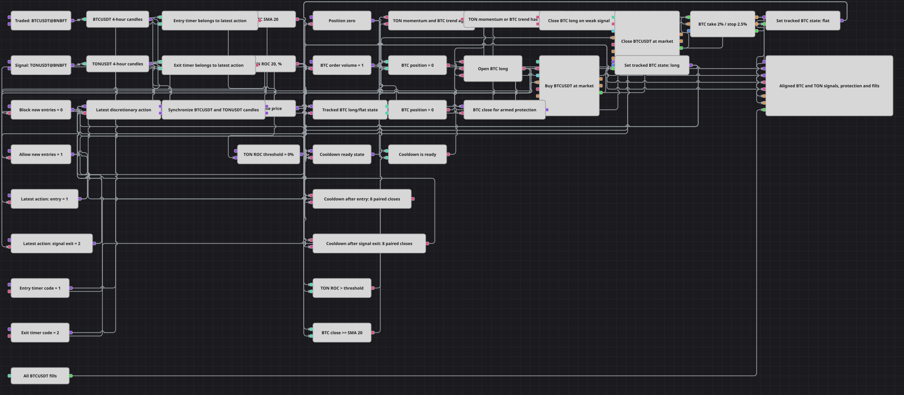

# Cross-Instrument Signal Strategy Diagram
[Русский](README_ru.md) | [中文](README_zh.md) | [Español](README_es.md) | [Deutsch](README_de.md) | [Português](README_pt.md) | [日本語](README_ja.md)

This diagram synchronizes finished four-hour TONUSDT@BNBFT and BTCUSDT@BNBFT candles. TONUSDT supplies a 20-period rate-of-change signal, while BTCUSDT supplies its own 20-period simple moving-average filter. The diagram is intended to run with Strategy Security set to BTCUSDT@BNBFT; an internal 0/1 flat/long latch, shared entry-permission state, and fill-driven protection then manage that long-only exposure.

## Strategy Overview

- Two independent security variables configure only the TONUSDT and BTCUSDT four-hour candle subscriptions. Their finished candles are aligned before a decision, so the TON momentum value and BTC trend filter always belong to the same synchronized interval.
- TON ROC(20) is bullish above zero and becomes an exit condition at zero or below. BTCUSDT is eligible for entry when its Close is at or above SMA(20), and a Close below SMA(20) is an exit condition.
- A long entry requires all four conditions at once: `TON ROC(20) > 0`, `BTC Close >= BTC SMA(20)`, the internal state latch reports flat, and the shared `Cooldown is ready` state permits entry. The externally assembled AND then triggers a NoCondition market buy with Volume 1.
- The entry action clears the shared entry permission and starts Entry Cooldown N, while a discretionary signal sell clears the same state and starts Signal-exit Cooldown N. The corresponding timer restores permission after eight synchronized candle pairs; a generation check suppresses completion from an older timer after a newer reset. Exits never wait for this state, and protection exits do not reset it.
- The BTCUSDT market-buy fill switches the latch to long and arms percentage protection with a 2% take-profit and a fixed, non-trailing 2.5% stop-loss. A discretionary close fill or Take/Stop activation and fill switches the latch back to flat. The strategy never opens a short position.

## Entry and Exit Rules

- **Long entry**: On a synchronized finished four-hour pair, the external entry AND triggers a NoCondition market buy with Order Volume 1 when TON ROC(20) is above zero, BTC Close is at or above BTC SMA(20), the state latch reports flat, and shared `Cooldown is ready` permits entry. The action trades the selected Strategy Security, which must be BTCUSDT@BNBFT to match the Traded Security candle parameter.
- **Short entry**: There is no short entry. The discretionary sell uses ReduceOnly, MarketOrder, and Volume 1, so it can only reduce the selected Strategy Security exposure; Take and Stop protection likewise close the long exposure.
- **Exit**: When the latch reports long, `TON ROC(20) <= 0` or `BTC Close < BTC SMA(20)` triggers the ReduceOnly market sell without waiting for the shared cooldown state. A 2% take-profit or 2.5% fixed stop-loss can also close the exposure with a market order; the stop does not trail.

## Parameters

| Parameter | Default | Description |
|---|---|---|
| Traded Security | BTCUSDT@BNBFT | Security used only by the traded-instrument candle subscription. Set the selected Strategy Security to the same BTCUSDT@BNBFT value because actions and strategy trades use Strategy Security. |
| Signal Security | TONUSDT@BNBFT | Security used only by the signal-instrument candle subscription; its momentum contributes a signal and no action is addressed to this variable. |
| BTC Candles Series | 04:00:00 | Finished four-hour BTCUSDT candle series used for Close, SMA(20), state decisions, and the chart. |
| TON Candles Series | 04:00:00 | Finished four-hour TONUSDT candle series used for ROC(20) and synchronized decisions. |
| BTC SMA Length | 20 | Period of the SimpleMovingAverage calculated from finished BTCUSDT candles. |
| TON ROC Length | 20 | Period of the RateOfChange calculated from finished TONUSDT candles. |
| ROC Threshold | 0 | Zero level used to distinguish the positive momentum entry state from the non-positive signal exit state. |
| Entry Cooldown N | 8 | Number of synchronized candle pairs counted by the entry-action timer before it can restore shared entry permission. |
| Signal-exit Cooldown N | 8 | Number of synchronized candle pairs counted by the discretionary signal-exit timer before it can restore shared entry permission. |
| Order Volume | 1 | Fixed quantity used by both the NoCondition market buy and the ReduceOnly market sell for the selected Strategy Security. |
| Take Profit | 2% | Percentage gain from the filled entry price that activates take-profit protection. |
| Stop Loss | 2.5% | Percentage loss from the filled entry price that activates stop-loss protection. |
| Trailing Stop Loss | false | Disabled, so the 2.5% stop-loss remains fixed rather than following favorable price movement. |
| Use Market Orders | true | Enabled, so take-profit and stop-loss protection close the position with market orders. |

## Diagram Details

- Separate security [Variable](https://doc.stocksharp.com/en/topics/designer/strategies/using_visual_designer/elements/data_sources/variable.html) blocks feed only the independent TONUSDT@BNBFT and BTCUSDT@BNBFT candle subscriptions. The order actions and Strategy trades use Strategy Security instead; select BTCUSDT@BNBFT there as well, so it matches the Traded Security candle parameter.
- Two [Candles](https://doc.stocksharp.com/en/topics/designer/strategies/using_visual_designer/elements/data_sources/candles.html) blocks emit only finished four-hour candles. A [Sync](https://doc.stocksharp.com/en/topics/designer/strategies/using_visual_designer/elements/common/sync.html) block pairs the two streams at `04:00:00` before either instrument enters the decision chain.
- An [Indicator](https://doc.stocksharp.com/en/topics/designer/strategies/using_visual_designer/elements/common/indicator.html) block calculates RateOfChange 20 for TONUSDT, and another calculates SimpleMovingAverage 20 for BTCUSDT. Comparison blocks express the positive/non-positive ROC states and the BTC Close relations above or below its average.
- A numeric Unit [Variable](https://doc.stocksharp.com/en/topics/designer/strategies/using_visual_designer/elements/data_sources/variable.html) acts as the state latch: `0` means flat and `1` means long. Buy MyTrade writes `1`; discretionary sell MyTrade plus Take/Stop activation and MyTrade events write `0`. Logical-condition blocks combine that state with the synchronized signals.
- Two action-specific N-values timers hold Entry Cooldown N and Signal-exit Cooldown N at 8. Either action clears one shared entry-permission state; its timer may restore `Cooldown is ready` after eight synchronized pairs, while a generation check rejects stale completion from an earlier timer. The external flat-entry AND has one cooldown input. It triggers a buy [Modify position](https://doc.stocksharp.com/en/topics/designer/strategies/using_visual_designer/elements/positions/modify.html) action configured as NoCondition, MarketOrder, Volume 1; the signal exit triggers a separate ReduceOnly, MarketOrder, Volume 1 sell without that input.
- [Position protection](https://doc.stocksharp.com/en/topics/designer/strategies/using_visual_designer/elements/positions/protect.html) receives both buy and discretionary-close fills: the buy fill arms Take Profit `2%` and fixed Stop Loss `2.5%`, while the close fill clears stale protection state. Trailing Stop Loss is `false` and Use Market Orders is `true`. The chart receives both synchronized candle streams, BTC SMA(20), TON ROC(20), Take and Stop order streams, and all BTC fills from Strategy trades.

## Usage

Import the `.json` file into Designer, run it in the backtester on historical data, then adjust the parameters or the blocks themselves to fit your instrument before trading it live.
