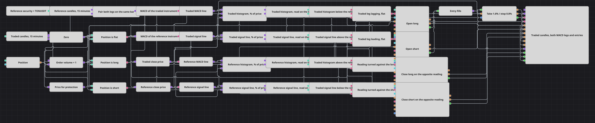

# 跨品种 MACD 比较策略图
[English](README.md) | [Русский](README_ru.md) | [Español](README_es.md) | [Deutsch](README_de.md) | [Português](README_pt.md) | [日本語](README_ja.md)

该图只交易一个品种，但依据两个品种作出决策。在被交易品种和参考品种上分别计算 MACD，所比较的不是两者的价格，而是两者的动量：当被交易的一方在快线读数上较弱、而在慢线读数上仍然较强时，图会把这视为尚未收敛的差距并买入。反向情形则卖出。

## 策略概览

- 指数（Index）模块按表达式构建一个合成品种，并把它交给第二个 K 线模块——第二个品种正是通过这种方式才进入图中。
- 两条腿都以相同的时间框架订阅 K 线序列：一条基于策略品种，另一条基于 Index 生成的品种。
- 同步（Sync）为每条腿各保留一条线路，并让两者一起输出，因此被交易品种的读数与参考品种的读数始终描述同一根 K 线，而不是哪条序列先到就用哪条。
- 每条腿各有自己的 MACD，转换器从中取出三个数值：MACD 线、信号线，以及其下方那根 K 线的收盘价。
- 每条腿再用两个公式把它们换算成该腿自身价格的百分比——柱状图，即 MACD 减信号线，以及信号线本身。当两个品种的价格相差若干数量级时，直接比较原始数值毫无意义。
- 四个变量在被交易品种的 K 线上读取这四个百分比，因此比较以及随后的委托都由被交易的品种来定时，而不是由最后收盘的那条腿。
- 比较模块把两条腿并排放在一起——柱状图对柱状图、信号线对信号线——四个逻辑条件再加入持仓状态，每个动作一个闸门：开多、开空、平多、平空。
- 入场为固定数量的市价委托，且只在空仓时发出；反向读数负责平仓，持仓保护（Position protection）按入场价的百分比带有止盈和止损。

## 入场与出场规则

- **做多入场**: 在被交易品种的一根 K 线上，其柱状图位于参考柱状图之下，而其信号线位于参考信号线之上，且当前为空仓。快线读数表明被交易的一方落后，慢线读数表明它仍然领先，图便把这一对读数视为有待补上的滞后。持仓修改（Position modify）以市价买入委托量。
- **做空入场**: 在被交易品种的一根 K 线上，其柱状图位于参考柱状图之上，而其信号线位于参考信号线之下，且当前为空仓。持仓修改以市价卖出委托量。
- **离场**: 有两条离场途径，任何一条都可能先触发。反向读数会平掉持仓：多头在柱状图领先于参考、而信号线落后于参考时离场，空头则为相反的一对。二者都是设为平仓的持仓修改，因此数量取自持仓本身，一次委托内不会反手——图回到空仓状态，等待新的信号。与此无关地，持仓保护跟随每一笔入场成交，在相对入场价盈利 1.6% 或亏损 0.8% 时平仓。

## 参数

| 参数 | 默认值 | 说明 |
|---|---|---|
| Reference Security | TONUSDT@BNBFT * 1 | 指数模块据以构建参考品种的表达式。它指定一个品种并乘以 1，价格因此保持不变，同时使该设置仍然是一个算术表达式。 |
| Traded Candles | 00:15:00 | 被交易 K 线序列的时间框架，也是每笔委托构建所依据的节奏。 |
| Reference Candles | 00:15:00 | 参考 K 线序列的时间框架。它必须与被交易的一致，否则两条腿永远不会落入同一根 K 线。 |
| Sync Interval | 00:15:00 | 同步把两条腿归入的时间桶长度；与 K 线的长度相同。 |
| Traded MACD Fast | 12 | 在被交易品种上构建的 MACD 的快速移动平均长度。 |
| Traded MACD Slow | 26 | 同一 MACD 的慢速移动平均长度。它与快速长度之间的差距决定了一段行情要持续多久，柱状图才会作出反应。 |
| Traded MACD Signal | 9 | 同一 MACD 的信号线长度；柱状图正是相对这条线来度量的。 |
| Reference MACD Fast | 12 | 在参考品种上构建的 MACD 的快速移动平均长度。每条腿各自带有三个长度，因此两者可以分别调整，但只有在两者设置相同时，两个柱状图的比较才有意义。 |
| Reference MACD Slow | 26 | 参考 MACD 的慢速移动平均长度。除非有意在不同的周期上度量这两个品种，否则应使其与被交易的一致。 |
| Reference MACD Signal | 9 | 参考 MACD 的信号线长度。出于同样的理由，应使其与被交易的一致。 |
| Order Volume | 1 | 委托数量，以手为单位。 |
| Take Profit, % | 1.6 | 止盈距离，以入场价的百分比表示。 |
| Stop Loss, % | 0.8 | 止损距离，以入场价的百分比表示。 |

## 图表详情

- 两个 K 线模块都只接受已完成的 K 线。未完成 K 线的更新携带的是该 K 线开盘的时间，据此构建的委托会比其发出的时刻更早。
- 同步按其中各数值的最早时间放行一组数据，正因如此，同步的输出不会直接到达委托：四个变量会在被交易品种的 K 线上重新读取这些数值，委托正是按那根 K 线的节奏构建的。代价是比较所用的是最后一对已完成的读数，相对它所作用的那根 K 线滞后一根。
- 每个保存常量的变量——零和委托量——都由被交易品种的 K 线触发。没有触发源的变量会保留其数值而永不输出，等待它的条件也就永远无法凑齐。
- 两个 MACD 模块都只输出已形成的最终值，因此比较在每条腿都具备完整指标之后才开始，并且不会在一根 K 线内部变动。
- 每条同步线路的两端都要连接。送入而从未取出的数值会让该模块一直等待它，策略将无法启动。

## 使用方法

将 `.json` 文件导入 Designer，在回测器中用历史数据运行，然后根据自己的交易品种调整参数或方块，确认无误后再用于实盘。
